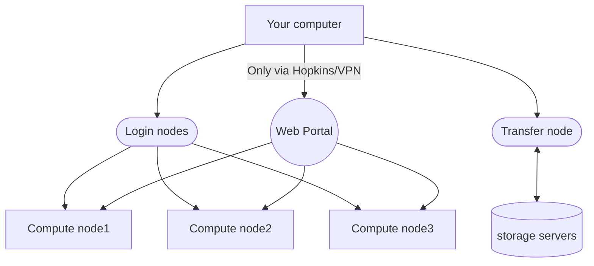

---
tags:
  - topic-overview
title: "Access Overview"
---

# Accessing the Cluster: Overview

## Cluster structure overview
The cluster consists of some public-facing hosts with the remaining computers "behind them" on private networks. An incomplete and very oversimplified approximation:

## Public-facing: Login and Transfer 
The login and transfer nodes are accessible to the wider Internet. 
For security reasons, the web portal is only available to computers on Hopkins networks. If you are not on a Hopkins campus, that means that you need to use the VPN to be able to see that node.

* **login**: Normally jhpce01.jhsph.edu and jhpce02.jhsph.edu
* **transfer**: {==jhpce-transfer01.jhsph.edu==}
* **web portal**: {==[jhpce-app02.jhsph.edu](https://jhpce-app02.jhsph.edu)==}

## SSH Is The Primary Method
Access to the JHPCE cluster requires the use of SSH.

SSH stands for Secure SHell. SSH is actually a set of internet standard protocols. Programs implementing these protocols include both command line interface (CLI) tools and those with graphic user interfaces (GUI).  They all enable you to make secure, encrypted connections from one computer to the next.

[This document](ssh.md) provides more information on SSH.

## X11/The X Window System

The [X Window System](https://en.wikipedia.org/wiki/X_Window_System) (aka X11, aka X) is the primary GUI system for UNIX computers. X allows a program (an X "client") running on a UNIX computer in the cluster to be displayed on a remote computer (running an X "server"[^2]) over the network. To use it, your local computer needs to have X server software installed on it.

SSH provides support for tunnelling X11 over an encrypted connection. You may need to tell SSH that you want that service, by, for example, adding the -X flag to an ssh command in a macOS Terminal.

[^2]:Note that X reverses the normal conception of client/server operation, which is that the remote computer is the "server". In X11, the "server" is the program receiving the keyboard and mouse inputs and displaying the output of remote "client" programs.

- macOS users need to install [XQuartz](https://en.wikipedia.org/wiki/XQuartz) from [xquartz.org](https://www.xquartz.org).
- Windows users need to use a program like MobaXterm (highly recommended) or [Cygwin](https://en.wikipedia.org/wiki/Cygwin). We have a page describing installing and using [MobaXterm](mobaxterm.md).
- Linux laptop or desktop users are already using X as their windowing system.

For more information, see [our X11 document](x11.md).

## Multi-factor authentication (MFA)
There are two basic "factors" required to log into a computer, whether your laptop or a remote UNIX cluster login node -- your username and a password. {==JHPCE requires the use of an additional factor==}, either a [one-time password](ssh.md#one-time-passwords) (OTP) six digit code, or the use of [SSH key pairs](ssh.md#ssh-keys). 

### One Time Passwords
When you SSH into JHPCE, you will be prompted for a “Verification Code:” This is your cue to enter in a one-time password six digit code.

Programs like `Google Authenticator` and `Micrsoft Authenticator` generate one-time password codes (OTP). These are only good for a single use, whether you successfully log in or not. Typically they are used to generate a _stream_ of time-based OTPs, or TOTPs. These are only good for one minute, adding another layer of difficulty for someone trying to impersonate you.

These programs are usually used on smartphones, but there are programs available to create them on laptops and desktops. The key with using ANY OTP program is to get it from a trusted source. We will default to mentioning the `Google Authenticator`.

After you log into JHPCE for the first time, you should immediately configure your OTP program using a "secret" accessible to you on the cluster via the `auth_util` program. Instructions for doing that are found in the [orientation documents](https://docs.google.com/presentation/d/1elMSTUdKws7FLVFK7vVV_AErA4brNSPX/pub){:target="_blank"}.

## Web Portal
We have a web server named [jhpce-app02.jhsph.edu](https://jhpce-app02.jhsph.edu) configured to offer a growing number of services. Click on the links to learn more.

* Reset your password or generate a OTP ([learn more](../portal/web-reset.md))
* Run applications on the cluster (RStudio, JupyterLab, VS Code) ([learn more](../portal/web-apps.md))
* Inspect a catalog of research databases (under development) ([learn more](../portal/datacatalog.md))

## SAFE Desktop
A virtual desktop named the [Secure Analytic Framework Environment](https://ictr.johnshopkins.edu/service/informatics/safe-desktop/) (SAFE) is a resource that some people find useful for their computing, as well as a means to access JHPCE (via the [MobaXterm](mobaxterm.md) application). It is a virtual Windows computer equipped with many applications JHPCE members use for their research, including SAS and Stata. It includes 100GB of secure data storage for sensitive (PHI, PII) information. That data can be shared by research groups. Free for Johns Hopkins Medicine staff and students, it {==requires filling out a form and waiting for approval==}.
You can complete the [SAFE User form](https://johnshopkins.service-now.com/serviceportal?id=sc_cat_item&sys_id=61fa28a26ffb220088e1f13f5d3ee45e) to request an account. We recommend using the "Request a SAFE Desktop (no storage) option if you will be just using the SAFE desktop to access JHPCE or JADE.

## File Transfers

We have a transfer server {==jhpce-transfer01.jhsph.edu==} for file transfers into and out of the cluster. It is connected by a 40G Ethernet link to Hopkins networks.
This computer also offers a Globus Endpoint service (described [here](globus.md)) for transfers from personal computers and other institutions.

Transferring data _into or out of the cluster_ is documented [here](../access/file-transfer.md).

The login nodes SHOULD NOT be used for file transfers into and out of the cluster beyond extremely trivial cases. Their connections are four times slower and they are relied upon by all of your peers.

Please use compute nodes for transfers _WITHIN the cluster_. For example, copying significant volumes of files from one file system to another, such as `/dcs05/a-place/` to `/dcs07/somewhere-else/`. Information about doing that can be found [here](../files/copying-files.md)

