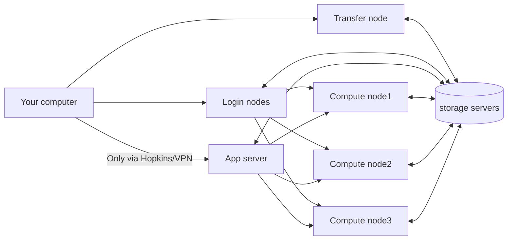

---
tags:
  - in-progress
  - topic-overview
---

# Accessing the Cluster: Overview

## Cluster structure overview
The cluster consists of some public-facing hosts with the remaining computers "behind them" on private networks.

## Public-facing: Login and Transfer 
The login and transfer nodes are accessible to the wider Internet. 
For security reasons, the web portal[^1] is only available to computers on Hopkins networks. If you are not on a Hopkins campus, that means that you need to use the VPN to be able to see that node.
[^1]: jhpce-app02.jhsph.edu

## SSH Is The Primary Method
Access to the JHPCE cluster requires the use of SSH.

SSH stands for Secure SHell. SSH is actually a set of internet standard protocols. Programs implementing these protocols include both command line interface (CLI) tools and those with graphic user interfaces (GUI).  They all enable you to make secure, encrypted connections from one computer to the next.

[This document](ssh.md) provides more information on SSH.

## X11/The X Window System

The [X Window System](https://en.wikipedia.org/wiki/X_Window_System) (aka X11, aka X) is the primary GUI system for UNIX computers. X allows a program (an X "client") running on a UNIX computer in the cluster to be displayed on a remote computer (running an X "server"[^2]) over the network. To use it, your local computer needs to have X server software installed on it.

SSH provides support for tunnelling X11 over an encrypted connection. You may need to tell SSH that you want that service, by, for example, adding the -X flag to an ssh command in a macOS Terminal.

[^2]:Note that X reverses the normal conception of client/server operation, which is that the remote computer is the "server". In X11, the "server" is the program receiving the keyboard and mouse inputs and displaying the output of remote "client" programs.

- macOS users need to install [XQuartz](https://en.wikipedia.org/wiki/XQuartz) from [xquartz.org](https://www.xquartz.org).
- Windows users need to use a program like MobaXterm (highly recommended) or [Cygwin](https://en.wikipedia.org/wiki/Cygwin). We have a page describing installing and using [MobaXterm](mobaxterm.md).
- Linux laptop or desktop users are already using X as their windowing system.

For more information, see our [X11](x11.md) document.

## Multi-factor authentication (MFA)
There are two basic factors required to log into a computer, whether your laptop or a remote UNIX cluster login node -- your username and a password. JHPCE requires the use of an additional factor, either a [one-time password](ssh.md#one-time-passwords) (OTP) six digit code, or the use of [SSH key pairs](ssh.md#ssh-keys). 

### One Time Passwords
When you SSH into JHPCE, you will be prompted for a “Verification Code:” This is your cue to enter in a one-time password six digit code.

Programs like `Google Authenticator` and `Micrsoft Authenticator` generate one-time password codes (OTP). These are only good for a single use, whether you successfully log in or not. Typically they are used to generate a _stream_ of time-based OTPs, or TOTPs. These are only good for one minute, adding another layer of difficulty for someone trying to impersonate you.

These programs are usually used on smartphones, but there are programs available to create them on laptops and desktops. The key with using ANY OTP program is to get it from a trusted source. We will default to mentioning the `Google Authenticator`.

After you log into JHPCE for the first time, you should immediately configure your OTP program using a "secret" accessible to you on the cluster via the `auth_util` program. Instructions for doing that are found in the [Orientation document](../orient/images/latest-orient.pdf).

## Web Portal
Describe capabilities of web portal.
Links to the apps page(s) about it.

## SAFE Desktop
A virtual desktop named the [Secure Analytic Framework Environment](https://ictr.johnshopkins.edu/service/informatics/safe-desktop/) (SAFE) is a resource that some people find useful for their computing, as well as a means to access JHPCE (via the [MobaXterm](mobaxterm.md) application). It is a virtual Windows computer equipped with many applications JHPCE members use for their research, including SAS and Stata. It includes 100GB of secure data storage for sensitive (PHI, PII) information. That data can be shared by research groups. Free for Johns Hopkins Medicine staff and students, it {==requires filling out a form and waiting for approval==}.

## File Transfers
Brief description of our transfer node and its capabilities. Admonition to not use login node for transfers (either in or out or within the cluster)

Point to some overview doc about this topic, which is going to have several documents in total, not one giant one, i.e.

* overview doc
* globus
* windows-specific? recommend a tool
* Internal file transfers - this deserves a document. Perhaps under the Managing Files header. Do's, don'ts, sample batch job, good rsync args to use, etc.

