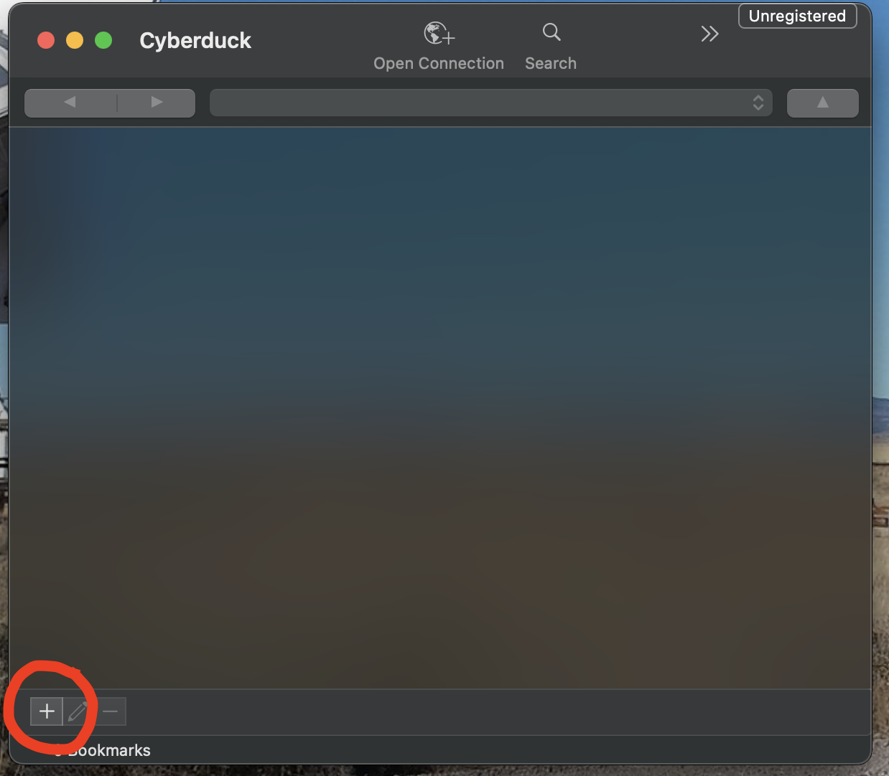
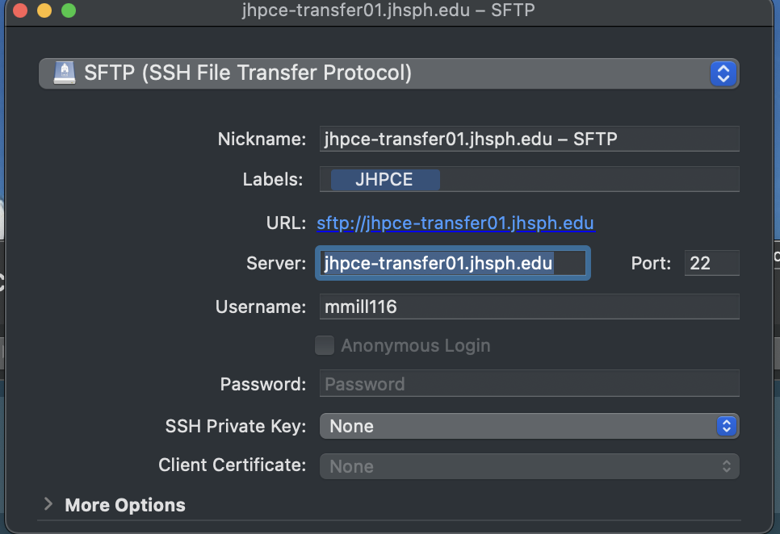

---
tags:
title: File Transfer - Overview
---

# File Transfer To and From the JHPCE Cluster 
There are 2 general ways to think about transfering data to and from the JHPCE cluster. 

* The most common way to think about tranferring data is where the transfer is initiated from some place outside of the JHPCE cluster, such as one's laptop or some other HPC system external to the cluster. 
* The second approach to transferring data is where the connection is initiated from within the JHPCE cluster.  In this case one would have already logged into the cluster, and from within the cluster, one needs to reach out to some external location to copy data from that location into the cluster.

In both cases, file transfers should be done through the JHPCE transfer node, and not the login node.  Details about using the transfer node are given below.  Also, in both scenarios, there are a slew ways that data transfer occurs.

!!! Notice "Transferring files within the cluster"
    Copying files around inside the cluster, between JHPCE file systems, is a different activity.
    We have a document about [using rsync](../files/copying-files.md) to copy files.
    This tool can be used for both internal copies and for moving files into or out of the cluster.

## Transfering data from outside of JHPCE

For transferring files to and from the cluster, you should use the transfer node rather than the login node. The name of the transfer node is `jhpce-transfer01.jhsph.edu` (compared to the primary login node `jhpce01.jhsph.edu`).
The transfer node is significantly faster, as the transfer node has a 40G Ethernet connection to the high-speed JHU ScienceDMZ  while the login nodes have 10G connections. 
The use of the transfer node also relieves the login node from having to bear the stress of file transfer traffic, which can put a significant load on the network capacity of the node. Since the login node is used by everyone to access the cluster, data transfers through the login node can slow cluster access down for all users, and this makes users grumpy.

A number of options exist for transfering files to-and-fro between JHPCE and your local host. Which solution you chose depends on your use case.

### SFTP - Secure File Transfer Program (or Protocol)

The most common method for transferring files to and from JHPCE is with sftp.  The sftp command is part of the ssh suite of programs used for interacting securely with remote systems.  The sftp command allows you to transfer files to and from JHPCE over a secure encypted channel.

#### Text based SFTP usage

By default, sftp is a text-baseed interactive program. The "sftp" progam is installed by default on MacOS and Linux desktops, and is availble from running a Terminal on one's local system. 
To use `sftp`, you would run the command (substituting JHPCE-USERID with your JHPCE login ID) :

```
sftp JHPCE-USERID@jhpce-transfer01.jhsph.edu
```
and then proceed to login with your JHPCE password and Google Authenticator.

Once you’ve connected, you’ll be shown an `sftp>` prompt.  From here you can use
the standard shell commands `ls` to get a directory listing, and `cd` to
change directories.  While the `ls` and `cd` commands refer to your location on the cluster,
there are sister commands `lls` and `lcd` to navigate on you local system. 
In addition to the `ls` and `cd` commands, there are commands for actually doing the file transfers.

- You can use the `get` command to transfer a file from the cluster to your local system
- You can uhe `put` command to transfer a file from your local system to the cluster.

Once you are done with `sftp`, you would type `exit` to end the session.

Here is an example of using sftp from a terminal running on a MacOS system.

<pre class="mbash"><code class="mbash">
MyMac: <b>sftp mmill116@jhpce-transfer01.jhsph.edu</b>
(mmill116@jhpce-transfer01.jhsph.edu) Verification code: <b>(JHPCE Verification Code Typed In)</b>
(mmill116@jhpce-transfer01.jhsph.edu) Password: <b>(JHPCE Password Typed In)</b>
Connected to jhpce-transfer01.jhsph.edu.
sftp> <b>ls</b>
10billion                                                                       
2024-09                                                                         
500                                                                             
Bird.jpeg                                                                       
CITATION                                                                        
bin                                                                             
data                                                                            
jhpce-app                                                                       
scripts                                                                         
tmp                                                                             
sftp> <b>cd tmp</b>
sftp> <b>ls</b>
ACL                                     HLA                                     
a                                       a1                                      
aaa                                     aaaa                                    
abc                                     acl-test                                
shared                                  temp-26800-7554-21111.sam               
test-rsync                              test1                                   
test2                                   testhere                                
tmp                                     tmp2                                    
tmp3                                    x                                       
zzz                                     zzzz                                    

sftp> <b>lcd Documents</b>
sftp> <b>lls</b>
ACL-CMS.txt
Screenshot 2024-11-12 at 3.30.24 PM.png
Screenshot 2025-02-25 at 10.34.09 AM.png
Screenshot 2025-02-25 at 10.34.18 AM.png
Screenshot 2025-02-26 at 3.28.57 PM.png
Zoom
show-example.txt
sftp> <b>put show-example.txt</b>
Uploading show-example.txt to /users/mmill116/tmp/show-example.txt
show-example.txt                          100% 4798   182.1KB/s   00:00    
sftp> <b>ls</b>
ACL                                     HLA                                     
a                                       a1                                      
aaa                                     aaaa                                    
abc                                     acl-test                                
shared                                  <mark>show-example.txt                    </mark>
temp-26800-7554-21111.sam               test-rsync                              
test1                                   test2                                   
testhere                                tmp                                     
tmp2                                    tmp3                                    
x                                       zzz                                     
zzzz 
sftp> <b>exit</b>
MyMac: 

</code></pre>

#### Graphical SFTP - Cyberduck/MobaXterm

If you would rather use a graphical SFTP connection, wherein you can drag-and-drop files between your local system
and the cluster you can use either MobaXterm on a Windows system, or Cyberduck on a Mac system.  We have
an example of setting up SFTP in MobaXterm at [on this page](https://jhpce.jhu.edu/access/mobaxterm/#configuring-sftp-sessions)

For Macos, we recommend Cyberduck from [this site](https://cyberduck.io/).  Cyberduck still uses sftp under the hood,
but presents files and folders in a graphical window, allowing drag-and-drop operations between your local system and
the JHPCE cluster.

Below are the steps to setting up Cyberduck on your local MacOS system:

- Start up the Cyberduck app.
- Click on "+" at bottom left

- This will open a new window where you can configure your sftp session
- Select SFTP as the Protocol
- For Label, you can use JHPCE
- For Server, use "jhpce-transfer01.jhsph.edu"
- For "username" put your JHPCE username
- Keep the port as 22
- Do not enter a Password
- If you have an SSH key for the cluster select it in the SSH Private Key dropdown

- Close the dialog box by clicking on the Macos red "Close" button in the upper left.
- This will save a session "Bookmark" for you in the Cyberduck application
- You can now double-click on the saved session.
- You will be prompted for your Verification Code and Password
- At this point you will see your JHPCE home directory displayed, and you can drag-and-drop files between your Mac and the JHPCE cluster.

One last note - we stronly recommend setting up SSH Keys [SSH key pairs](ssh.md#ssh-keys). Without keys, you will 
be prompted for your verification code and password for each file you transfer.

### SCP

The `scp` command can be thought of as a `network cp` command.  Like sftp, scp is part of the ssh suite of products.  The scp command is better for situation where you know exactly which files you want to copy, and don't need to navigate around the filesystems interactively with the sftp command.

An example of the command to transfer a file called `data.txt` from your local system to your home directory on the cluster would be:

```
scp LOCAL_PATH/data.txt USERID@jhpce-transfer01.jhsph.edu:REMOTE_PATH/REMOTE_TARGET_FILENAME
```

where the paths default to your current local directory and home
directory on the remote. The target filename if omitted will be the
local filename.

If you want to copy a file from the cluster to your local laptop/desktop, you would reverse the arguments. For example to copy `data2.txt` from the cluster to a local file:

```
scp USERID@jhpce-transfer01.jhsph.edu:REMOTE_PATH/data2.txt LOCAL_PATH/LOCAL_TARGET_FILENAME
```

### SCP vs. SFTP: Choosing the Right File Transfer Protocol (per ChatGPT)

When transferring files to and from university servers, it's essential to use a secure and efficient method. The two most common protocols are **SCP (Secure Copy Protocol)** and **SFTP (Secure File Transfer Protocol)**. Below, we compare their features, use cases, and best practices.

#### What is SCP?  
SCP is a simple and fast protocol for securely transferring files between computers over SSH (Secure Shell). It is commonly used for one-time transfers when speed is a priority.

##### Key Features of SCP:
- **Fast and efficient** for large files or bulk transfers.
- **Encrypts** data and authentication credentials.
- **Command-line based**; supports automation via scripts.
- **No file management options**—only direct transfers.

##### When to Use SCP:
- When you need a **quick, one-time file transfer**.
- If you’re working primarily from the **command line**.
- When **speed is more important** than file management.

#### What is SFTP?  
SFTP is an SSH-based protocol that offers a more comprehensive solution for secure file transfers, allowing both file transfer and remote file management.

##### Key Features of SFTP:
- **Secure and reliable**, with encrypted transfers.
- **Supports interactive file management** (rename, delete, list directories).
- **Compatible with both command-line and GUI clients**.
- **Slower than SCP** for large file transfers due to additional protocol overhead.

##### When to Use SFTP:
- When you need to **browse directories** or **manage files remotely**.
- If you prefer using a **graphical client** like FileZilla or WinSCP.
- When working on **projects that require frequent updates** and file modifications.

#### Which One Should You Use?  

| Feature       | SCP  | SFTP  |
|--------------|------|-------|
| **Security** | ✅ SSH encryption | ✅ SSH encryption |
| **Speed**    | 🚀 Faster for large files | 🐢 Slightly slower |
| **File Management** | ❌ No file operations | ✅ Rename, delete, list, etc. |
| **Ease of Use** | ⚡ Command-line only | 🖥️ GUI support available |
| **Best for** | Quick transfers | Ongoing file management |


### Rsync

### Globus
Globus is a web-based interface for transferring files. We have a Globus endpoint on the JHPCE cluster. Please see [this document](globus.md).

## Transfering data from inside of JHPCE to the outside world

The above examples are for initiating transfers from a location outside of the JHPCE cluster.  If though
you are already on the cluster, and need to pull data from an external site, there are a number of methods for
doing this.  For all of these methods, you will need to first utilize the JHPCE transfer node via eiher srun or sbatch
with the "--partition transfer" [partition](../slurm/partitions.md) option.

### SFTP - Interactive use of the transfer partition

In addition to using SFTP to initiate transfers from your local system, you can use SFTP from within the JHPCE cluster
on the transfer node.  For transferring the data from an external site into the JHPCE cluster with sftp, you would need to:
 
- login to the cluster as normal
- start an srun session on the transfer partition
- cd to the directory on the cluster that you want to store the data
- initiate the sftp to their site, logging in with the credentials they provide
- within sftp, cd to the directory on their site that has the data
- within sftp, use “ls” to get a listing of files on their site
- use “get” or “wget” to transfer the files from their site to the JHPCE cluster

Here is an example of what this would look like:

<pre class="mbash"><code class="mbash">
Mac:[25/04/09 10:13] ~ $ <b>ssh mmill116@jhpce01.jhsph.edu</b>
Last login: Tue Apr  8 17:04:18 2025 from 174.172.134.59
🌸 🌸 🌸 🌸 🌸 🌸 🌸 🌸 🌸 🌸 🌸 🌸 🌸 🌸 🌸 🌸 🌸 🌸 🌸 🌸 🌸 🌸
Use of this system constitutes agreement to adhere to all
applicable JHU and JHSPH network and computer use policies.
🌸 🌸 🌸 🌸 🌸 🌸 🌸 🌸 🌸 🌸 🌸 🌸 🌸 🌸 🌸 🌸 🌸 🌸 🌸 🌸 🌸 🌸
 
Need Help? bitsupport@lists.jh.edu for SLURM, cluster, storage & login issues
           bithelp@lists.jh.edu for application issues: R/SAS/python/modules...
 
The SLURM shared partition is currently at 68% core usage and 69% RAM usage.
--------------------------------------------------------------------
SLURM: "slurmuser" displays per-user cluster resource usage for running/pending
SLURM: Run "slurmuser -h" to see important options.
--------------------------------------------------------------------
--------------------------------------
     Your Home Directory Usage        
Username     Space Used         Quota     
mmill116     230G               350G      
--------------------------------------
[mmill116@jhpce01 ~]$ <b>srun --pty --partition transfer bash</b>
[mmill116@transfer-01 ~]$ <b>cd /dcs07/smart/data/mmtest/</b>
[mmill116@transfer-01 mmtest]$ <b>sftp demo@test.rebex.net</b>
The authenticity of host 'test.rebex.net (<no hostip for proxy command>)' can't be established.
ED25519 key fingerprint is SHA256:d7Te2DHmvBNSWJNBWik2KbDTjmWtYHe2bvXTMM9lVg4.
This key is not known by any other names
Are you sure you want to continue connecting (yes/no/[fingerprint])? yes
Warning: Permanently added 'test.rebex.net' (ED25519) to the list of known hosts.
Welcome to test.rebex.net! See https://test.rebex.net/ for more information.
(demo@test.rebex.net) Password: 
Connected to test.rebex.net.
sftp> <b>ls</b>
pub          readme.txt   
sftp> <b>cd pub</b>
sftp> <b>ls</b>
example   
sftp> <b>ls -la </b>
drwx------ 2 demo users          0 Mar 31  2023 .
drwx------ 2 demo users          0 Mar 31  2023 ..
drwx------ 2 demo users          0 Mar 31  2023 example
sftp> <b>cd example</b>
sftp> <b>ls -la</b>
drwx------ 2 demo users          0 Mar 31  2023 .
drwx------ 2 demo users          0 Mar 31  2023 ..
-rw------- 1 demo users      36672 Mar 19  2007 KeyGenerator.png
-rw------- 1 demo users      24029 Mar 19  2007 KeyGeneratorSmall.png
-rw------- 1 demo users      11546 Mar 19  2007 ResumableTransfer.png
-rw------- 1 demo users      80000 Mar 19  2007 WinFormClient.png
-rw------- 1 demo users      17911 Mar 19  2007 WinFormClientSmall.png
-r-------- 1 demo users      19156 Feb 16  2007 imap-console-client.png
-r-------- 1 demo users      16471 Feb 16  2007 mail-editor.png
-r-------- 1 demo users      35414 Feb 16  2007 mail-send-winforms.png
-r-------- 1 demo users      49011 Feb 16  2007 mime-explorer.png
-rw------- 1 demo users      58024 Mar 19  2007 pocketftp.png
-rw------- 1 demo users      20197 Mar 19  2007 pocketftpSmall.png
-r-------- 1 demo users      20472 Feb 16  2007 pop3-browser.png
-r-------- 1 demo users      11205 Feb 16  2007 pop3-console-client.png
-rw------- 1 demo users        379 Sep 19  2023 readme.txt
-rw------- 1 demo users       2635 Mar 19  2007 winceclient.png
-rw------- 1 demo users       6146 Mar 19  2007 winceclientSmall.png
sftp> <b>get readme.txt</b>
Fetching /pub/example/readme.txt to readme.txt
readme.txt                                    100%  379     1.8KB/s   00:00    
sftp> <b>exit</b>
[mmill116@transfer-01 mmtest]$ <b>ls</b>
readme.txt  test-file  test-file2  test-file3
[mmill116@transfer-01 mmtest]$ <b>more readme.txt </b>
Welcome to test.rebex.net!
 
You are connected to an FTP or SFTP server used for testing purposes
by Rebex FTP/SSL or Rebex SFTP sample code. Only read access is allowed.
 
For information about Rebex FTP/SSL, Rebex SFTP and other Rebex libraries
for .NET, please visit our website at https://www.rebex.net/
 
For feedback and support, contact support@rebex.net
 
Thanks!
[mmill116@transfer-01 mmtest]$ 

</code></pre>

### wget and curl
The wget and curl commands can be used to download files from a web site.  They work in a similar manner, and you will need to know the full URL path to the file.  The main difference is that wget will save the data downloaded to a file, and curl will display the file on standard output, so you'll likely need to redirect the output to a file to save it.

Here are examples:

<pre class="mbash"><code class="mbash">
[mmill116@transfer-01 mmtest]$ <b>wget https://ftp.ncbi.nlm.nih.gov/genomes/check.txt</b>
--2025-04-09 15:16:15--  https://ftp.ncbi.nlm.nih.gov/genomes/check.txt
Resolving ftp.ncbi.nlm.nih.gov (ftp.ncbi.nlm.nih.gov)... 130.14.250.11, 130.14.250.12, 130.14.250.7, ...
Connecting to ftp.ncbi.nlm.nih.gov (ftp.ncbi.nlm.nih.gov)|130.14.250.11|:443... connected.
HTTP request sent, awaiting response... 200 OK
Length: 73071 (71K) [text/plain]
Saving to: ‘check.txt’

check.txt                100%[=================================>]  71.36K  --.-KB/s    in 0.001s  

2025-04-09 15:16:16 (119 MB/s) - ‘check.txt’ saved [73071/73071]

[mmill116@transfer-01 mmtest]$ <b>ls -al check.txt</b>
-rw-r--r-- 1 mmill116 smart 73071 Jul  6  2022 check.txt

[mmill116@transfer-01 mmtest]$ <b>curl https://ftp.ncbi.nlm.nih.gov/genomes/species.diff.txt > species.diff.txt</b>
  % Total    % Received % Xferd  Average Speed   Time    Time     Time  Current
                                 Dload  Upload   Total   Spent    Left  Speed
100 49453  100 49453    0     0  52834      0 --:--:-- --:--:-- --:--:-- 52778
[mmill116@transfer-01 mmtest]$ <b>ls -la species.diff.txt</b>
-rw-r--r-- 1 mmill116 smart 49453 Apr  9 15:16 species.diff.txt
</code></pre>

### Batch use of the transfer node/partition

In addition to using `srun` to perform file transfers interactively, you can create a bash shell script with the
commands needed to perfomr the file transfers, and then use `sbatch` to submit this as a batch job.  This is especially
helpful, if not required, for long running file transfers, where an srun session might get interrupted.

Here is an example of a job that uses "wget" to do a file transfer in batch mode.

<pre class="mbash"><code class="mbash">
[mmill116@jhpce01 ~]$ <b>cat wget-example.sh</b>
#!/bin/bash
#SBATCH --partition=transfer
#SBATCH --time=4-00:00:00

wget -O $MYSCRATCH/SRR026674.fastq.gz "https://trace.ncbi.nlm.nih.gov/Traces/sra/sra.cgi?cmd=dload&run_list=SRR026674&format=fastq"
[mmill116@jhpce01 ~]$ <b>sbatch wget-example.sh</b>
Submitted batch job 15916781
[mmill116@jhpce01 ~]$ <b>squeue --me</b>
             JOBID PARTITION     NAME     USER ST       TIME  NODES NODELIST(REASON)
[mmill116@jhpce01 ~]$ <b>more slurm-15916781.out </b>
--2025-04-09 16:15:32--  https://trace.ncbi.nlm.nih.gov/Traces/sra/sra.cgi?cmd=dload&run_list=SRR02
6674&format=fastq
Resolving trace.ncbi.nlm.nih.gov (trace.ncbi.nlm.nih.gov)... 130.14.29.113, 2607:f220:41e:4290::113
Connecting to trace.ncbi.nlm.nih.gov (trace.ncbi.nlm.nih.gov)|130.14.29.113|:443... connected.
HTTP request sent, awaiting response... 301 Moved Permanently
Location: /Traces/index.html?cmd=dload&format=fastq&run_list=SRR026674 [following]
--2025-04-09 16:15:33--  https://trace.ncbi.nlm.nih.gov/Traces/index.html?cmd=dload&format=fastq&ru
n_list=SRR026674
Reusing existing connection to trace.ncbi.nlm.nih.gov:443.
HTTP request sent, awaiting response... 200 OK
Length: 5713 (5.6K) [text/html]
Saving to: ‘/fastscratch/myscratch/mmill116/SRR026674.fastq.gz’

     0K .....                                                 100%  134M=0s

2025-04-09 16:15:33 (134 MB/s) - ‘/fastscratch/myscratch/mmill116/SRR026674.fastq.gz’ saved [5713/5
713]

[mmill116@jhpce01 ~]$ <b>ls -la /fastscratch/myscratch/mmill116/SRR026674.fastq.gz</b>
-rw-r--r-- 1 mmill116 mmi 5713 Dec 11 11:59 /fastscratch/myscratch/mmill116/SRR026674.fastq.gz
[mmill116@jhpce01 ~]$ 
</code></pre>

### Rclone/Onedrive

[Rclone](https://en.wikipedia.org/wiki/Rclone) can be used to access network file resources, such as OneDrive,
Google Drive, and AWS. See [here](../access/onedrive.md) for instructions on using it to connect to Hopkins OneDrive storage.

### Aspera

[Aspera](https://www.ibm.com/products/aspera) is a commercial product from IBM that some site used to serve data
out from their sites.  Aspera (per their marketing) allows file transfers that are
reportedly 20 times faster than `ftp`.  Documentation is available for macOS, Linux and Windows.

Aspera is required to download data from the
[NCBI Aspera](https://www.ncbi.nlm.nih.gov/home/download/) server or download/upload data from/to JHU CIDR on the
Bayview campus.  Several other companies use Aspera servers for alowing file downloads.

The Aspera license does not allow us to install the client for our users. You must install it
yourself. You can download the Aspera Connect Linux Client from the [Aspera Download site](https://www.ibm.com/aspera/connect/). This will download a "tar.gz" file that you can then upload to your account on the JHPCE cluster, with sftp or scp.

You will then need to extract and run the install script from the tar.gz file.  For example:

```
tar xvf ibm-aspera-connect_4.2.13.820_linux_x86_64.tar.gz
bash ibm-aspera-connect_4.2.13.820_linux_x86_64.sh
```

This will install the `ascp` command under your home directory at  `~/.aspera/connect/bin`.  You can either add `~/.aspera/connect/bin` to your `PATH`, or use the full path to the `ascp` command to run it.

You may also need to do other steps, such as install an extension to your web browser. Instructions on how to do that for Linux, as an example, are available from IBM [here](https://www.ibm.com/docs/en/aspera-connect/4.2?topic=suc-installation).

### Unison

!!! Warning
    We no longer have unison installed in the cluster. You can install your own copy of it.
    
Using [Unison](https://en.wikipedia.org/wiki/Unison_(software)), you can keep data synchronized between directories, including ones on a single computer or between the cluster and on your local system. Both CLI and GUI versions are available. Unison needs to be installed on both computers if used across a network.

Unison is a synchronization tool. It can be told to update files in both SOURCE and DESTINATION locations according to some rules.

Unison home page is [here](https://github.com/bcpierce00/unison?tab=readme-ov-file#readme) with a [wiki](https://github.com/bcpierce00/unison/wiki) that provides access to documentation and some binaries.

An extensive [tutorial](https://ostechnix.com/how-to-synchronize-files-with-unison-on-linux/) at ostechnix.

A [wiki](https://wiki.archlinux.org/title/unison) about using it from ArchLinux.

[This](https://github.com/jfiksel/cluster-example#how-to-use-unison-for-file-transfer-and-syncing) document written by a previous JHPCE user (Jacob Fiksel) might still be useful.

### git
You can clone a git repository from a github site to the JHPCE cluster using the "git" command.  For example
<pre class="mbash"><code class="mbash">
[mmill116@transfer-01 mmtest]$ <b>git clone https://github.com/ruanyf/simple-bash-scripts</b>
Cloning into 'simple-bash-scripts'...
remote: Enumerating objects: 344, done.
remote: Counting objects: 100% (74/74), done.
remote: Compressing objects: 100% (23/23), done.
remote: Total 344 (delta 55), reused 54 (delta 51), pack-reused 270 (from 2)
Receiving objects: 100% (344/344), 69.19 KiB | 13.00 KiB/s, done.
Resolving deltas: 100% (102/102), done.
Updating files: 100% (51/51), done.
[mmill116@transfer-01 mmtest]$ <b>cd simple-bash-scripts</b>
[mmill116@transfer-01 simple-bash-scripts]$ <b>ls</b>
README.md  scripts
[mmill116@transfer-01 simple-bash-scripts]$ <b>cd scripts/</b>
[mmill116@transfer-01 scripts]$ <b>ls</b>
addition.sh             directorysize.sh     lowercase.sh        subtraction.sh
affect.sh               disk-space.sh        multiplication.sh   table.sh
archive-and-encrypt.sh  division.sh          pomodoro.sh         test-file.sh
armstrong.sh            encrypt.sh           prime.sh            thumbnail.sh
binary2decimal.sh       evenodd.sh           process.sh          traps.sh
calculator.sh           factorial.sh         random-emoji.sh     up.sh
collectnetworkinfo.sh   fibonacci.sh         randomfile.sh       versioncompare.sh
color.sh                get-temperature.sh   rang-random.sh      weather.sh
convertlowercase.sh     hardware_machine.sh  read-menu.sh        whereIP.sh
count-lines.sh          hello-world.sh       remotebackup.sh     while-menu.sh
cpu.sh                  hextodec.sh          server-health.sh    while-read.sh
dec2hex.sh              interactive.sh       simplecalc.sh
decimal2binary.sh       list-dir.sh          special-pattern.sh
[mmill116@transfer-01 scripts]$ <b>bash color.sh</b>
  LOVE  [mmill116@transfer-01 scripts]$ 
[mmill116@transfer-01 scripts]$ 
</code></pre>

### rsync
We have a good document about [using rsync](../files/rsync.md) to copy files.

### ftp
ftp is an older, less secure, unencrypted channel for transferring files.
However if you are downloading files from an older site that does not
support SFTP or one of the other more modern mechanisms, you can use
ftp.  Ftp works in a similar interactive manner as sftp - see [above](#sftp-secure-file-transfer-program-or-protocol)
Here is an example of using ftp:

```
[mmill116@transfer-01 mmtest]$ ftp ftp-air.larc.nasa.gov
ftp: ftp-air.larc.nasa.gov: Name or service not known
ftp> exit
[mmill116@transfer-01 mmtest]$ ftp wuarchive.wustl.edu
ftp: wuarchive.wustl.edu: Name or service not known
ftp> exit
[mmill116@transfer-01 mmtest]$ ftp ftp.ngdc.noaa.gov
Connected to ftp.ngdc.noaa.gov (140.172.190.215).
220-                    ----- Notice -----
220-
220- You are accessing a U.S. Government information system, which includes:
220- 1) This computer, 2) This computer network, 3) All computers connected
220- to this network, and 4) All devices and storage media attached to this
220- network or to a computer on this network.
220- 
220- You understand and consent to the following:
220- you may access this information system for authorized use only; you have
220- no reasonable expectation of privacy regarding any communication of data
220- transiting or stored on this information system; at any time and for any
220- lawful Government purpose, the Government may monitor, intercept, and
220- search and seize any communication or data transiting or stored on this
220- information system; and any communications or data transiting or stored
220- on this information system may be disclosed or used for any lawful
220- Government purpose.
220- 
220- This information system may contain Controlled Unclassified Information
220- (CUI) that is subject to safeguarding or dissemination controls in
220- accordance with law, regulation, or Government-wide policy. Accessing
220- and using this system indicates your understanding of this warning.
220-
220-                    ----- Notice -----
220-
220- Questions/Problems should be directed to ncei.webmaster@noaa.gov
220 
Name (ftp.ngdc.noaa.gov:mmill116): anonymous
331 Please specify the password.
Password:
230 Login successful.
Remote system type is UNIX.
Using binary mode to transfer files.
ftp> ls
227 Entering Passive Mode (140,172,190,215,187,166).
150 Here comes the directory listing.
drwxrwxr-x   32 ftp      ftp            32 Sep 10  2012 DMSP
-rw-rw-r--    1 ftp      ftp          1516 Feb 04  2016 INDEX.txt
-rw-rw-r--    1 ftp      ftp          3766 Feb 09  2018 README.txt
drwxrwsr-x   26 ftp      ftp            29 Oct 30 20:51 STP
drwxr-xr-x    2 ftp      ftp             2 Sep 17  2003 Snow_Ice
drwxrwxr-x    2 ftp      ftp             2 Jun 22  2004 Solid_Earth
drwxr-xr-x    3 ftp      ftp             3 Aug 07  2017 coastwatch
drwxr-xr-x    2 ftp      ftp             2 Jul 22  2016 dmsp4alan
-rw-rw-r--    1 ftp      ftp          9036 Feb 04  2016 ftp.html
drwxrwsr-x   11 ftp      ftp            11 Dec 19  2017 geomag
-rw-r--r--    1 ftp      ftp            53 Jul 27  2010 google12c4c939d7b90761.html
lrwxrwxrwx    1 ftp      ftp             8 Aug 01  2011 index.html -> ftp.html
drwxr-sr-x    2 ftp      ftp             2 Nov 25  2003 international
drwxr-xr-x   21 ftp      ftp            21 Jan 03  2022 ionosonde
drwxrwxr-x    4 ftp      ftp             6 Dec 15  2011 mgg
drwxrwxr-x    8 ftp      ftp             9 Dec 12  2014 pub
drwxrwsr-x    4 ftp      ftp             4 Nov 08  2010 wdc
226 Directory send OK.
ftp> exit
221 Goodbye.
[mmill116@transfer-01 mmtest]$ 
```

### Write your own programs in python or perl or c or R ....
No examples here... but all programming languages provide some function call or library or module to do file downloads from within the code itself.

# Old Stuff

+ Mount remote filesystems — directories at JHPCE mounted on your local host. **IS THIS MATERIAL STILL ACCURATE IN 2024?** Is this [example SSHFS doc](https://hpc-docs.cubi.bihealth.org/connecting/configure-ssh/linux/#file-system-mount-via-sshfs) worth re-using?
