---
tags:
  - in-progress
---
# Mobaxterm Configuration 
Mobaxterm is a Windows application that provides an ssh client, scp
client and X11 server all in one program.  It is a very convenient tool
for accessing the JHPCE cluster and utilizing the many features of the
cluster.  There is some configuration that needs to be done though in
order to effectively use Mobaxterm in the JHPCE environment.  This FAQ
will take you through the steps needed to configure Mobaxterm.  Before
your proceed you should have your Google Authenticator app available.

## Download
The first thing you will need to do is download the MobaXterm program from their web site
[http://mobaxterm.mobatek.net/download-home-edition.html](http://mobaxterm.mobatek.net/download-home-edition.html)

Be sure to use the "Installer Edition" instead of the "Portable Edition"

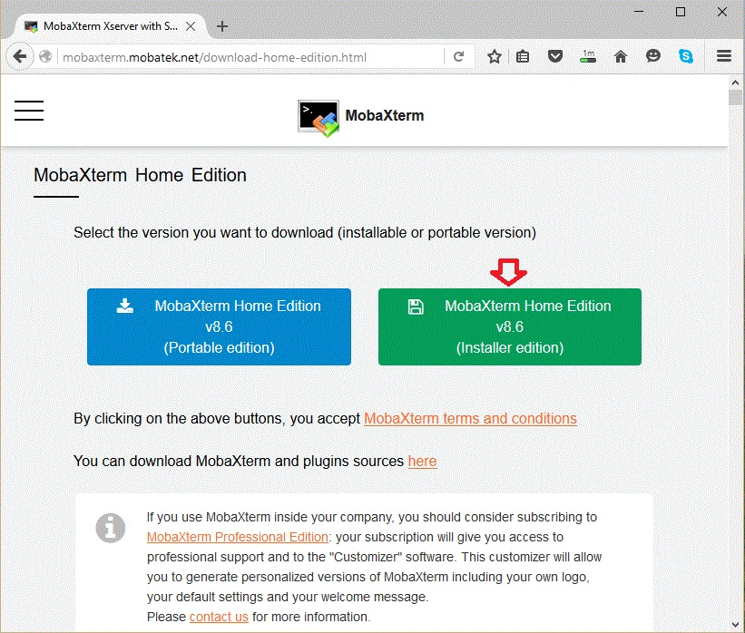

Once the program has been downloaded, install it as you would any other Windows program.

## Configuring SSH Sessions

Once the program is installed, start the MobaXterm program. You should see a screen like this:

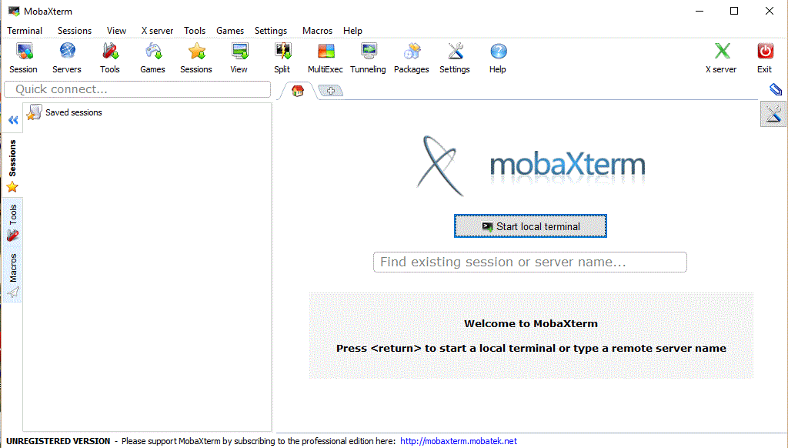

From this screen, click on the "Sessions" icon 

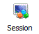

in the upper left corner.

On the "Session settings" screen, click on "SSH"

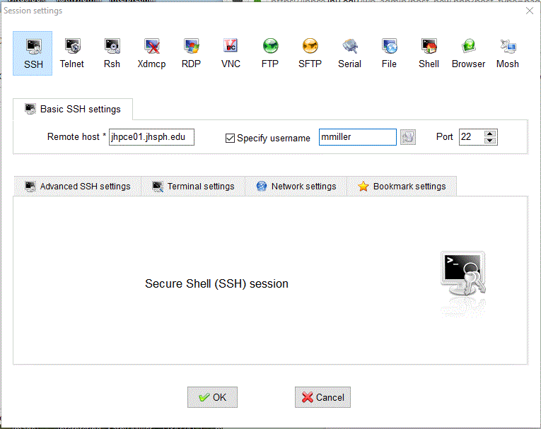

Enter "jhpce01.jhsph.edu" as the "Remote host". Click on the "Specify
username" checkbox, and enter your JHPCE username in the next
field. Then click the "OK" button.

When you click OK, you will initiate an SSH session to the JHPCE
cluster. You will be prompted for your Google Authenticator
"Verification Code", and then your password.

Once you enter your password correctly, you will see a number of
boxes pop up (usually 3) prompting for another Verification Code. Click
"Cancel on these boxes. You will then be prompted to save your
password. In the lower left, check the box that says "Do not ask this
again" and then click "No". (We will get rid of these annoying boxes in
a couple of steps).

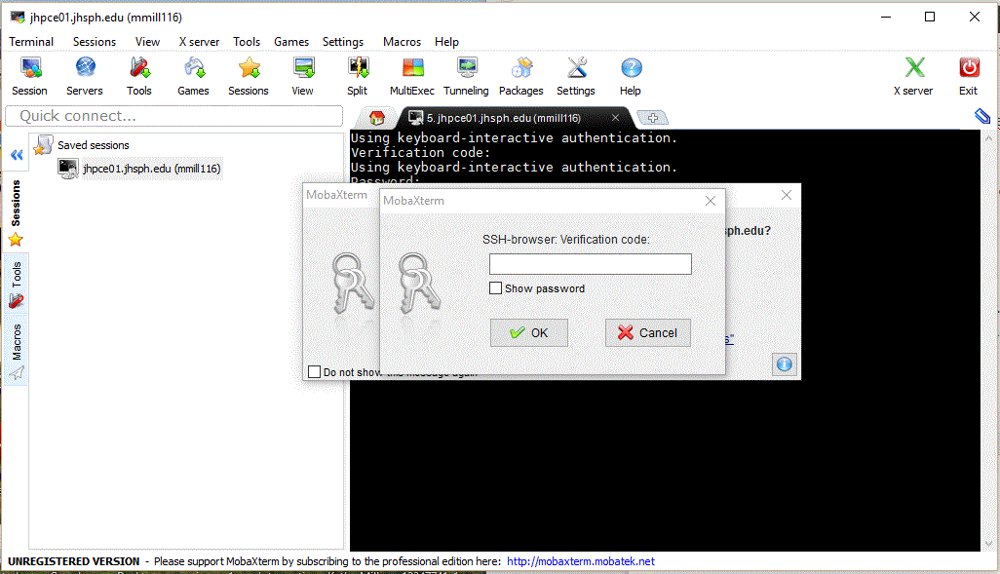

At this point you should be logged into the JHPCE cluster and sitting
at a shell prompt.

After you exit out of the JHPCE cluster, a "jhpce01" session will be
saved as a "Saved Sessions".  To login again, double-click on the
jhpce01 "Saved Session", and you should then be prompted for
"Verification Code" (which will come from Google Authenticator) and
"Password:"

## Configuring SFTP Sessions

If you use MobaXterm to access the JHPCE cluster, and you want to transfer
large files to ofr from the cluster, you should set up a separate SFTP session
in MobaXterm using the “jhpce-transfer01.jhsph.edu” data transfer node, rather
than the“jhpce03.jhsph.edu” login node. The “jhpce03.jhsph.edu” node is only
meant to be used for logging into the cluster, and not transferring large
files. The “jhpce03.jhsph.edu” node only has a 1 Gb/s network connection to the
JHU network, whereas the “jhpce-transfer01.jhsph.edu” node has a 40 Gb/s
connection. While an individual file transfers would not be able to achieve the
full 40Gb/s speed, it will be significantly faster than using the 1Gb/s
connection on the “jhpce03.jhsph.edu”

You can set up an SFTP session in MobaXterm using the following steps.

1. Startup MobaXterm.  You likely already have a “jhpce03.jhsph.edu” session
configured for logging into the JHPCE cluster
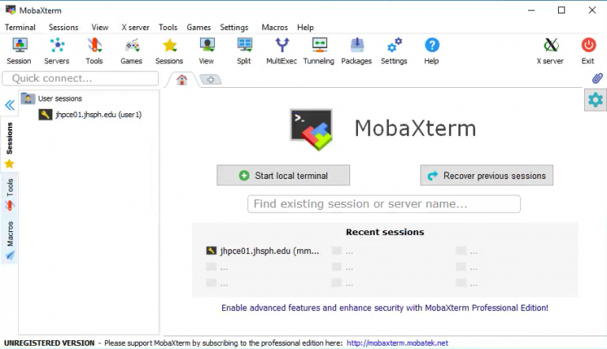
2. Click on the “Session” icon in the upper left corner.  This will bring up a
   window where you can create new sessions.
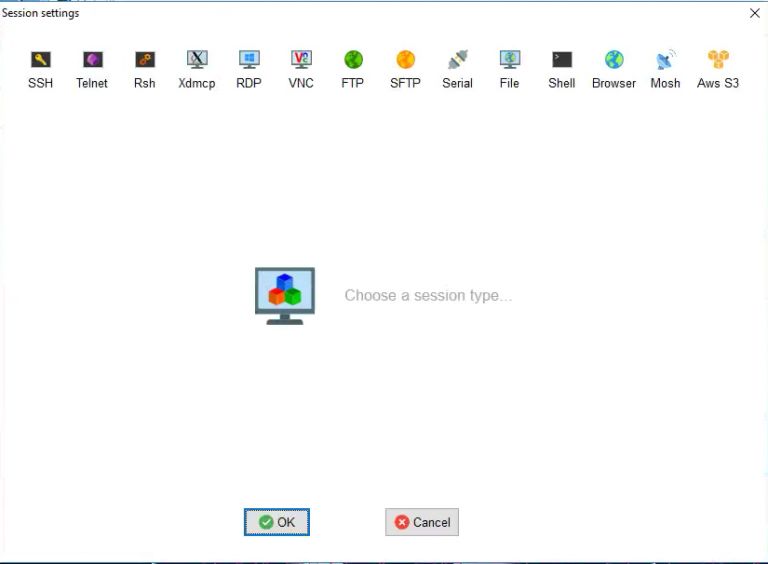
3. Select “SFTP”
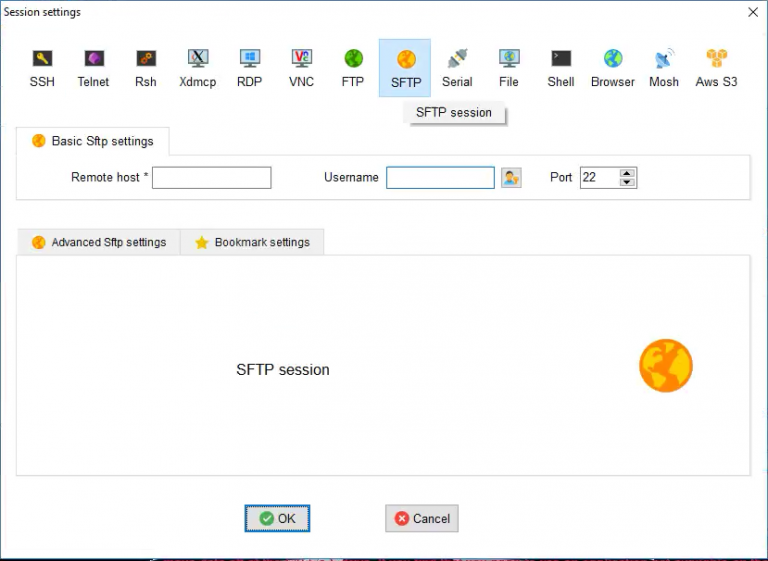
4. In the “Remote host” field, enter jhpce-transfer01.jhsph.edu.  In the
   “Username” field, enter your JHPCE user ID.
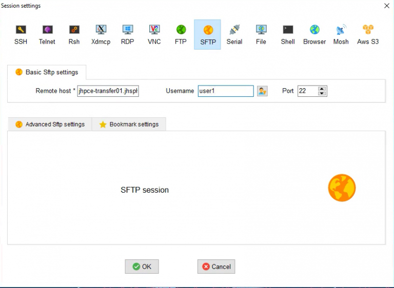
5. Click on the “Advanced Sftp Setting” tab.
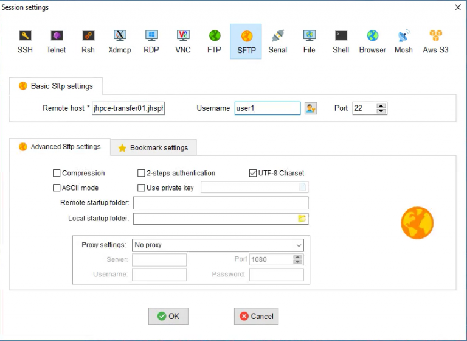
6. Check the box marked “2-steps authentication”.  Optionally, if you have an
   SSH key, you can check the “Use private key” box, and then enter the path to
your private key.
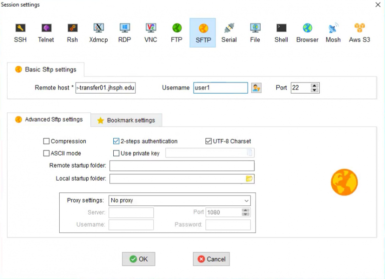
7. When you click “OK”, you will be prompted for you “Verification Code” (which
   will be from Google Authenticator) and “Password”.  After you enter your
password, you will be prompted to “Save Password?”, and be sure to respond
“No’.
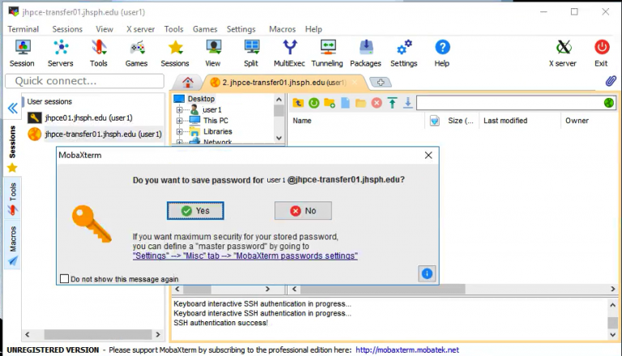
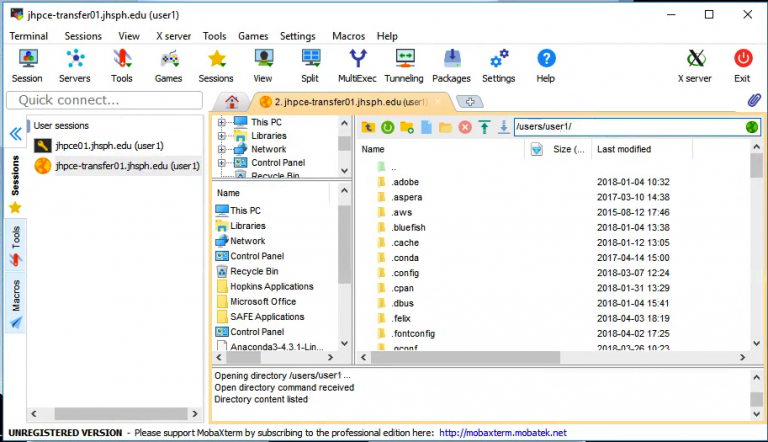
8. You should now see the list of files your home directory from the JHPCE
   cluster displayed on the screen.  You can transfer files to and from the
JHPCE cluster by dragging-and-dropping them onto this file list.
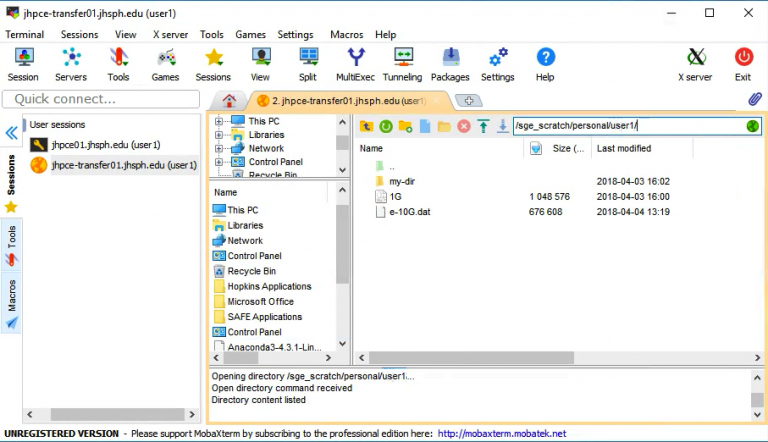
9. To access you scratch space, you can enter the path
   “/fastscratch/myscratch/USERID” (where USERID is your JHPCE cluster user id.
10. When you are done with your sftp session, you can close the session by
    clicking on the red X on the “jhpce-transfer01” tab.  This red X will show
up when you hover your cursor over the right hand side of the tab.

    
## OPTIONAL -- Setting up SSH Keys in MobaXterm:
To make logging in more streamlined and avoid the pop-up windows when
you login, you can create an SSH key pair in MobaXterm. Before
starting you should login to the JHPCE cluster in MobaXterm using your
Google Authenticator and Password. Once you are logged in:

Click on "Tools -\> MobaKeyGen"

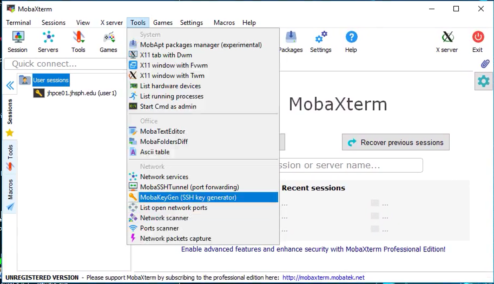

You should then see the "MobaXterm SSH Key Generator" Screen. Click
on "Generate", and you will be prompted to move the mouse around to
generate random data.

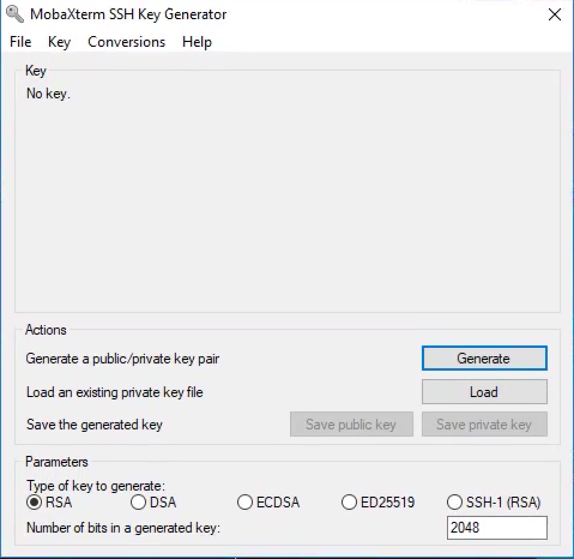

Move your mouse until the green bar fills up.

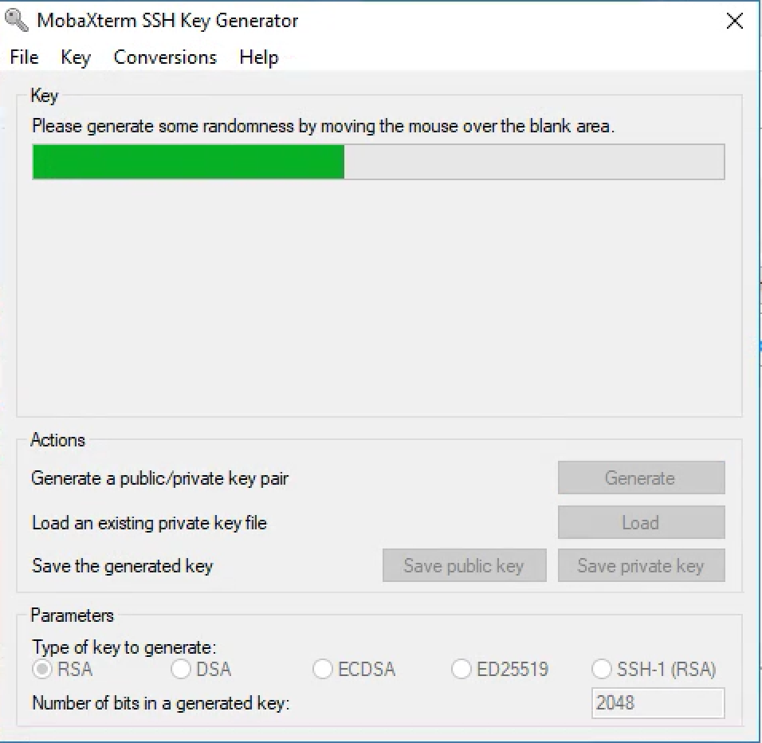

Once the green bar fills up, you should see a populated screen.

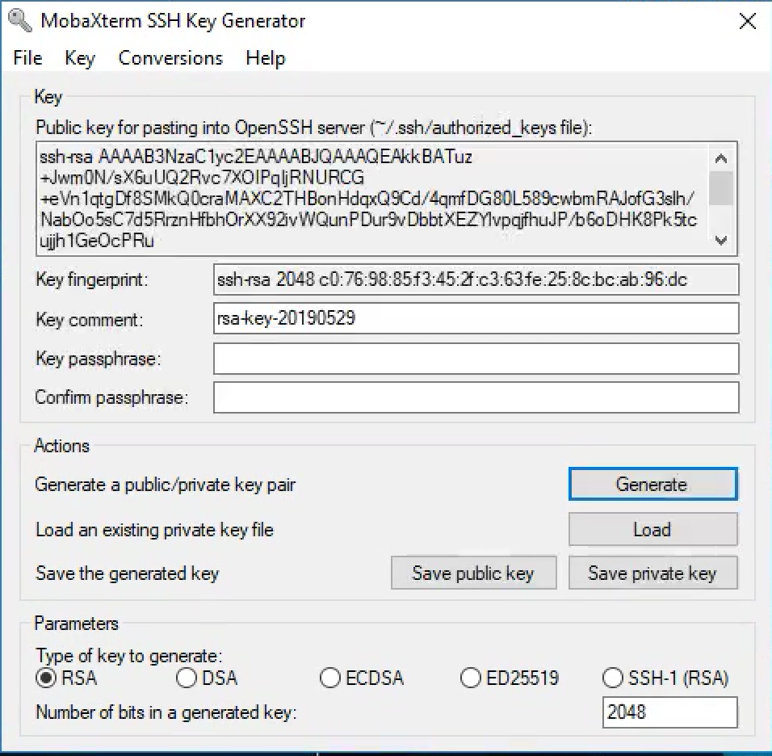

For security purposes, we strongly recommend you protect your key with
a password.  To do so, enter a password in the "Key passphrase" and
"Confirm passphrase" boxes. Next, click "Save private key", and save
the key to a know locationon your local laptop/desktop (such as you
"Documents directory).

Now, at the top of the window you'll see the text version of your public
key. Copy the contents of this output with your mouse, making sure to
scroll all the way to the bottom of the text box.  NOTE: to do
Copy/Paste in MobaXterm, you should not use \<CTRL\>-C and \<CTRL\>-V.
Instead, select the text you want to copy, then use the right mouse
button to bring up the context menu, and select  Copy or select Paste
when you are pasting.

Now, go back to the tab where your JHPCE ssh session is running.
From your home directory, cd into the .ssh directory. In this
directory, you will need to update the file `authorized_keys`. Edit
this file with your text editor of choice (nano, vi, emacs) as shown
below. If the file does not exist, you can also create the file with
the command below.

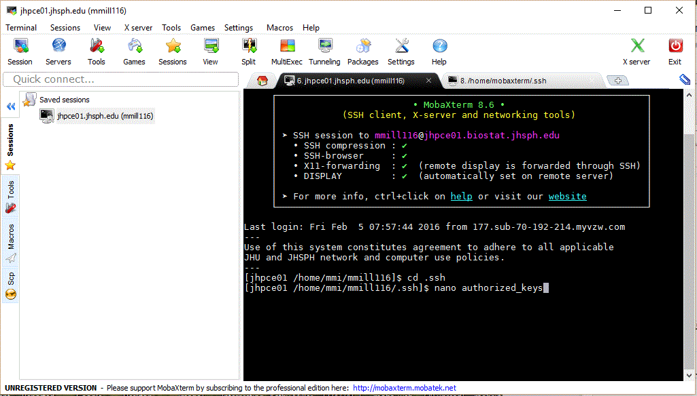

Paste in the public key that you copied from your local session.
Depending on your editor, the new key may only show up on one long
line, or it may wrap to multiple lines. Save the "authorized\_keys"
file when you are done.

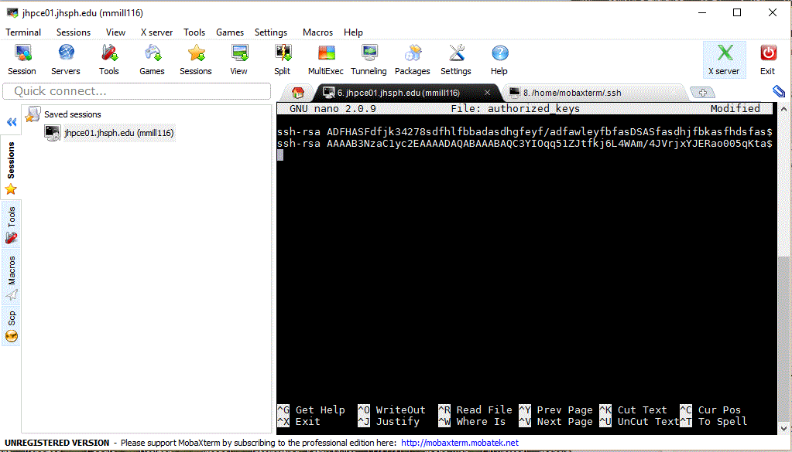

If you assigned a passphrase to your key (and you really should have)
we need to make a couple of extra steps to allow the passphrase to be
entered only once, instead of every time you start a new login
session.

+ First go to "Settings-\>Configuration" and go to the "General" tab and click on "MobaXterm password management"
+ At the top of the window where it says "Save sesison passwords", you should click "Ask"
+ Also be sure to check the "Save SSH keys passphrase as well" box
+ Then click "OK"

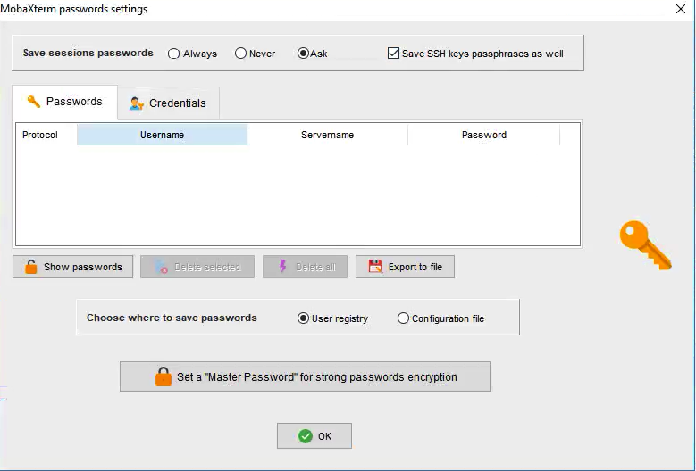

+  Next on the "Configuration Window" go to the "SSH" tab, and at the
   bottom of the screen check the "Use internal SSH agent "MobAgent"
+  Just below this checkbox, click the "+" sign on the right side of
   the "Load Following Keys" screen, and navigate to your "Private
   Key", and select it.

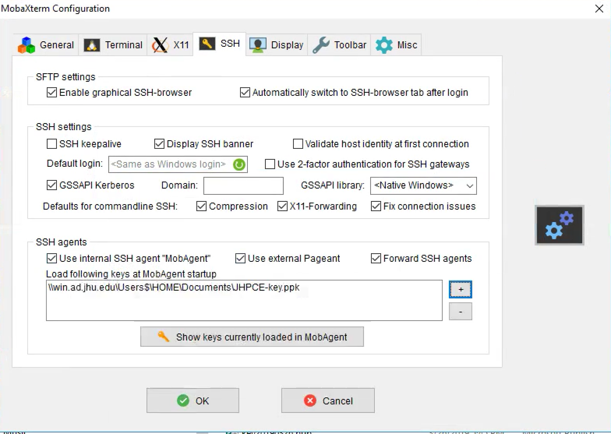

Then click OK. You will be prompted to restart Mobaxterm. Go ahead and
restart it. When you MobaXterm restarts, you will be prompted to enter
your passphrase for your private key.

The final step will be to add your key to the JHPCE session in the
MobaXerm application. On the left pane of MobaXterm, you should see a
list of "Saved sessions", including a session for the "jhpce01" login
node. Right-Click on the "jhpce01" session, and select "Edit Session".
This will open a window that looks like:

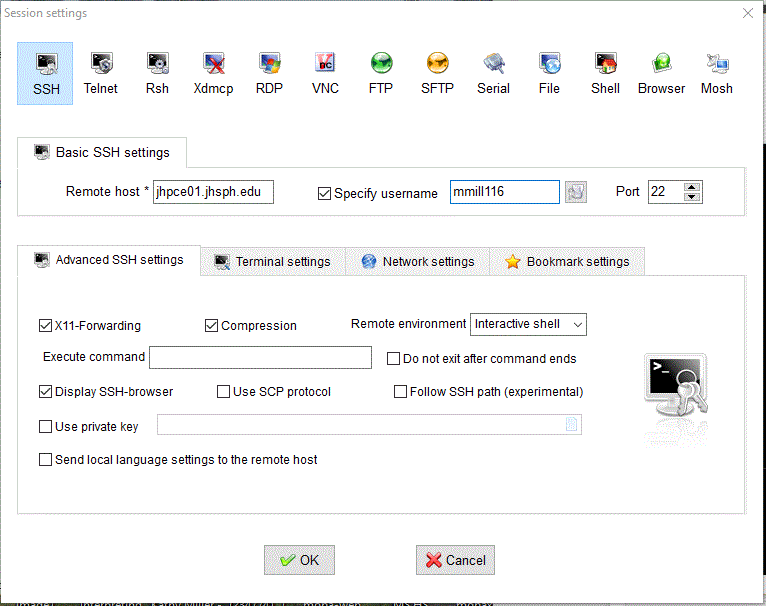

+ Select the "Use private key" checkbox.
+ The field next to the checkbox should populate with a path to your
local private key. If it does not, or it is not the correct path, then
click the blue icon on the right side of the field, and navigate to
the location of your "private key" file.

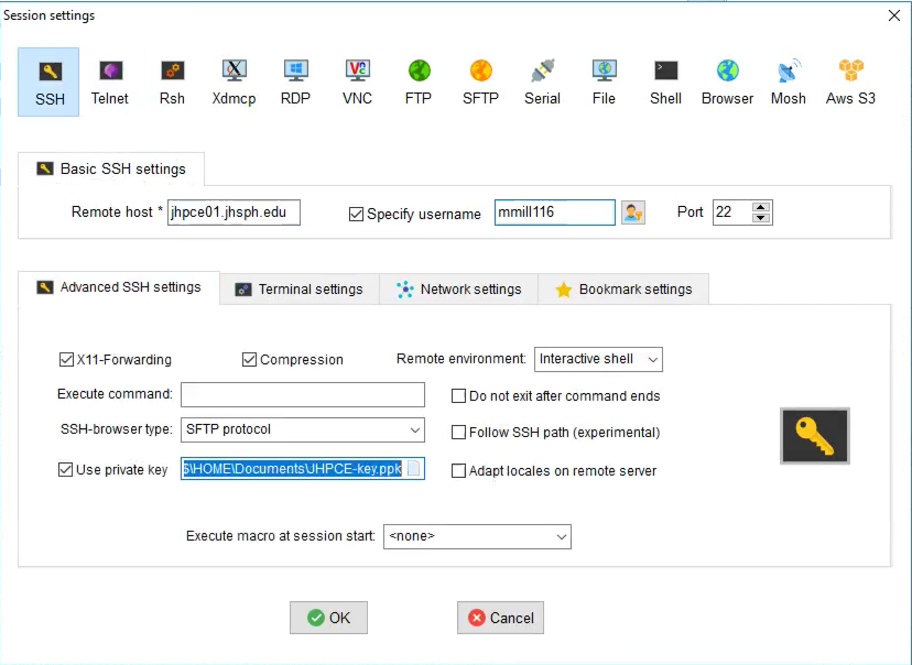

+ Click OK to save your changes.
+ Now, in the left pane of Saved Sessions, you should be able to
double click on the "jhpce01" session, and a new tab should open up,
and log you into the JHPCE cluster without having to enter a password
or Google Authenticator PIN.
+ Once you have verified that you can login, exit out of all of your
SSH sessions, and close the MobaXterm app.  Reopen the MobaXterm
application, double click on the "jhpce01" session.  As before, a new
tab should open up, and log you into the JHPCE cluster without having
to enter a password or Google Authenticator PIN. 
