---
tags:
  - in-progress
---
# Mobaxterm Configuration 
Mobaxterm is a Windows application that provides an ssh client, scp
client and X11 server all in one program.  It is a very convenient tool
for accessing and utilizing the many features of the two clusters we maintain (named JHPCE and JADE). ("We" is an organization known as JHPCE, so it has become a bit confusing.)

This FAQ
will take you through the steps needed to configure Mobaxterm.  Before
your proceed you should have your Google or Microsoft Authenticator app available. (You can use other One Time Password (OTP) programs, on a smart phone or a computer. We default to saying Google Authenticator.)

## Our two clusters require different settings
The images in this page were generated with respect to using MobaXterm in our JHPCE cluster. The JADE cluster uses different login & transfer servers and different TCP/IP ports for SFTP transfers.  ==JADE users need to evaluate what you read/see and adjust accordingly!!==  We try to call out the changes below, but you should not blindly replicate what you see.

|Cluster|Login|Transfer|SFTP Port|
|-------|-----|--------|---------|
|JHPCE|jhpce01.jhsph.edu jhpce03.jhsph.edu|jhpce-transfer01.jhsph.edu|port 22 (the default)|
|JADE|jade01.jhsph.edu|(in the future) jade-transfer01.jhsph.edu|see [this page](https://jhpce.jhu.edu/jade/access/sftp-transfers/)|

## Download
The first thing you will need to do is download the MobaXterm program from their web site
[http://mobaxterm.mobatek.net/download-home-edition.html](http://mobaxterm.mobatek.net/download-home-edition.html)

Be sure to use the "Installer Edition" instead of the "Portable Edition" (The Portable Edition does not save your previous Sessions, forcing you to configure one every time.) The Professional Edition is only needed if you want to get support from the vendor.

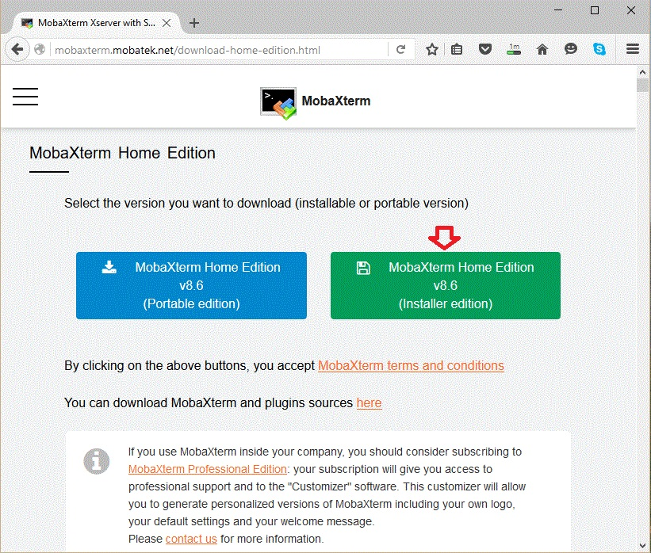

Once the program has been downloaded, install it as you would any other Windows program.

## Configuring SSH Sessions

Once the program is installed, start the MobaXterm program. You should see a screen like this:

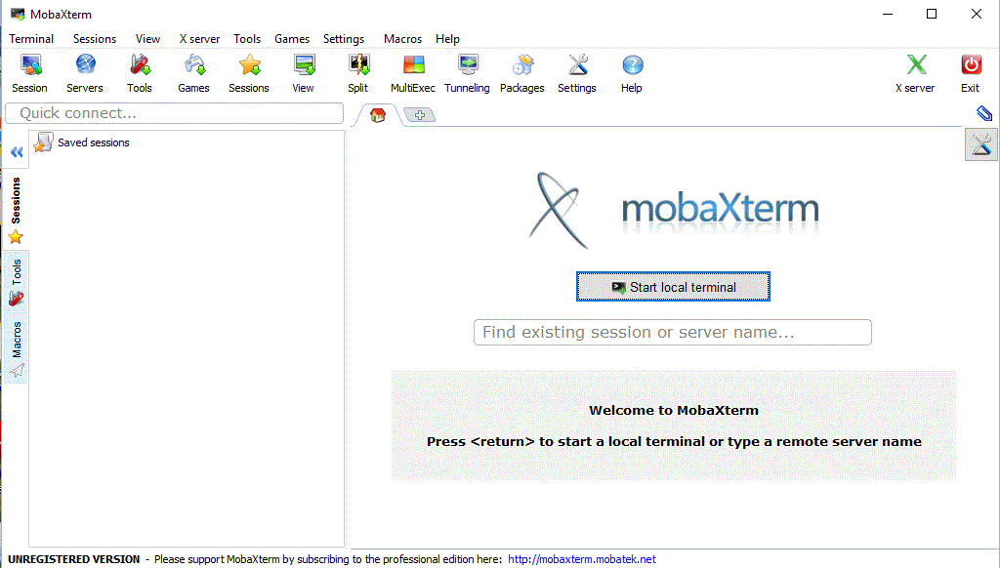

!!! warning
    Do not ever use "Start local terminal" and then ssh or sftp from inside it. It doesn't work reliably enough to support. Always create a "Session" (using that left-hand-most icon) of the right network protocol.

From this screen, click on the "Sessions" icon 

in the upper left corner.

On the "Session settings" screen, click on "SSH"

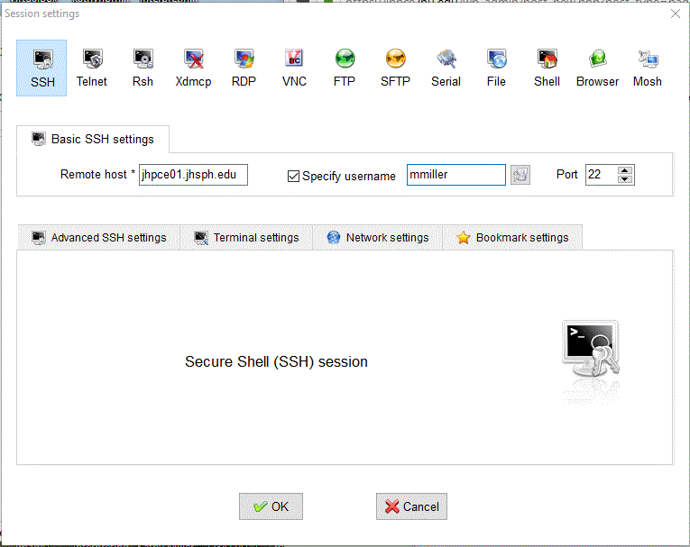

Enter the appropriate fully qualified domain host name in the "Remote host" field (see the chart at mobaxterm.md#our-two-clusters-require-different-settings). Click on the "Specify
username" checkbox, and enter your JHPCE or JADE username in the next
field. Then click the "OK" button.

When you click OK, you will initiate an SSH session to the JHPCE or JADE
cluster. You will be prompted for your Google Authenticator
"Verification Code", and then your password. (We use "Verification Code",  "code" and "OTP" interchangeably.)

!!! Warning
    Verification codes are only good for one use, whether or not you successfully log in. 
    We advise against using your mouse to select, copy and paste usernames, passwords and codes when setting up your account for the first time. Too frequently people inadvertently copy in an extra character, such as a trailing space. They think they're entering something they're not and are confounded when they cannot login.

You will see a number of boxes pop up. You will be prompted to save your
password. In the lower left, check the box that says "Do not ask this
again" and then click "No". Another prompts for a Verification Code -- enter it.  (JHPCE users can get rid of the need to enter verification codes in a couple of steps.) 

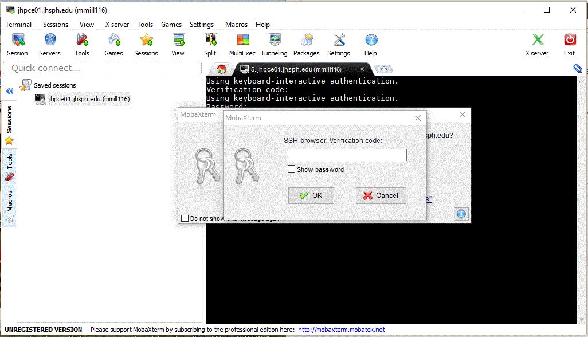

At this point you should be logged into the cluster and sitting at a shell prompt.

!!! warning "Always log out correctly"
    We advise against closing the MobaXterm application or the tab within the program as your first step. Always type "exit" at the shell prompt first. You want to give the cluster computer the chance to clean up properly.
    
After you exit out of the cluster, the  session will be saved as a "Saved Session" and given a name reflecting the server you configured it to use, e.g. "jhpce01".  These can be accessed in several ways, such as by clicking on the gold star icon in the center of the tool bar if the "Quick connect..." pane is hidden.

To login again, double-click on the appropriate saved session, and you should then be prompted for your password and
verification code (which you get from Google Authenticator).

## Configuring SFTP Sessions

### What server to use?

If you use MobaXterm to transfer files into or out of the JHPCE or JADE clusters, you need to consider which server to use. 

Our login servers are acceptable to use when transferring small amounts of data, where small is less than 5GB.

The JHPCE cluster has a "transfer" server (`jhpce-transfer01.jhsph.edu`) which should be used for everything more intensive. It is connected to the rest of Hopkins at 40 Gb/sec rather than the 10 used on the login nodes. Also, the login nodes are critical for everyone to use the cluster, while the transfer node is meant for that purpose.

The JADE cluster has, in May 2026, only a login server. We are planning to create a transfer server this summer. ==JADE users must use non-standard TCP/IP ports as documented [here](../jade/access/sftp-transfers.md).==  JADE users can follow the following MobaXterm configuration instructions if they substitute in the correct hostnames and TCP/IP ports.

!!! warning "You must interpret these screenshots/instructions"
    Do not blindly enter choices. These examples are based on configuring SFTP access to the JHPCE cluster.

### Configure an SFTP Session
You can set up an SFTP session in MobaXterm using the following steps.

1. Start MobaXterm.  You likely already have a “jhpce01.jhsph.edu” session
configured for logging into the JHPCE cluster
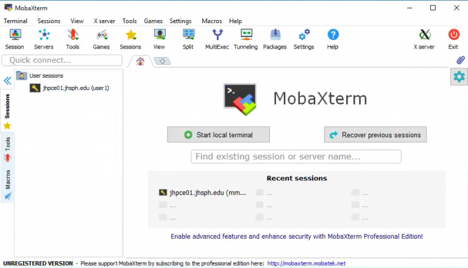
2. Click on the “Session” icon in the upper left corner.  This will bring up a
   window where you can create new sessions.
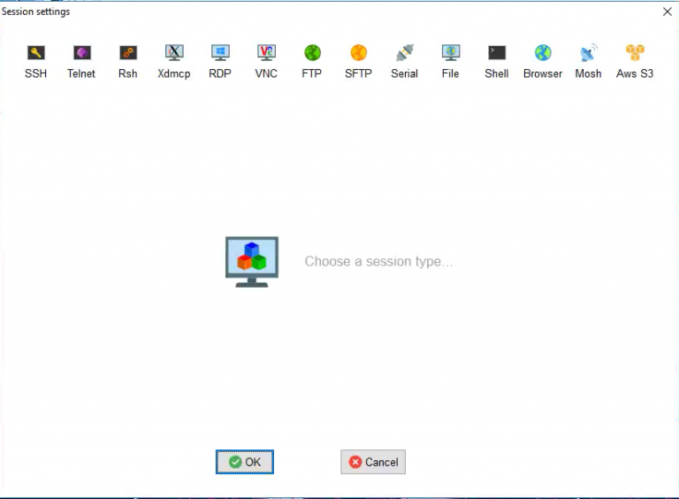
3. Select “SFTP”
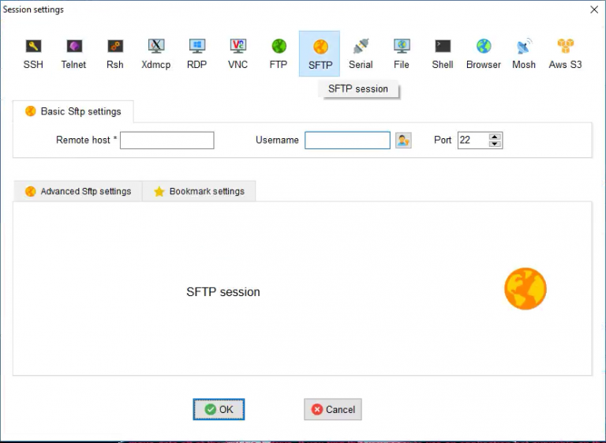
4. In the “Remote host” field, enter jhpce-transfer01.jhsph.edu.  In the
   “Username” field, enter your JHPCE user ID.
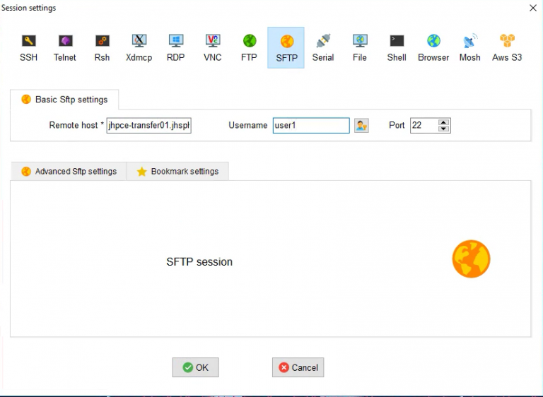
5. Click on the “Advanced Sftp Setting” tab.
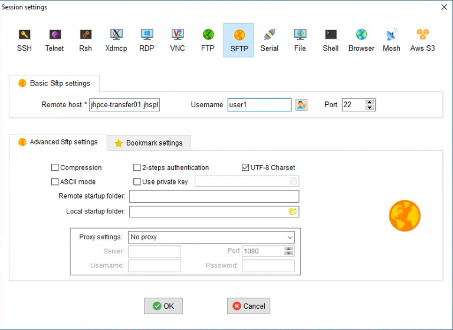
6. Check the box marked “2-steps authentication”.  Optionally, if you have an
   SSH key, you can check the “Use private key” box, and then enter the path to
your private key.
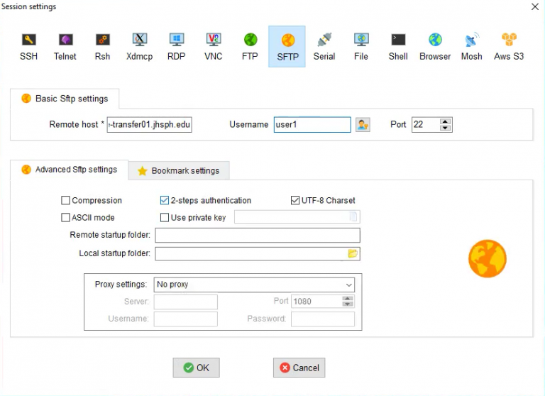
7. When you click “OK”, you will be prompted for you “Verification Code” (which
   will be from Google Authenticator) and “Password”.  After you enter your
password, you will be prompted to “Save Password?”, and be sure to respond
“No’.
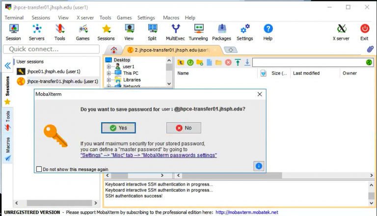
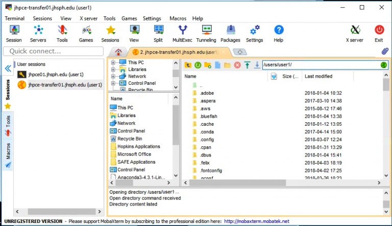
8. You should now see the list of files your home directory from the JHPCE
   cluster displayed on the screen.  You can transfer files to and from the
JHPCE cluster by dragging-and-dropping them onto this file list.
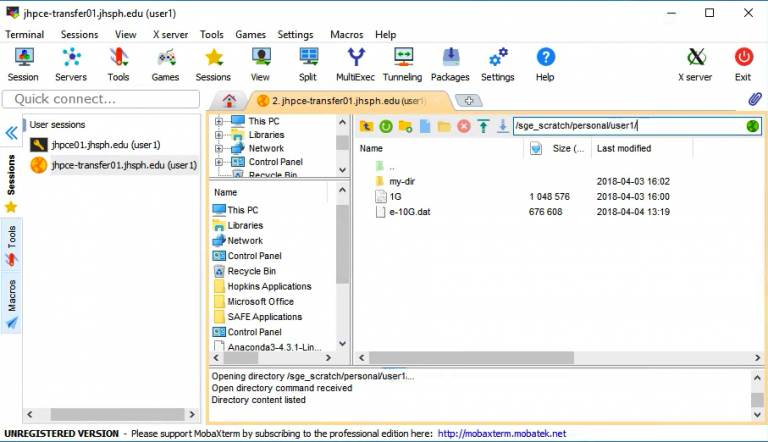
9. To access you scratch space, you can enter the path
   “/fastscratch/myscratch/USERID” (where USERID is your JHPCE cluster user id.
10. When you are done with your sftp session, you can close the session by
    clicking on the red X on the “jhpce-transfer01” tab.  This red X will show
up when you hover your cursor over the right hand side of the tab.

    
## Setting up SSH Keys in MobaXterm

### Why?
This is an optional step for JHPCE cluster users (==but not for JADE users== -- they are not allowed to use SSH key pairs) to streamline their JHPCE login process.

JHPCE and JADE require Multi-Factor Authentication (MFA). MFA refers to requiring one or more additional credentials (factors) beyond a username and password. JHPCE supports using either a OTP code or public key cryptography. JADE requires the use of a OTP code.

SSH programs (of which SFTP is one) support public key cryptography. We discuss them [here](access/ssh.md/#ssh-keys-more-info). This technology uses a pair of two keys, one "private" and the other "public".

MobaXterm can be configured to use public keys, whether they are ones you have generated using another tool, or generated with MobaXterm. We show here how to do the latter.

### Creating a SSH key pair in MobaXterm 

Before starting, log into the JHPCE cluster in MobaXterm using your OTP code and password. This will allow you to be logged in and stay logged in while you test the resulting configuration.

These old screenshots show the use of an "RSA" type of key. ==In 2026 a better type is "ED25519"==.  You will not experience any difference in operation because of this choice -- you'll only see  "ed25519" instead of "rsa" in various places.

Once logged in:

Click on "Tools -\> MobaKeyGen"

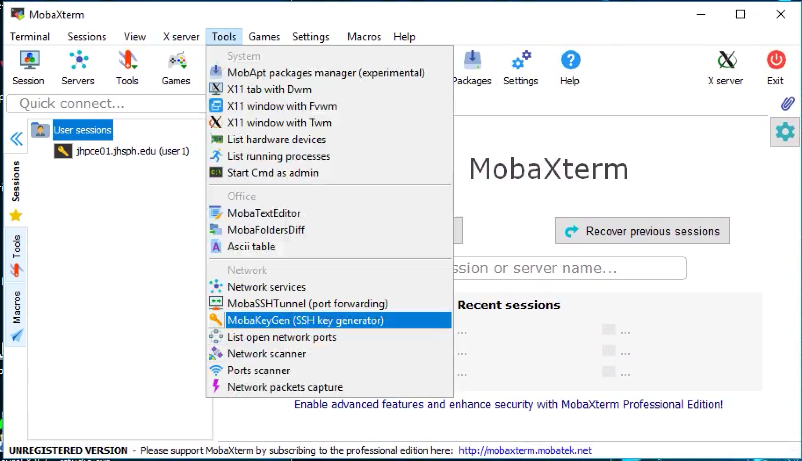

You should then see the "MobaXterm SSH Key Generator" Screen. ==Click on the radio button labeled "ED25519"==, verify that the "Number of bits in a generated key" field is "256", then click the "Generate" button.

You will be prompted to move the mouse around to
generate random data to make the encryption stronger.

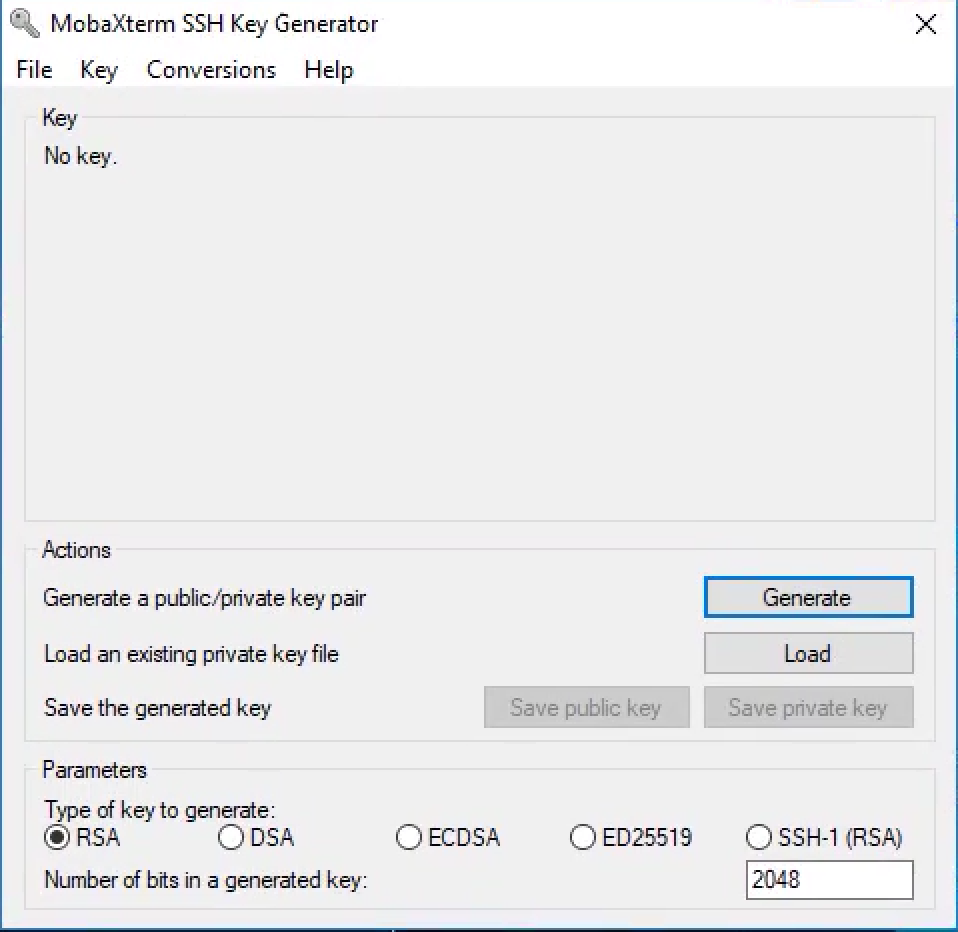

Move your mouse until the green bar fills up.

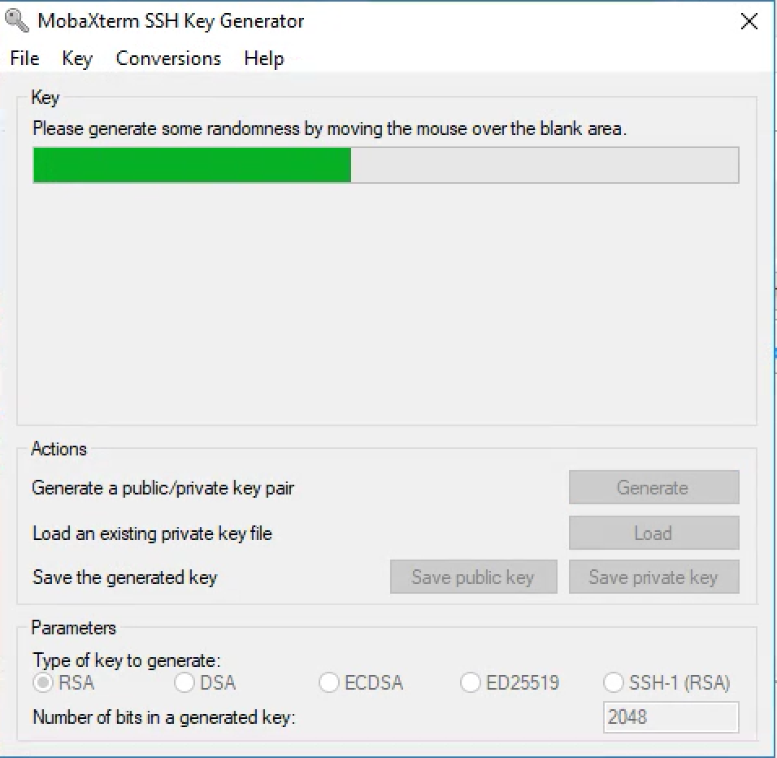

Once the green bar fills up, you should see a populated screen (except that ed25519 will show up where rsa is seen here).

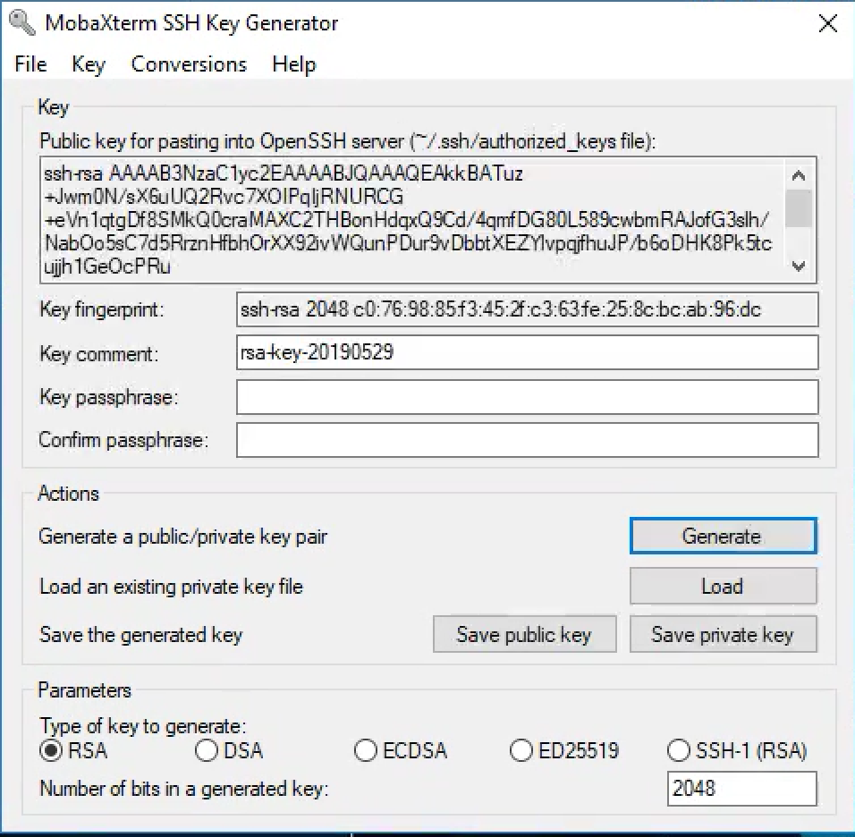

For security purposes, we strongly recommend you protect your key with
a passphrase. Document this for yourself somewhere secure.

To do so,

1. enter a password in the "Key passphrase" and "Confirm passphrase" boxes.
2. Next, click "Save private key", and
3. save the key to a known location on your local laptop/desktop (such as you
"Documents" directory).

Now, at the top of the window you'll see the text version of your public
key. Copy the contents of this field with your mouse, making sure to
scroll all the way to the bottom of the text box. 

NOTE: to do Copy/Paste in MobaXterm, you should not use \<CTRL\>-C and \<CTRL\>-V.
Instead, select the text you want to copy, then use the right mouse
button to bring up the context menu, and select Copy (or select Paste
when you are pasting).

Now, go back to the tab where your JHPCE ssh session is running.

Change into your account's .ssh directory with "cd ~/.ssh/" In this
directory, you will need to update or create the file `authorized_keys`. Edit
this file with your text editor of choice (nano, vi, emacs) as shown below.

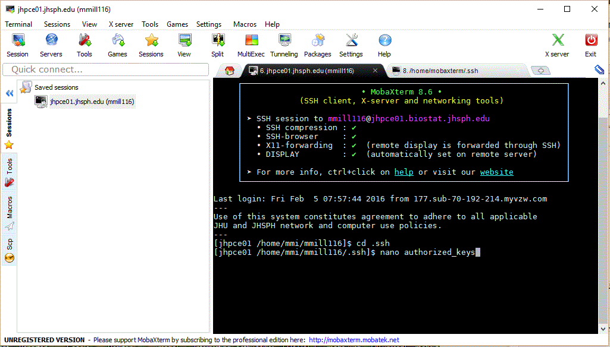

Paste in the public key that you copied from your local session. Depending on your editor, the new key may only show up on one long line, or it may wrap to multiple lines, but it ==must be in one logical line==. (The example image shows _two_ different public keys in this person's file. It is best practice to use different public-private key pairs for different organizations.)

Save the `authorized_keys`file when you are done.

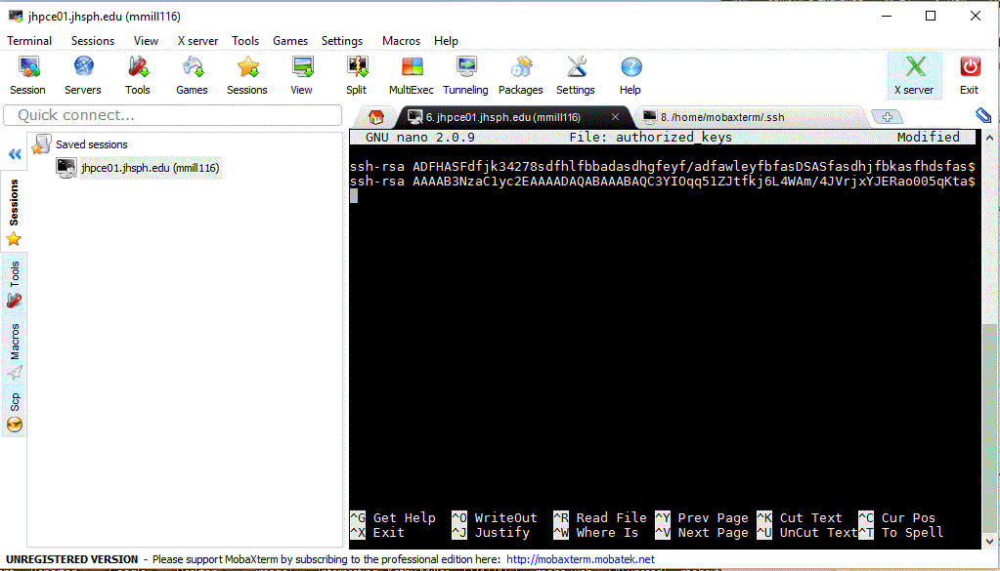

### Configure MobaXterm to use your new SSH key pair

#### First we configure MobaXterm as a whole
If you assigned a passphrase to your key (and you really should have), these steps will allow you to enter the passphrase (which protects your key pair) only once, instead of every time you start a new login session.

1. First go to "Settings-\>Configuration", then go to the "General" tab and click on "MobaXterm password management"
2. At the top of the window where it says "Save session passwords", you should click "Ask"
3. Also be sure to check the "Save SSH keys passphrase as well" box
4. Then click "OK"

??? warning "if you are tempted to click on the Set a Master Password for strong passwords encryption button (click to open)"
    Carefully consider this choice. What that will do is create a password that controls access to your MobaXterm configuration. You will need to provide it each time you launch MobaXterm. It is not a terrible idea, but it WILL mean that you need to understand which password does what, and keep track of them.
    You will have this list of passwords to manage (all of which are independent of each other):
    1. your JHED password for Hopkins
    2. your MobaXterm master password
    3. your JHPCE or JADE cluster password
    4. your SSH key pair passphrase.

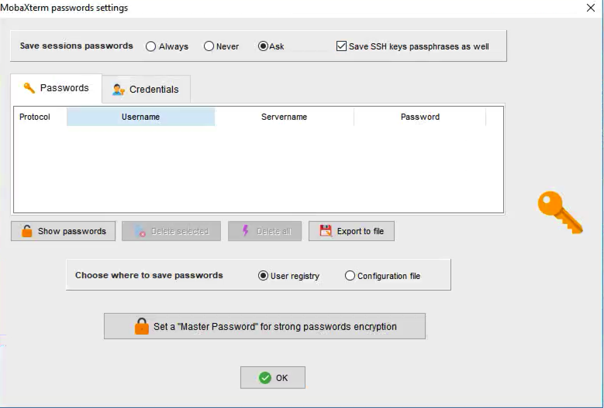

1. Next on the "Configuration Window" go to the "SSH" tab, and at the bottom of the screen check the "Use internal SSH agent "MobAgent"
2. Just below this checkbox, click the "+" sign on the right side of the "Load Following Keys" screen, and navigate to your private key file (whereever you saved it), and select it.
3. Click the OK button. 

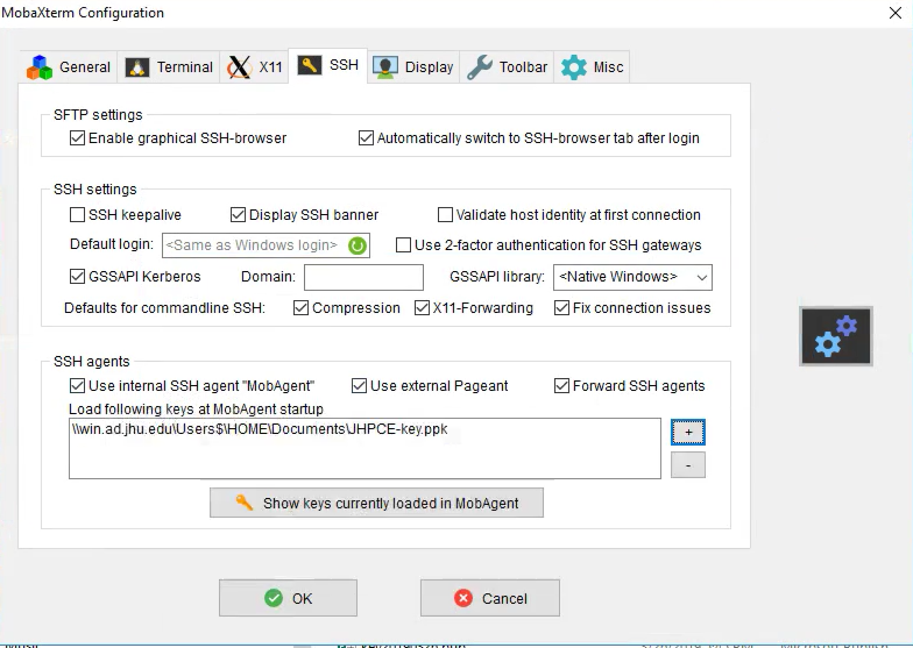

You will be prompted to restart Mobaxterm. Go ahead and restart it. When you MobaXterm restarts, you will be prompted to enter your passphrase for your private key.

#### Now we configure existing MobaXterm sessions
The final step will be to add your key to the saved session(s) in the
MobaXterm application. In the left "Quick connection..." pane of MobaXterm, you should see a list of saved sessions, including a session for the "jhpce01" (or "jhpce03") login node. Right-Click on the "jhpce01" session, and select "Edit Session".
This will open a window that looks like:

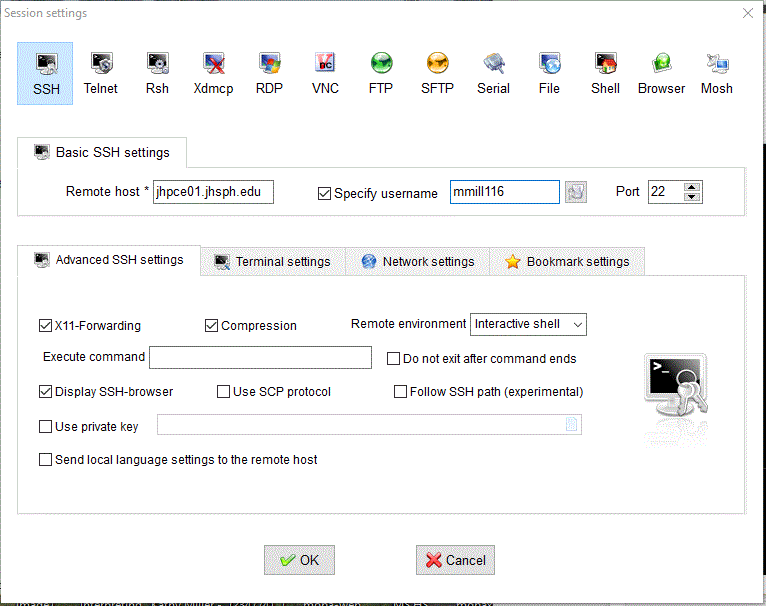

1. Select the "Use private key" checkbox.
2. The field next to the checkbox should populate with a path to your
local private key. (If it does not, or it is not the correct path, then
click the blue icon on the right side of the field, and navigate to
the location of your "private key" file.)

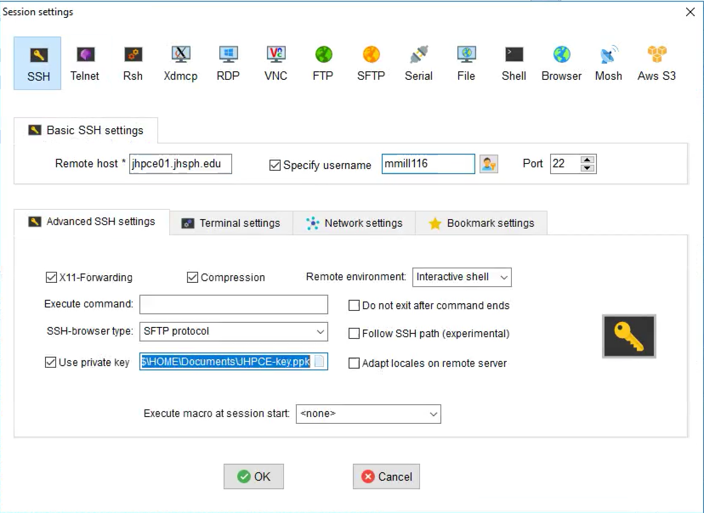

3. Click OK to save your changes.

#### Now test the changes
1. In the left pane of Saved Sessions,
double click on the "jhpce01" session. A new tab should open up in the horizontal tab bar, and log you into the JHPCE cluster without your having to enter a Google Authenticator code.
2. Once you have verified that you can login, exit out of all of your
SSH sessions by entering "exit" in each shell, and close the MobaXterm app.
3. Reopen the MobaXterm
application, double click on the "jhpce01" session.  As before, a new
tab should open up, and log you into the JHPCE cluster without having
to enter a Google Authenticator PIN. 
