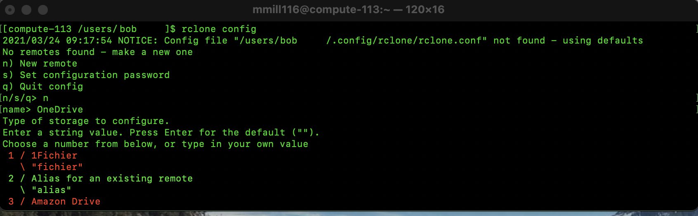
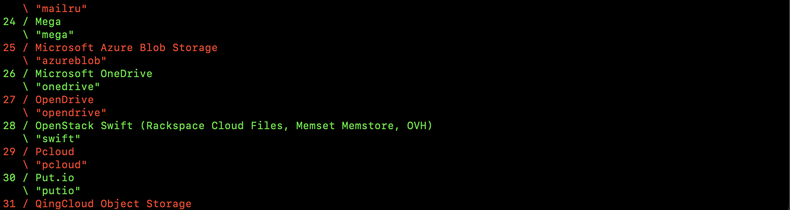
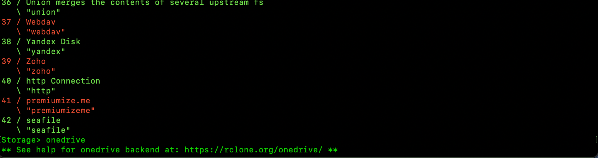
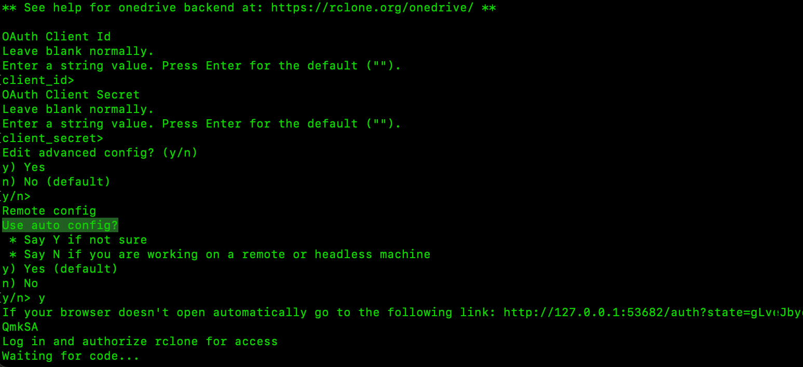
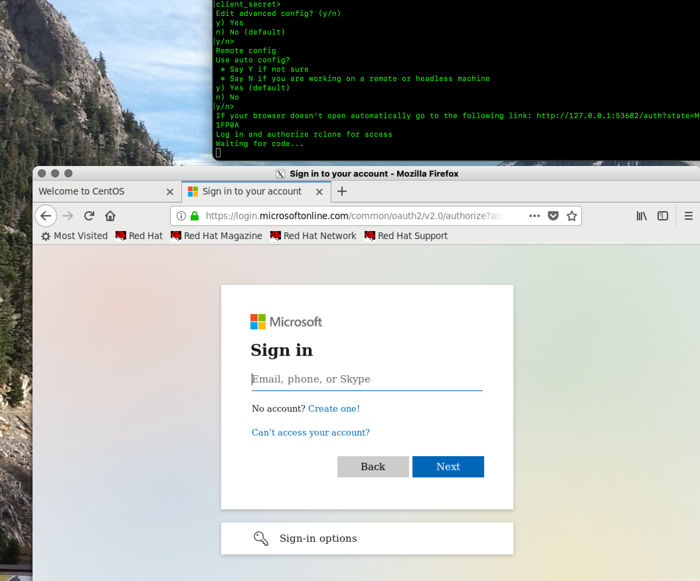
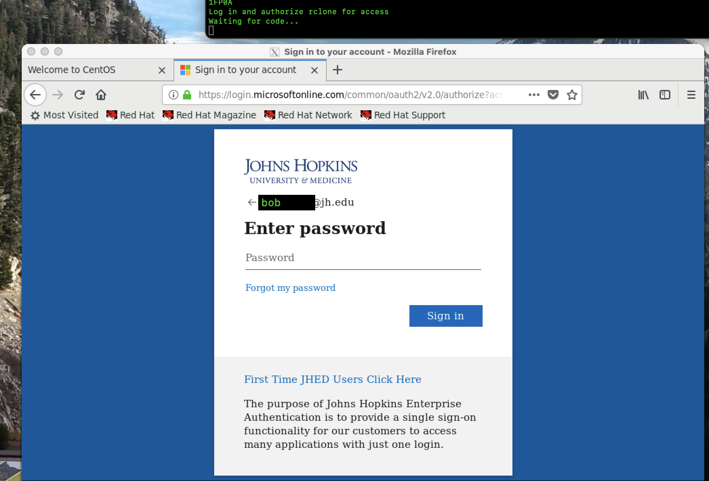
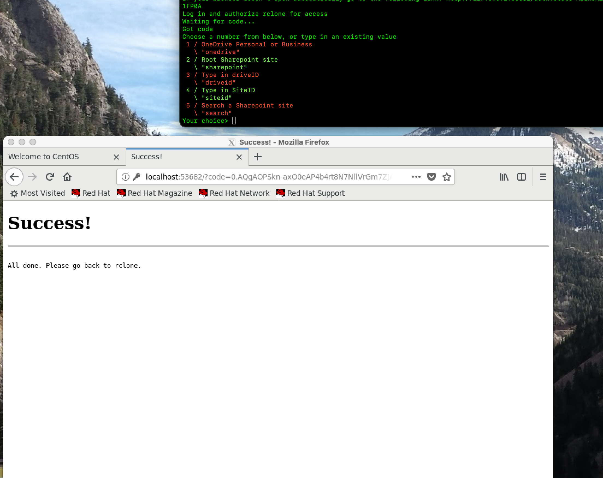
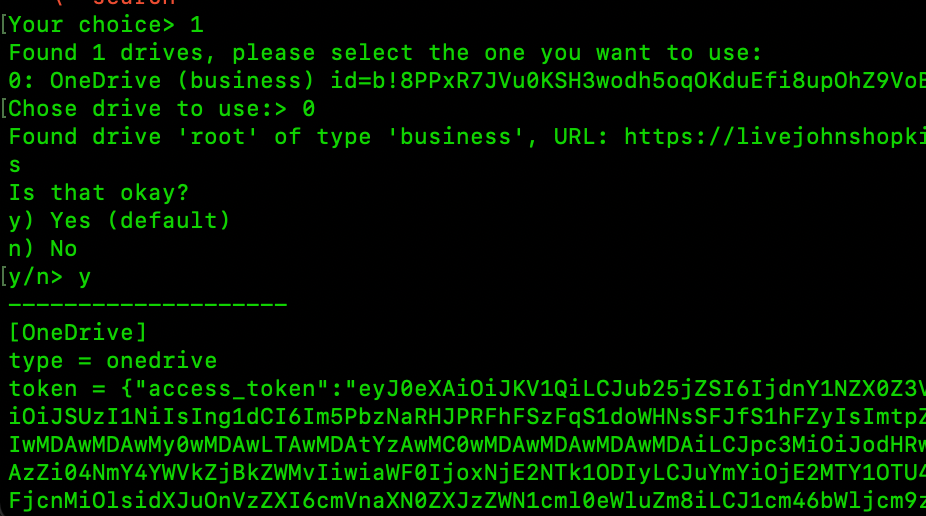
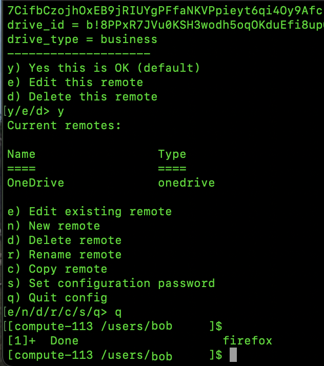

---
tags:
  - needs-review
---
# Using rclone to access OneDrive

Below is an example of using rclone to access the OneDrive network resource on the JHPCE cluster.  The initial setup is a bit involved, but [regular operation](#regular-operation) is fairly straightforward.

## One-time Configuration

Before you start, you will need to have an X11 graphical environment set up either by using [MobaXterm](https://mobaxterm.mobatek.net) on a Windows system or [Xquartz](https://www.xquartz.org) on a Mac.  

To start using rclone to access Onedrive, login to the cluster as normal, and then srun into a compute node with a 10G RAM request (srun –-pty –-x11 –-mem=10G bash ) .  

Part of the rclone setup process will involve using a web browser to generate an authentication key.  Before starting the rclone configuration process, you should set your web browser on the cluster to use Chromium with the ```xdg-settings``` command.  When the browser does start, you may see a stream of warning message about “libGL errors”, but these are because we are using X11 forwarding and not a local graphics card, and assuming the browser starts up acter a few seconds, those messages can be ignored.

```
[compute-113 /users/bob]$ xdg-settings set default-web-browser chromium-browser.desktop
```

Now, from your srun session, you will need to run “module load rclone”, and then run “rclone config” to begin the rclone setup.

```console
[jhpce01 /users/bob]$ srun --pty --x11 –-mem=10G bash
[compute-113 /users/bob]$ module load rclone
[compute-113 /users/bob]$ rclone config
NOTICE: Config file "/users/bob/.config/rclone/rclone.conf" not found - using defaults"
No remotes found - make a new on
n) New remote
s) Set configuration password
q) Quit config
n/s/q> n

```

When prompted to “make a new remote”, enter “n” for “new remote”.
When prompted for a name, enter something descriptive, like “OneDrive”.
Next, you will be presented with a long list of storage types.



. . .



. . .



When prompted for the type of storage to use, enter “onedrive”.
When prompted for “Oauth Client ID”, just hit enter.
When prompted for “Oauth Client Secret”, just hit enter.
When prompted to “Edit advanced config”, just hit enter to use the default “No” answer.
When prompted to “Use auto config?”, enter “y”.
At this point you’ll see a URL with “http://127.0.0.1” in the address, and get a message “Waiting for code…”



Also at this point, the Chromium browser should open a new tab, and start going to the http://127.0.0.1 address, which should redirect you to the Microsoft login page.



From here, you should enter “JHEDID@jh.edu”. Where of course you specify your own JHEDID. You will then be sent to the familiar “Johns Hopkins” JHED Login screen, where you should enter your JHED password.



When prompted to “Save your login”, you should select “Don’t Save”.
You should then see in the web browser display, a “Success!” message, and in your “srun” session, you should see the message “Got code”, and then a selection of OneDrive site options. You should select option “1” for “onedrive”.



Next, you should see a message where you can select which drive to use. There should only be one drive, so select “0”.
You will also get a confirmation message, and you should select “y”.



At this point a summary of the configuration will be displayed, and you should select “y” to accept the configuration. Finally, you can enter “q” to quit the config process, and you can also close the web browser.



At this point your OneDrive connection has been configured, and you can start to access your OneDrive.

## Regular Operation
To access your OneDrive, you’ll use the “rclone” command with various options. The most often used commands are “rclone lsd” to list directories, “rclone ls” to recursively list files (this can take a long time if you have a lot of files in OneDrive and you are listing the top level directory), and “rclone copy” to copy data between the cluster and your OneDrive.

An example of “rclone lsd” is below. There are a couple of key items to note. 

- First, the name of the argument following “lsd” should be the same name your used for your OneDrive config. You can run “rclone listremotes” to see the name you used. 
- The second item to note is that the name of your remote must end in a colon.
- Thirdly, if you will be copying large amounts of data, this should be run from the transfer node, as seen below.

```console
[jhpce01 /users/bob]$ srun --pty --x11 -p transfer bash
[transfer-01 /users/bob]$ module load rclone
[transfer-01 /users/bob]$ rclone lsd OneDrive:
          -1 2019-12-21 01:54:32         2 BoxMigration
          -1 2014-11-05 17:23:32        25 Documents
          -1 2014-11-05 17:22:55       173 HomeDir
          -1 2021-01-19 13:12:36         2 JHPCE-Billing-Videos
          -1 2015-12-03 11:37:36         1 Lustre
          -1 2019-07-11 17:25:16        10 OLDVMs
          -1 2014-11-05 15:15:11         1 Shared with Everyone
          -1 2019-07-11 12:13:21         0 USB
```
To see the files in a particular directory, you would use “rclone ls” and supply a directory name after the colon.

```console
[compute-113 /users/bob]$ rclone ls OneDrive:Documents
    84842 FY2014Q3 JHPCE Charges.xlsx
    89229 FY2014Q4 JHPCE Charges.xlsx
    57580 Globus-compute-022.rtf
    43103 HPSCC Expenses.xlsx
   684491 JHPCE-Overview-2014.pdf
  1061265 JHPCE-Overview-2014.pptx
    71168 JHU-Intel-Test-Cluster-Access.xls
. . .
   410012 pg10031.txt
  4454050 pg31100.txt
  1418582 pg6400.txt
      426 plot1.r
       20 plot1.sh
       83 test1.sh
[compute-113 /users/bob]$ 
```

Finally “rclone copy” can be used to transfer files between your OneDrive and the JHPCE cluster.

```console
[compute-113 /users/bob]$ ls pg6400.txt
ls: cannot access pg6400.txt: No such file or directory
[compute-113 /users/bob]$ rclone copy OneDrive:Documents/pg6400.txt .
[compute-113 /users/bob]$ ls -l pg6400.txt
-rw-r--r-- 1 bob mmi 1418582 Nov  5  2014 pg6400.txt
[compute-113 /users/bob]$ touch zzz-test.txt
[compute-113 /users/bob]$ rclone copy zzz-test.txt OneDrive:Documents
[compute-113 /users/bob]$ rclone ls OneDrive:Documents | tail
  2806147 ge_presentation.pdf
   320053 pdf.tgz
  5589891 pg100.txt
   410012 pg10031.txt
  4454050 pg31100.txt
  1418582 pg6400.txt
      426 plot1.r
       20 plot1.sh
       83 test1.sh
        0 zzz-test.txt
```
 
This should give you a good start on using “rclone” to access your OneDrive. Please email “bitsupport” if you have any questions.
