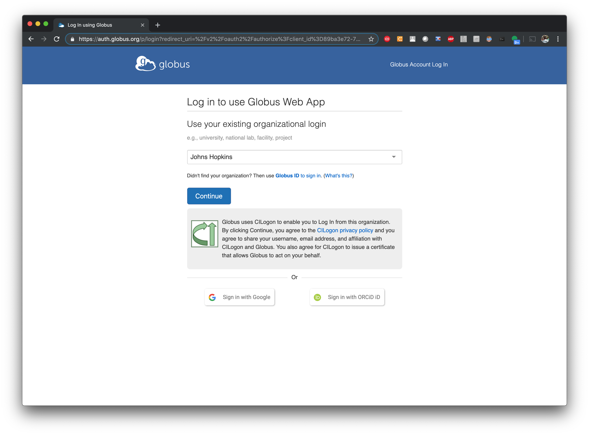
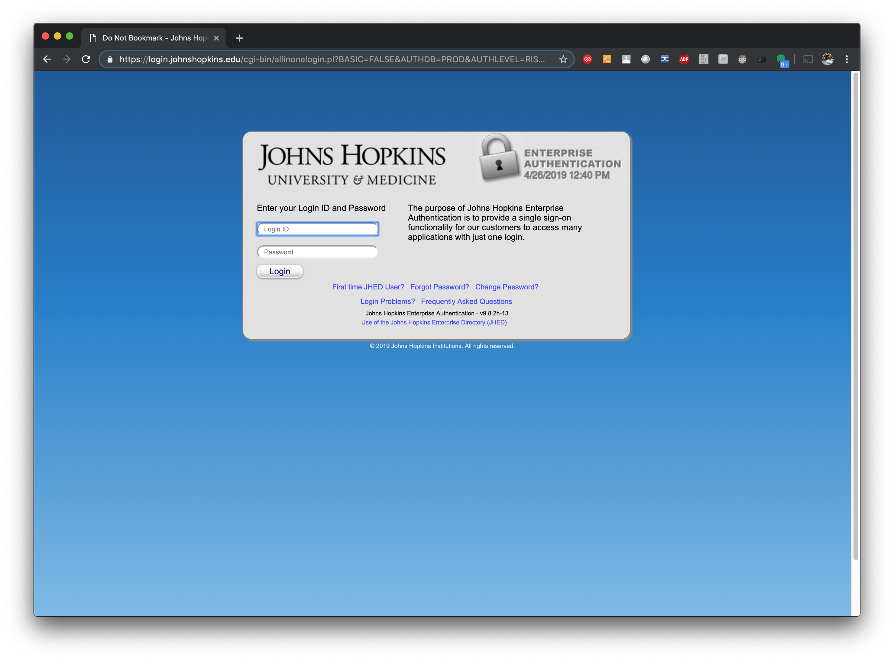
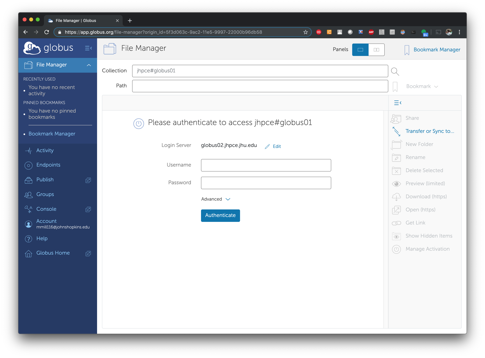
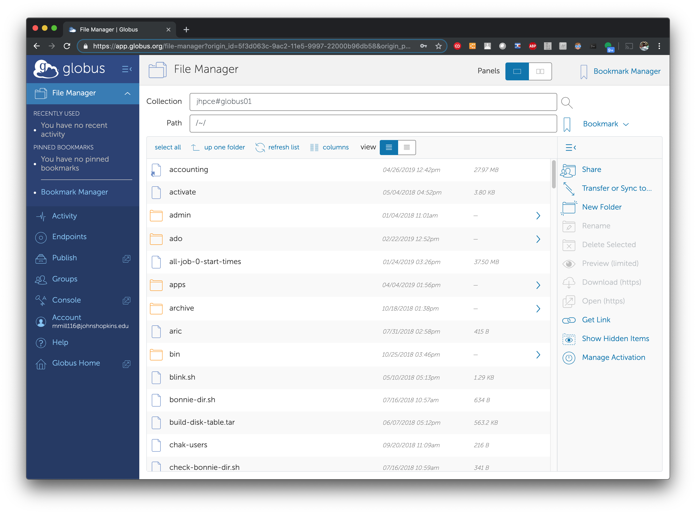
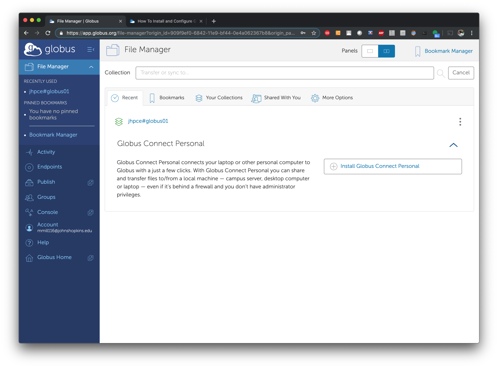
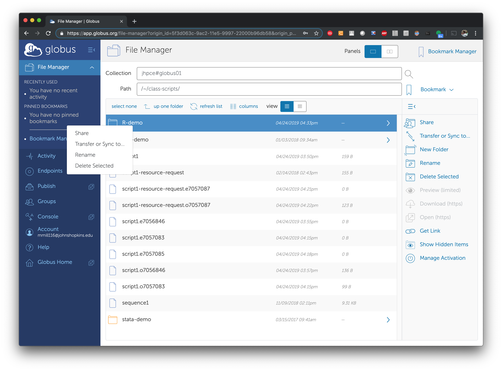
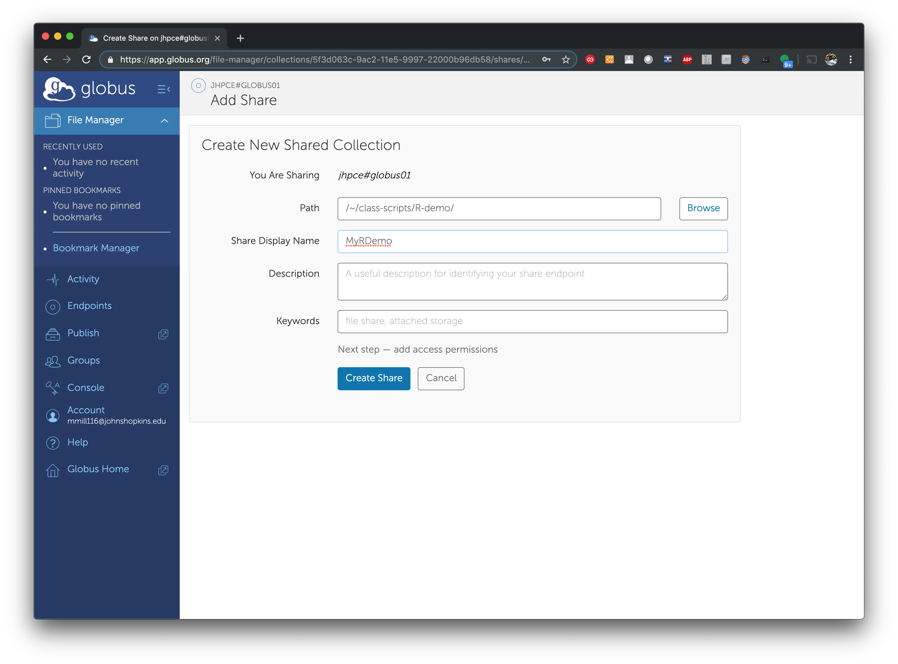
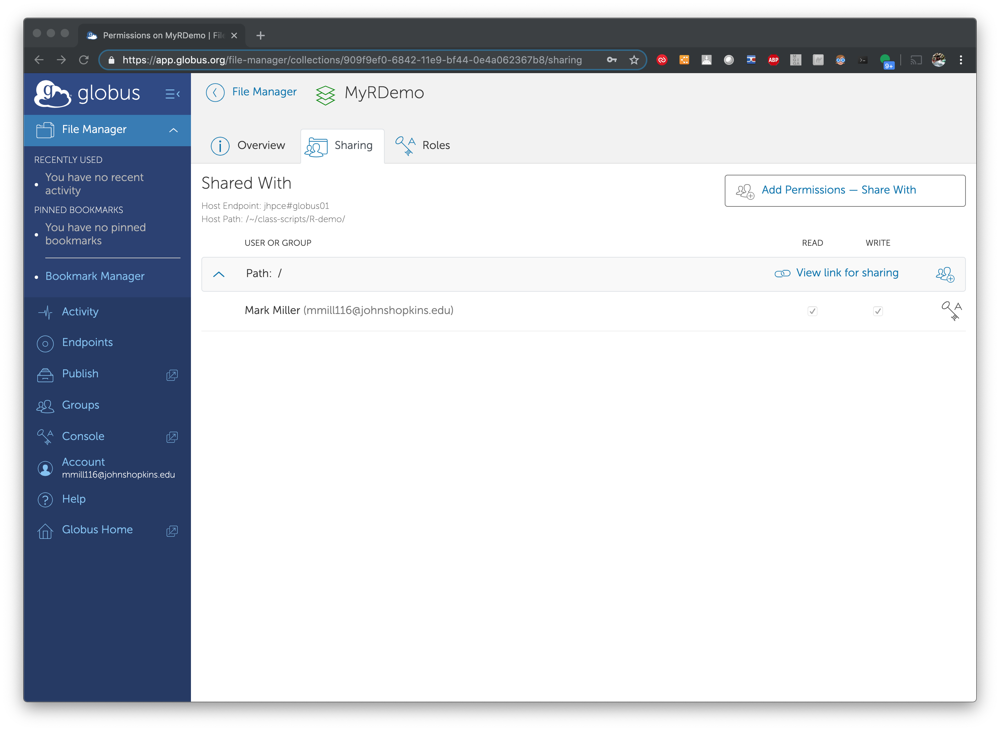
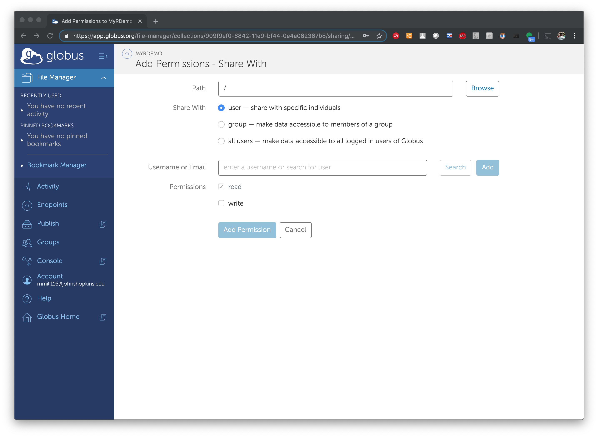
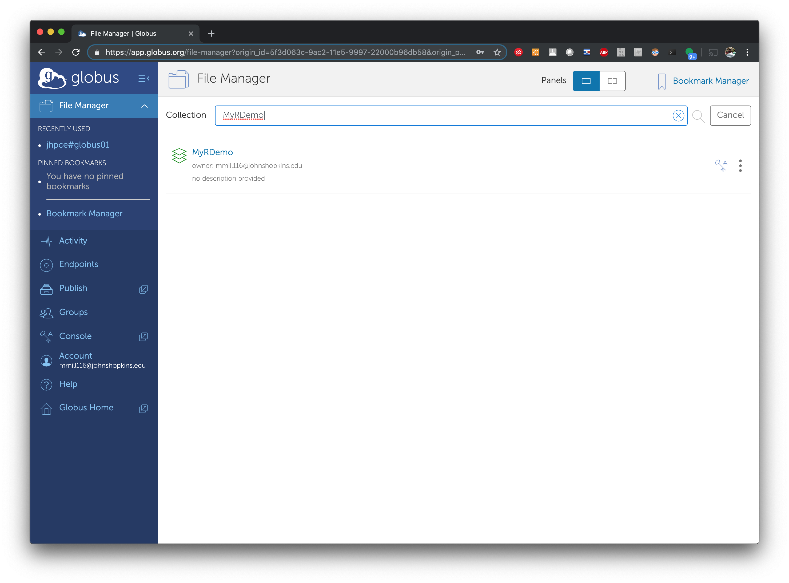

# Using Globus to transfer files 

Globus is a “dropbox-like” service to enable data sharing between
academic and research communities. By using Globus, you can easily
transfer files between Globus endpoints, share data with
collaborators, and easily transfer data between the JHPCE cluster and
your local desktop or laptop.

## Setting up an account

The first step in using Globus is setting up and account on the Globus
site.  To start, go to
[https://www.globus.org/](https://www.globus.org/ "https://www.globus.org/") and clicking on the “Log in” button in the
upper right. You should now see the screen below. Select “Johns
Hopkins” from the list of Organizations.

You will now be directed to the JHU Login Screen. Enter your JHED ID and Password:

Once you enter your JHED information you will be sent to the main Globus window:

## Transferring Files

With Globus, you can transfer data between nodes (known as
“Endpoints”) that are part of the Globus network. The endpoint for
the JHPCE cluster is called `jhpce#globus01`. To connect to the JHPCE
endpoints, enter `jhpce#globus01` in the “Collections field, and
select it from the list of results displayed.

Once you select the `jhpce#globus01` endpoint, you will be prompted to enter your JHPCE Login and Password:

And once you login you will be shown a flie list of your home directory on the JHCPE cluster.

In order to transfer data to and from your desktop, you will need to
install the Globus Connect Personal package
([https://www.globus.org/globus-connect-personal](https://www.globus.org/globus-connect-personal
"https://www.globus.org/globus-connect-personal")) on your desktop.
To do this, click on the “Two-Panel” icon at the top of your globus
session, and then click on Install Globus Connect Personal.

On the next screen, follow the steps on the next page to download the
appropriate software package for your system, generate a Globus Key,
and create a Globu name for your desktop/laptop. 

Once you install and start Globus Connect Personal, you will be able
to easily transfer files between your desktop/laptop and the JHPCE
cluster via the Globus web interface.

## Sharing data with others

One of the benefits fo using Globus is that you can share data from
the JHPCE cluster with outside collaborators. To do this navigate to
the directory you wish to share, select it, and either Right-Click on
it, or select “Share” from the menu on the right hand side of the
screen. In this example, I’m sharing the `$HOME/class-scripts/R-demo`
directory from within my home directory.

Next, you will be prompted to provide a name for your share.  In this example, I’m calling it “MyRDemo”.  Once you enter the name and Description, click “Create Share”:

Next you will be shown the current access permissions, which should be
just for your account to start with.  To grant others permission to
access your share, click on “Add Permissions – Share With”

You will now be able to select which users you wish to share your directory with.  The person you are sharing with must have a Globus account, and will need to provide their Globus ID or email with you.  Enter their Username or Email, click “Add”, and then click “Add Permission”.  We strongly recommend that you only grant “read” permission. for your share.

Alternatively. you can create an “anonymous share” to share a
directory with anyone on Globus. To do this select “all users”.
Again, we strongly recommend that you only grant “read” permission for
your share.

Once your share is created, you can notify your collaborators that
they can access your data by using the Share name you created (in this
example it’s “MyRDemo”), and can search for your share name.

