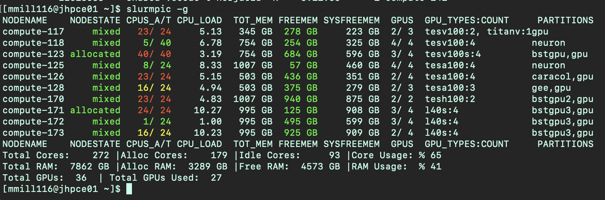

						
We have a number of GPU nodes on the JHPCE cluster that are available for
general use. Below is the process for accessing the GPU node with an
interactive session, and a couple of examples of running programs and
submitting jobs that utilizes a GPU.

From the JHPCE SLURM cluster login node, you can access a GPU node
interactively by using the &#8220;&#8211;partition gpu&#8221; and
&#8220;&#8211;gpus&#8221; options to the srun command. You can also supply
traditional options to srun, and you may find that you need to request
additional system RAM for your program to run. Here is an example of how to
request a single GPU on the &#8220;gpu&#8221; partition. You can run
&#8220;nvidia-smi&#8221; to see the GPU that you&#8217;ve been assigned.

<pre><code>[login31 /users/mmill116]$ <strong>srun --pty --x11 --partition gpu --gpus=1 --mem=20G bash </strong>
[compute-117 /users/mmill116]$ <strong>nvidia-smi</strong> 
 Tue Nov 28 08:39:23 2023       
 +---------------------------------------------------------------------------------------+
 | NVIDIA-SMI 535.86.10              Driver Version: 535.86.10    CUDA Version: 12.2     |
 |-----------------------------------------+----------------------+----------------------+
 | GPU  Name                 Persistence-M | Bus-Id        Disp.A | Volatile Uncorr. ECC |
 | Fan  Temp   Perf          Pwr:Usage/Cap |         Memory-Usage | GPU-Util  Compute M. |
 |                                         |                      |               MIG M. |
 |=========================================+======================+======================|
 |   0  Tesla V100-PCIE-32GB           On  | 00000000:89:00.0 Off |                    0 |
 | N/A   41C    P0              28W / 250W |      0MiB / 32768MiB |      0%      Default |
 |                                         |                      |                  N/A |
 +-----------------------------------------+----------------------+----------------------+
 +---------------------------------------------------------------------------------------+
 | Processes:                                                                            |
 |  GPU   GI   CI        PID   Type   Process name                            GPU Memory |
 |        ID   ID                                                             Usage      |
 |=======================================================================================|
 |  No running processes found                                                           |
 +---------------------------------------------------------------------------------------+
</pre></code>
As of November 2024, we have the following GPUs available on the gpu partition:
<table>
<tr>
<td><strong>Node Name</strong></td>
<td><strong>Description</strong></td>
<td><strong>GPU Count</strong></td>
</tr>

<tr>
<td><strong>compute-117</strong></td>
<td>Our first GPU node.<br>2 Intel(R) Xeon(R) Silver 4116 CPUs and 384GB of RAM</td>
<td> 2 Nvidia V100 GPUs with 32GB RAM<br> 1 Nvidia Titan V with 11GB RAM</td>
</tr>

<tr>
<td><strong>compute-123</strong></td>
<td> The first Biostat GPU node<br>2 Intel(R) Xeon(R) Silver 4210R CPUs and 768GB of RAM</td>
<td> 4 Nvidia V100s GPUs with 32GB RAM</td>
</tr>

<tr>
<td><strong>compute-126</strong></td>
<td>One of the Lieber (Collado) GPU nodes<br>2 Intel(R) Xeon(R) Gold 5317 CPUs and 512GB of RAM</td>
<td>4 Nvidia A100 GPUs with 80GB RAM</td>
</tr>

<tr>
<td><strong>compute-128</strong></td>
<td>One of the Feinberg Lab (CEGS) GPU nodes<br>2 Intel(R) Xeon(R) Gold 5317 CPUs and 512GB of RAM</td>
<td>4 Nvidia A100 GPUs with 80GB RAM</td>
</tr>

<tr>
<td><strong>compute-170</strong></td>
<td> The second Biostat GPU node<br>1 Intel(R) Xeon(R) Silver 4510R CPUs and 1TB of RAM</td>
<td>2 Nvidia H100s GPUs with 96GB RAM</td>
</tr>

<tr>
<td><strong>compute-171 - compute-173</strong></td>
<td>Group of 3 Biostat GPU nodes, sharing GPUs with the general gpu queue.<br>1 AMD EPYC 7443P CPUs and 1TB of RAM (each node)</td>
<td>12 Nvidia L40S GPUs with 46GB RAM - 4 GPUs in each node</td>
</tr>

</table>

You can request a particular model of GPU using the "GRES" option
(Generic Resources) to srun and sbatch. The following GRES options are available for
the various models of GPUS:

<center><table>
<tr><td><strong>GPU Type</strong></td><td><strong>GRES  Option</strong></td></tr>
<tr><td>Nvidia Titan V with 11GB RAM</td><td>titanv</td></tr>
<tr><td>Nvidia V100 with 32GB RAM</td><td>tesv100</td></tr>
<tr><td>Nvidia V100S with 32GB RAM</td><td>tesv100s</td></tr>
<tr><td>Nvidia A100 with 80GB RAM</td><td>tesa100</td></tr>
<tr><td>Nvidia H100 with 96GB RAM</td><td>tesh100</td></tr>
<tr><td>Nvidia L40S with 46GB RAM</td><td>l40s</td></tr>
</table></center>

NVIDIA assigns different "Computing Capability" values to each GPU model. These values can be found [here](https://developer.nvidia.com/cuda-gpus), and help one determine what the GPU is capable of doing. Details can be found [here](https://docs.nvidia.com/cuda/cuda-c-programming-guide/index.html#compute-capabilities). Specific descriptions for each generation as well as some specific CUDA routines to use with each are here: [7.x](https://docs.nvidia.com/cuda/cuda-c-programming-guide/index.html#compute-capability-7-x), [8.x](https://docs.nvidia.com/cuda/cuda-c-programming-guide/index.html#compute-capability-8-x), and [9.x](https://docs.nvidia.com/cuda/cuda-c-programming-guide/index.html#compute-capability-9-0)

<center><table>
<tr><td><strong>GPU Type</strong></td><td><strong>GRES  Option</strong></td><td><strong>Computing Capability</strong></td></tr>
<tr><td>Nvidia Titan V with 11GB RAM</td><td>titanv</td><td>7.0</td></tr>
<tr><td>Nvidia V100 with 32GB RAM</td><td>tesv100</td><td>7.0</td></tr>
<tr><td>Nvidia V100S with 32GB RAM</td><td>tesv100s</td><td>7.0</td></tr>
<tr><td>Nvidia A100 with 80GB RAM</td><td>tesa100</td><td>8.0</td></tr>
<tr><td>Nvidia H100 with 96GB RAM</td><td>tesh100</td><td>9.0</td></tr>
<tr><td>Nvidia L40S with 46GB RAM</td><td>l40s</td><td>8.9</td></tr>
</table></center>

You can see what GPUs are available by running the ```slurmpic -g``` command.
The GPUS column will show how many GPUs are in use and how many are available
on each node:



One commonly used option when using GPUs in a SLURM environment is the ```--gpu-bind=closest```
option. This will make sure the core/CPU that is assigned to your job is the closest one to the controling bus that the GPU is on. So if you are trying to get the most out of the performance of your GPU code, this option may be helpful.  There is a really good description of GPU/CORE binding at [https://pawsey.atlassian.net/wiki/spaces/US/pages/51929056/Example+Slurm+Batch+Scripts+for+Setonix+on+GPU+Compute+Nodes](https://pawsey.atlassian.net/wiki/spaces/US/pages/51929056/Example+Slurm+Batch+Scripts+for+Setonix+on+GPU+Compute+Nodes)

You will also notice that there are several partitions with GPUs in them.  By
default all users should only access the "gpu" partition. The other partitions
ar PI-specific partitions for groups that have purchases GPUs for the JHPCE
cluster.


So, in order request a particular model of GPU you would use the value in the
&#8220;GRES Option&#8221; column above to srun or sbatch. In general it is
better to allow the cluster to assign an available gpu to you rather than
requesting a particular model, as certain models may not be available at the
time you are trying to run your program. In the below example, we are
requesting an Nvidia Titan V GPU.


<pre><code>[login31 /users/mmill116]$ <strong>srun --pty --x11 --partition gpu --gres=gpu:titanv:1&nbsp; bash</strong>
[compute-117 /users/mmill116]$ <strong>nvidia-smi</strong>
 Tue Nov 28 10:50:25 2023&nbsp; &nbsp; &nbsp; &nbsp;
 +---------------------------------------------------------------------------------------+
 | NVIDIA-SMI 535.86.10&nbsp; &nbsp; &nbsp; &nbsp; &nbsp; &nbsp; &nbsp; Driver Version: 535.86.10&nbsp; &nbsp; CUDA Version: 12.2 &nbsp; &nbsp; |
 |-----------------------------------------+----------------------+----------------------+
 | GPU&nbsp; Name &nbsp; &nbsp; &nbsp; &nbsp; &nbsp; &nbsp; &nbsp; &nbsp; Persistence-M | Bus-Id&nbsp; &nbsp; &nbsp; &nbsp; Disp.A | Volatile Uncorr. ECC |
 | Fan&nbsp; Temp &nbsp; Perf&nbsp; &nbsp; &nbsp; &nbsp; &nbsp; Pwr:Usage/Cap | &nbsp; &nbsp; &nbsp; &nbsp; Memory-Usage | GPU-Util&nbsp; Compute M. |
 | &nbsp; &nbsp; &nbsp; &nbsp; &nbsp; &nbsp; &nbsp; &nbsp; &nbsp; &nbsp; &nbsp; &nbsp; &nbsp; &nbsp; &nbsp; &nbsp; &nbsp; &nbsp; &nbsp; &nbsp; |&nbsp; &nbsp; &nbsp; &nbsp; &nbsp; &nbsp; &nbsp; &nbsp; &nbsp; &nbsp; &nbsp; | &nbsp; &nbsp; &nbsp; &nbsp; &nbsp; &nbsp; &nbsp; MIG M. |
 |=========================================+======================+======================|
 | &nbsp; 0&nbsp; NVIDIA TITAN V &nbsp; &nbsp; &nbsp; &nbsp; &nbsp; &nbsp; &nbsp; &nbsp; On&nbsp; | 00000000:B1:00.0 Off |&nbsp; &nbsp; &nbsp; &nbsp; &nbsp; &nbsp; &nbsp; &nbsp; &nbsp; N/A |
 | 28% &nbsp; 35C&nbsp; &nbsp; P8&nbsp; &nbsp; &nbsp; &nbsp; &nbsp; &nbsp; &nbsp; 26W / 250W |&nbsp; &nbsp; &nbsp; 0MiB / 12288MiB |&nbsp; &nbsp; &nbsp; 0%&nbsp; &nbsp; &nbsp; Default |
 | &nbsp; &nbsp; &nbsp; &nbsp; &nbsp; &nbsp; &nbsp; &nbsp; &nbsp; &nbsp; &nbsp; &nbsp; &nbsp; &nbsp; &nbsp; &nbsp; &nbsp; &nbsp; &nbsp; &nbsp; |&nbsp; &nbsp; &nbsp; &nbsp; &nbsp; &nbsp; &nbsp; &nbsp; &nbsp; &nbsp; &nbsp; |&nbsp; &nbsp; &nbsp; &nbsp; &nbsp; &nbsp; &nbsp; &nbsp; &nbsp; N/A |
 +-----------------------------------------+----------------------+----------------------+
 &nbsp; &nbsp; &nbsp; &nbsp; &nbsp; &nbsp; &nbsp; &nbsp; &nbsp; &nbsp; &nbsp; &nbsp; &nbsp; &nbsp; &nbsp; &nbsp; &nbsp; &nbsp; &nbsp; &nbsp; &nbsp; &nbsp; &nbsp; &nbsp; &nbsp; &nbsp; &nbsp; &nbsp; &nbsp; &nbsp; &nbsp; &nbsp; &nbsp; &nbsp; &nbsp; &nbsp; &nbsp; &nbsp; &nbsp; &nbsp; &nbsp; &nbsp; &nbsp; &nbsp; &nbsp;
 +---------------------------------------------------------------------------------------+
 | Processes:&nbsp; &nbsp; &nbsp; &nbsp; &nbsp; &nbsp; &nbsp; &nbsp; &nbsp; &nbsp; &nbsp; &nbsp; &nbsp; &nbsp; &nbsp; &nbsp; &nbsp; &nbsp; &nbsp; &nbsp; &nbsp; &nbsp; &nbsp; &nbsp; &nbsp; &nbsp; &nbsp; &nbsp; &nbsp; &nbsp; &nbsp; &nbsp; &nbsp; &nbsp; &nbsp; &nbsp; &nbsp; &nbsp; |
 |&nbsp; GPU &nbsp; GI &nbsp; CI&nbsp; &nbsp; &nbsp; &nbsp; PID &nbsp; Type &nbsp; Process name&nbsp; &nbsp; &nbsp; &nbsp; &nbsp; &nbsp; &nbsp; &nbsp; &nbsp; &nbsp; &nbsp; &nbsp; &nbsp; &nbsp; GPU Memory |
 |&nbsp; &nbsp; &nbsp; &nbsp; ID &nbsp; ID &nbsp; &nbsp; &nbsp; &nbsp; &nbsp; &nbsp; &nbsp; &nbsp; &nbsp; &nbsp; &nbsp; &nbsp; &nbsp; &nbsp; &nbsp; &nbsp; &nbsp; &nbsp; &nbsp; &nbsp; &nbsp; &nbsp; &nbsp; &nbsp; &nbsp; &nbsp; &nbsp; &nbsp; &nbsp; &nbsp; Usage&nbsp; &nbsp; &nbsp; |
 |=======================================================================================|
 |&nbsp; No running processes found &nbsp; &nbsp; &nbsp; &nbsp; &nbsp; &nbsp; &nbsp; &nbsp; &nbsp; &nbsp; &nbsp; &nbsp; &nbsp; &nbsp; &nbsp; &nbsp; &nbsp; &nbsp; &nbsp; &nbsp; &nbsp; &nbsp; &nbsp; &nbsp; &nbsp; &nbsp; &nbsp; &nbsp; &nbsp; |
 +---------------------------------------------------------------------------------------+ 
</pre></code>

Another option for for requesting a particular GPU model is to use the "--constraints" option to request a particular Node Feature defined for the node.  This is especially helpful when you want to select a number of GPU models that would be acceptible to you to use.  For example, one could run the folloing to request a node with either an l40s, tesv100, or titanv.

<pre><code>
[mmill116@jhpce01 ~]$ srun --pty -p gpu --gpus=1 --constrain="l40s|tesv100|titanv" bash 
</code></pre>

You can read more about using features at https://jhpce.jhu.edu/slurm/node-features/

At this point you can start running your GPU specific code. You can either use
install your own GPU-enabled programs, or use the version of python that is
installed on the GPU nodes.

Below is an example of running an MNIST tensorflow program. The tensorflow and keras python modules have been installed on the GPU nodes, so you can use the default system version of python. This example comes from <a href="https://www.tensorflow.org/tutorials/quickstart/beginner">https://www.tensorflow.org/tutorials/quickstart/beginner</a></p>


<pre><code>[login31 /users/mmill116]$ srun --pty --x11 --partition gpu --gpus=1 --mem=10G bash
[compute-117 /users/mmill116]$ python
Python 3.9.16 (main, Dec  8 2022, 00:00:00) 
[GCC 11.3.1 20221121 (Red Hat 11.3.1-4)] on linux
Type "help", "copyright", "credits" or "license" for more information.
>>> import tensorflow as tf
2023-11-28 09:05:16.067766: I tensorflow/core/platform/cpu_feature_guard.cc:182] This TensorFlow binary is optimized to use available CPU instructions in performance-critical operations.
To enable the following instructions: AVX2 AVX512F FMA, in other operations, rebuild TensorFlow with the appropriate compiler flags.
2023-11-28 09:05:16.850666: W tensorflow/compiler/tf2tensorrt/utils/py_utils.cc:38] TF-TRT Warning: Could not find TensorRT
>>> mnist = tf.keras.datasets.mnist
>>> (x_train, y_train), (x_test, y_test) = mnist.load_data()
>>> x_train, x_test = x_train / 255.0, x_test / 255.0
>>> model = tf.keras.models.Sequential([
...   tf.keras.layers.Flatten(input_shape=(28, 28)),
...   tf.keras.layers.Dense(128, activation='relu'),
...   tf.keras.layers.Dropout(0.2),
...   tf.keras.layers.Dense(10)
... ])
2023-11-28 09:05:31.942590: I tensorflow/core/common_runtime/gpu/gpu_device.cc:1639] Created device /job:localhost/replica:0/task:0/device:GPU:0 with 31141 MB memory:  -> device: 0, name: Tesla V100-PCIE-32GB, pci bus id: 0000:89:00.0, compute capability: 7.0
>>> predictions = model(x_train[:1]).numpy()
>>> predictions
array([[-0.745112  ,  0.49414337, -0.10749201, -0.23818162,  0.2159372 ,
        -0.38107562,  0.8540315 , -0.21077928,  0.04448523,  0.37432173]],
      dtype=float32)
>>> tf.nn.softmax(predictions).numpy()
array([[0.0417023 , 0.14399974, 0.07889961, 0.06923362, 0.10902808,
        0.06001488, 0.206376  , 0.07115702, 0.09184969, 0.12773912]],
      dtype=float32)
>>> loss_fn = tf.keras.losses.SparseCategoricalCrossentropy(from_logits=True)
>>> loss_fn(y_train[:1], predictions).numpy()
2.8131628
>>> model.compile(optimizer='adam',
...               loss=loss_fn,
...               metrics=['accuracy'])
>>> model.fit(x_train, y_train, epochs=5)
Epoch 1/5
2023-11-28 09:06:00.300076: I tensorflow/compiler/xla/service/service.cc:168] XLA service 0x7fee20069290 initialized for platform CUDA (this does not guarantee that XLA will be used). Devices:
2023-11-28 09:06:00.300099: I tensorflow/compiler/xla/service/service.cc:176]   StreamExecutor device (0): Tesla V100-PCIE-32GB, Compute Capability 7.0
2023-11-28 09:06:00.305647: I tensorflow/compiler/mlir/tensorflow/utils/dump_mlir_util.cc:255] disabling MLIR crash reproducer, set env var `MLIR_CRASH_REPRODUCER_DIRECTORY` to enable.
2023-11-28 09:06:00.371150: I tensorflow/compiler/xla/stream_executor/cuda/cuda_dnn.cc:432] Loaded cuDNN version 8904
2023-11-28 09:06:00.442691: I tensorflow/tsl/platform/default/subprocess.cc:304] Start cannot spawn child process: No such file or directory
2023-11-28 09:06:00.535627: I ./tensorflow/compiler/jit/device_compiler.h:186] Compiled cluster using XLA!  This line is logged at most once for the lifetime of the process.
1875/1875 [==============================] - 5s 2ms/step - loss: 0.2931 - accuracy: 0.9150
Epoch 2/5
1875/1875 [==============================] - 4s 2ms/step - loss: 0.1395 - accuracy: 0.9597
Epoch 3/5
1875/1875 [==============================] - 4s 2ms/step - loss: 0.1070 - accuracy: 0.9678
Epoch 4/5
1875/1875 [==============================] - 4s 2ms/step - loss: 0.0877 - accuracy: 0.9729
Epoch 5/5
1875/1875 [==============================] - 4s 2ms/step - loss: 0.0754 - accuracy: 0.9764
&lt;keras.src.callbacks.History object at 0x7feef9f09550>
>>> model.evaluate(x_test,  y_test, verbose=2)
313/313 - 1s - loss: 0.0714 - accuracy: 0.9756 - 600ms/epoch - 2ms/step
[0.07143650203943253, 0.975600004196167]
>>> </code></pre>


You can also submit a batch job to the cluster that uses GPUs. In this example
of submitting a batch job to use a GPU, we are creating 2 files, one containing
the python steps that we used above, and the second containing a shell script
that will be submitted to SLURM. The Python program looks like:


<pre><code>[login31 /users/mmill116/gpu-test]$ <strong>ls -al
</strong> total 496
 drwxr-xr-x    2 mmill116 mmi   4 Nov 28 11:49 .
 drwxr-x---+ 214 mmill116 mmi 412 Nov 28 11:49 ..
 -rw-r--r--    1 mmill116 mmi 789 Nov 28 11:47 nvidia-test.py
 -rwxr-xr-x    1 mmill116 mmi 343 Nov 28 11:49 test-slurm-gpu.sh
[login31 /users/mmill116/gpu-test]$ <strong>cat nvidia-test.py
</strong> import tensorflow as tf
 print("TensorFlow version:", tf.__version__)
 mnist = tf.keras.datasets.mnist
 (x_train, y_train), (x_test, y_test) = mnist.load_data()
 x_train, x_test = x_train / 255.0, x_test / 255.0
 model = tf.keras.models.Sequential([
   tf.keras.layers.Flatten(input_shape=(28, 28)),
   tf.keras.layers.Dense(128, activation='relu'),
   tf.keras.layers.Dropout(0.2),
   tf.keras.layers.Dense(10)
 ])
 predictions = model(x_train[:1]).numpy()
 predictions
 tf.nn.softmax(predictions).numpy()
 loss_fn = tf.keras.losses.SparseCategoricalCrossentropy(from_logits=True)
 loss_fn(y_train[:1], predictions).numpy()
 model.compile(optimizer='adam',
               loss=loss_fn,
               metrics=['accuracy'])
 model.fit(x_train, y_train, epochs=5)
 model.evaluate(x_test,  y_test, verbose=2)
</code></pre>

The script that will be used to submit to SLURM looks like. At this point you
need to include the LD_LIBRARY_PATH environemnt variable if you will be using
the system version of python:

<pre><code>>[login31 /users/mmill116/gpu-test]$ <strong>cat test-slurm-gpu.sh</strong>
!/bin/sh
SBATCH --partition=gpu
SBATCH --gres=gpu:titanv:1

echo $CUDA_VISIBLE_DEVICES
cd $HOME/gpu-test
nvidia-smi
export LD_LIBRARY_PATH=/jhpce/shared/jhpce/core/JHPCE_tools/3.0/lib:/usr/local/lib/python3.9/site-packages/nvidia/cudnn/lib:/jhpce/shared/jhpce/core/conda/miniconda3-23.3.1/envs/cudatoolkit-11.8.0/lib

python nvidia-test.py
</pre></code>

You can now use &#8220;sbatch&#8221; to submit the job, and examine the results.

<pre><code>
[login31 /users/mmill116/gpu-test]$ <strong>sbatch test-slurm-gpu.sh</strong>
 Submitted batch job 915238
 [login31 /users/mmill116/gpu-test]$ <strong>squeue --me</strong>
              JOBID PARTITION     NAME     USER ST       TIME  NODES NODELIST(REASON)
             915238       gpu test-slu mmill116  R       0:06      1 compute-117

[login31 /users/mmill116/gpu-test]$ <strong>ls</strong>
 nvidia-test.py&nbsp; slurm-915238.out&nbsp; test-slurm-gpu.sh
 [login31 /users/mmill116/gpu-test]$ squeue --me
 &nbsp;&nbsp; &nbsp; &nbsp; &nbsp; &nbsp; &nbsp; JOBID PARTITION &nbsp; &nbsp; NAME &nbsp; &nbsp; USER ST &nbsp; &nbsp; &nbsp; TIME&nbsp; NODES NODELIST(REASON)
 &nbsp; &nbsp; &nbsp; &nbsp; &nbsp; &nbsp; 915238 &nbsp; &nbsp; &nbsp; gpu test-slu mmill116&nbsp; R &nbsp; &nbsp; &nbsp; 0:21&nbsp; &nbsp; &nbsp; 1 compute-117 
[login31 /users/mmill116/gpu-test]$ <strong>squeue --me
</strong>              JOBID PARTITION     NAME     USER ST       TIME  NODES NODELIST(REASON)
[login31 /users/mmill116/gpu-test]$ ls
 nvidia-test.py  slurm-915238.out  test-slurm-gpu.sh
 [login31 /users/mmill116/gpu-test]$ cat slurm-915238.out
 0
 Tue Nov 28 11:55:08 2023       
 +---------------------------------------------------------------------------------------+
 | NVIDIA-SMI 535.86.10              Driver Version: 535.86.10    CUDA Version: 12.2     |
 |-----------------------------------------+----------------------+----------------------+
 | GPU  Name                 Persistence-M | Bus-Id        Disp.A | Volatile Uncorr. ECC |
 | Fan  Temp   Perf          Pwr:Usage/Cap |         Memory-Usage | GPU-Util  Compute M. |
 |                                         |                      |               MIG M. |
 |=========================================+======================+======================|
 |   0  NVIDIA TITAN V                 On  | 00000000:B1:00.0 Off |                  N/A |
 | 28%   35C    P8              26W / 250W |      0MiB / 12288MiB |      0%      Default |
 |                                         |                      |                  N/A |
 +-----------------------------------------+----------------------+----------------------+
 +---------------------------------------------------------------------------------------+
 | Processes:                                                                            |
 |  GPU   GI   CI        PID   Type   Process name                            GPU Memory |
 |        ID   ID                                                             Usage      |
 |=======================================================================================|
 |  No running processes found                                                           |
 +---------------------------------------------------------------------------------------+
 2023-11-28 11:55:08.645381: I tensorflow/core/platform/cpu_feature_guard.cc:182] This TensorFlow binary is optimized to use available CPU instructions in performance-critical operations.
 To enable the following instructions: AVX2 AVX512F FMA, in other operations, rebuild TensorFlow with the appropriate compiler flags.
 2023-11-28 11:55:09.449932: W tensorflow/compiler/tf2tensorrt/utils/py_utils.cc:38] TF-TRT Warning: Could not find TensorRT
 2023-11-28 11:55:10.803612: I tensorflow/core/common_runtime/gpu/gpu_device.cc:1639] Created device /job:localhost/replica:0/task:0/device:GPU:0 with 10696 MB memory:  -&gt; device: 0, name: NVIDIA TITAN V, pci bus id: 0000:b1:00.0, compute capability: 7.0
 TensorFlow version: 2.13.0
 Epoch 1/5
 2023-11-28 11:55:11.914159: I tensorflow/compiler/xla/service/service.cc:168] XLA service 0x7ff35c066ba0 initialized for platform CUDA (this does not guarantee that XLA will be used). Devices:
 2023-11-28 11:55:11.914504: I tensorflow/compiler/xla/service/service.cc:176]   StreamExecutor device (0): NVIDIA TITAN V, Compute Capability 7.0
 2023-11-28 11:55:11.920545: I tensorflow/compiler/mlir/tensorflow/utils/dump_mlir_util.cc:255] disabling MLIR crash reproducer, set env var <code>MLIR_CRASH_REPRODUCER_DIRECTORY</code> to enable.
 2023-11-28 11:55:11.985098: I tensorflow/compiler/xla/stream_executor/cuda/cuda_dnn.cc:432] Loaded cuDNN version 8904
 2023-11-28 11:55:12.057397: I tensorflow/tsl/platform/default/subprocess.cc:304] Start cannot spawn child process: No such file or directory
 2023-11-28 11:55:12.148968: I ./tensorflow/compiler/jit/device_compiler.h:186] Compiled cluster using XLA!  This line is logged at most once for the lifetime of the process.
 1875/1875 [==============================] - 5s 2ms/step - loss: 0.2948 - accuracy: 0.9142
 Epoch 2/5
 1875/1875 [==============================] - 4s 2ms/step - loss: 0.1433 - accuracy: 0.9574
 Epoch 3/5
 1875/1875 [==============================] - 4s 2ms/step - loss: 0.1078 - accuracy: 0.9675
 Epoch 4/5
 1875/1875 [==============================] - 4s 2ms/step - loss: 0.0884 - accuracy: 0.9725
 Epoch 5/5
 1875/1875 [==============================] - 4s 2ms/step - loss: 0.0751 - accuracy: 0.9769
 313/313 - 1s - loss: 0.0713 - accuracy: 0.9780 - 600ms/epoch - 2ms/step
 [login31 /users/mmill116/gpu-test]$ 
</pre></code>

