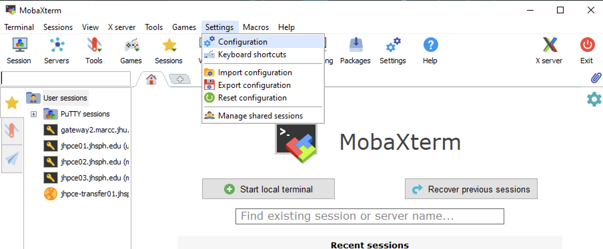
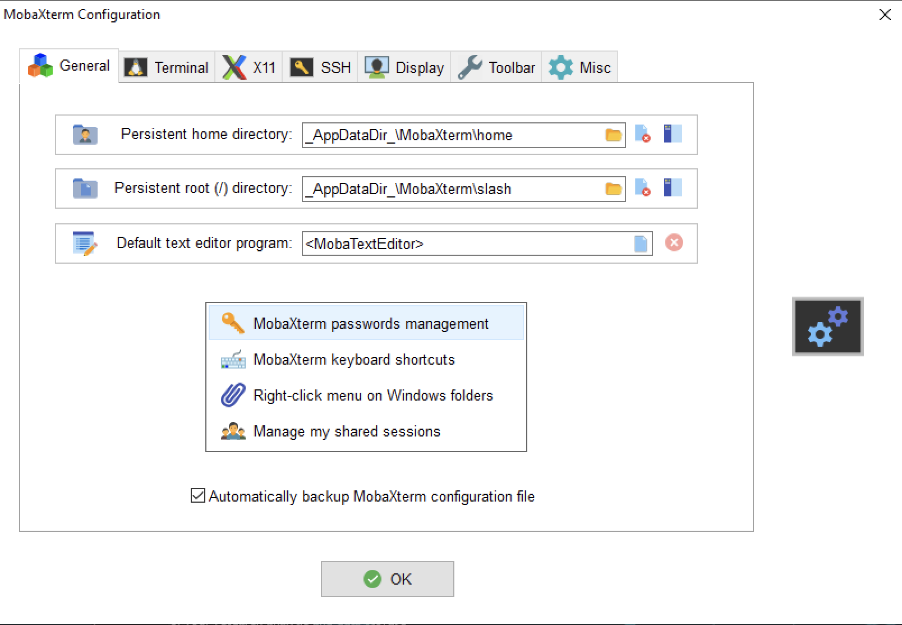
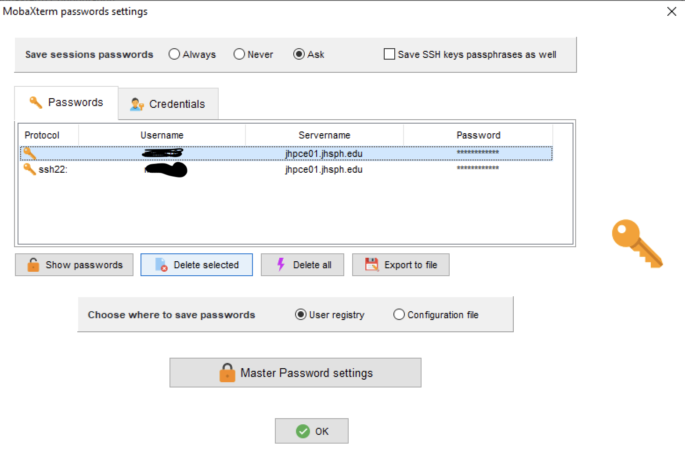

## SLURM FAQ

Questions about using SLURM are covered in their own FAQ [here](https://jhpce.jhu.edu/slurm/slurm-faq/).

## Orientation/Cluster Basics
You can access our latest orientation slides at [This Link](https://docs.google.com/presentation/d/1elMSTUdKws7FLVFK7vVV_AErA4brNSPX/pub){:target="_blank"}
(C-SUB users go [here](../orient/images/latest-csub-orient.pdf) instead (pdf).)  We update these periodically. The version date can be found on the first page in the lower right corner.

## Compatibility
- My script is giving odd error messages about `\r` or `^M`.

??? "Click to expand answer"
    Windows and Unix use different characters to indicate a new line.  If you have uploaded your script from a Windows machine, it may have the Windows newline characters.  These need to be replaced by the Unix newline characters.  To do this, you can run the “dos2unix” command on your script `dos2unix myscript.sh`. This will strip out all of the Windows newlines and replace them with the Unix newlines.

- My app is complaining that it can’t find a shared library, e.g. libgfortran.so.1
??? "Click to expand answer"
    Nine times out of ten, the allegedly missing library is there. The problem is that your application is looking for the version of the library that is compatible with the old system software. It will not help to point your application to the new libraries. They are more than likely to be incompatible with the new system. The correct solution is to reinstall your software. If the problem persists after the reinstallation, then please contact us and we will install standard libraries that are actually missing.

## File Transfer
- I cannot connect with SFTP in MobaXterm or other GUI program

??? "Click to expand answer"
    Because we use multifactor authentication (MFA), you need to configure your GUI program to either expect a prompt for a one time password (OTP) or be able to provide public key information.
    In MobaXterm, when configuring an SFTP session, you need to check the "2-steps authentication" box under the Advanced Settings tab.

- How do I copy a large directory structure from one place to another? Within the cluster? Into the cluster? Out of the cluster?

??? "Click to expand answer"
    We have a document about transferring data into or out of the cluster [here](../access/file-transfer.md).
    We have a document with advice about copying data around within the cluster [here](../files/copying-files.md). (This also includes good tips for using the rsync program for any data copying.)
    
    As an example, to copy a directory tree from /users/bob/src to /dcs08/bob/dst, first, create a cluster script, let's call it "copy-job", that contains the line
    ```
    #!/bin/bash

    rsync -avzh /users/bob/src /dcs08/bob/dst
    ```
    Next, submit a batch job to the cluster
    ```
    sbatch --mail-type=FAIL,END --mail-user=bob@jhu.edu copy-job
    ```
    This will submit the "copy-id" script to the cluster, which will run the job on one of the computer nodes, and send an email when it finishes.

    !!! Warning
        Please do not copy or move any larger files on the login nodes. Use the transfer node for internal/external transfers and compute nodes for transfers between cluster storage locations.

## Login
- SSH gave a warning: REMOTE HOST IDENTIFICATION HAS CHANGED
??? "Click to expand answer"
    Go into the ~/.ssh directory of your laptop/desktop and edit the known_hosts file. Search for the line that starts with the host that you ssh’d to. Delete that line (it is probably a long line that wraps). Then try again

- SSH "Bad owner or permissions"

??? "Click to expand answer"
    If you receive a message like "Bad owner or permissions on ~/.ssh/config" or continue to have to provide your password when ssh'ing to JHPCE when you think you have configured things to not need one, your file owner or permissions may be incorrect. See [this document](../access/ssh.md/#permissions-on-ssh-files) for answers.

- How do I delete saved passwords in MobaXterm?
??? "Click to expand answer"
    When using MobaXterm you should not save your password when prompted to do so. MobaXterm will save your password, and then inadvisedly try to use that as your “Verification Code:”, which means that when you first connect to the cluster in MobaXterm, you are prompted for “Password:”, and which you will need to press to be prompted for “Verification Code:” If you accidentally saved your password, you can remove the saved password by the following steps.  

    1) In MobaXterm, go to "Settings->Configuration"  
    

    2) On the next screen, select "MobaXterm Password Management"  
    

    3) This will display a list of saved passwords, and you should delete all of the entries that reference “jhpce”  
    

    Once these entries are deleted, you should be prompted for “Verification Code:” when you connect to the cluster via MobaXterm.

## Modules
- Why does bash report that it can’t find the module command?

??? "Click to expand answer"
    If you receive a message like
    
    ```bash linenums="0"
    bash: module: command not found
    ```
    
    The module is a shell function that is declared in `/etc/bashrc`. It is always a good idea for `/etc/bashrc` to be sourced immediately in you `~/.bashrc`.  Edit your `.bashrc` file so that the first thing it does is o execute the system bashrc file, i.e. your `.bashrc` file should start with the following lines:

    ```bash linenums="0"
    if [ -f /etc/bashrc ]; then
    . /etc/bashrc
    fi
    ```

## OpenSSL
- OpenSSL version mismatch error (e.g. Built against 30000070, you have 30100050)

??? "Click to expand answer"
    Please unload the conda_R module before doing your `git clone` or other ssh-related command. That module contains its own OpenSSL libraries which conflict with the system-provided one.

## Resources
- What is the SAFE desktop?

??? "Click to expand answer"
    The SAFE desktop is a virtual Windows computer that you can use to run scientific software and access JHPCE. For more information see this [item](../access/access-overview.md#safe-desktop).

## RStudio
- Why do I see a mass of error messages about "GL" and "GPU" every time I launch RStudio?

??? "Click to expand answer"
    Those errors are normal. RStudio expects to be run on a computer with an attached display driven by a local graphics processing card and supported by a set of graphics software libraries and device drivers. We don’t have such cards in our rack-mounted systems, nor the software that goes with them.

## SAS

We have a [SAS usage document](../sw/sas.md). Please read it for useful tips.

- When running SAS, an error dialog pops up about Remote Browser

??? "Click to expand answer"
    When running SAS, you may need to specify options to indicate which browser to use when displaying either help or graphical output. We recommend using the Chromium browser.

    See our [SAS usage document](../sw/sas.md) about how to resolve this issue.
- When starting SAS in an interactive session with browser support enabled, a stream of error messages appear

??? "Click to expand answer"
    These can be ignored because the web browser wants to run on a local system with a graphics card, and the our compute nodes don't have such cards or the software to support them.

    See our [SAS usage document](../sw/sas.md#with-browser-support) about redirecting output to resolve this issue.

    Without redirecting standard output and standard error you will see messages similar to ones below:
    ```
    [2970887:2970887:1024/152818.092311:ERROR:chrome_browser_cloud_management_controller.cc(163)] Cloud management controller initialization aborted as CBCM is not enabled.
        [2970887:2971086:1024/152818.161869:ERROR:login_database.cc(922)] Password store database is too new, kCurrentVersionNumber=35, GetCompatibleVersionNumber=39
        [2970887:2971087:1024/152818.164247:ERROR:login_database.cc(922)] Password store database is too new, kCurrentVersionNumber=35, GetCompatibleVersionNumber=39
        [2970887:2971086:1024/152818.167534:ERROR:login_database_async_helper.cc(59)] Could not create/open login database.
        [2970887:2971087:1024/152818.170351:ERROR:login_database_async_helper.cc(59)] Could not create/open login database.
        [2970887:2970887:1024/152818.626429:ERROR:object_proxy.cc(590)] Failed to call method: org.freedesktop.portal.Settings.Read: object_path= /org/freedesktop/portal/desktop: org.freedesktop.portal.Error.NotFound: Requested setting not found
    libGL error: No matching fbConfigs or visuals found
    libGL error: failed to load driver: swrast
    ```

## Slurm
- There is a dedicated [SLURM FAQ](../slurm/slurm-faq.md) document
- Commands related to SLURM can be found in [this document](../slurm/slurm-commands-ref.md) 

## SSH
- For a variety of questions and information about ssh - please see our [ssh document](../access/ssh.md).

- I’m on a Mac, and the ~C command to interrupt an ssh session isn’t working

??? "Click to expand answer"
    New versions of MacOS have disabled the ability to send an SSH Escape with `~C` (++tilde++ ++shift+c++). To reenable this, on you Mac, you need to set the `EnableEscapeCommandline` option. You can do this by either running `ssh -o EnableEscapeCommandline=yes . . .` or by editing your `~/.ssh/config` file, and at the top of that file add the line:
    ```
    EnableEscapeCommandline=yes
    ``` 
- SSH "Bad owner or permissions"

??? "Click to expand answer"
    If you receive a message like "Bad owner or permissions on ~/.ssh/config" or continue to have to provide your password when ssh'ing to JHPCE when you think you have configured things to not need one, your file owner or permissions may be incorrect. See [this document](../access/ssh.md/#permissions-on-ssh-files) for answers.

## Storage
- How much space does a directory use? How much is available?

See [this page](../storage/storage-tips.md) for information about evaluating disk space consumption.

- I've deleted files but I'm still restricted by disk quota

See [this document](../storage/quotas.md/#file-deletion-and-delayed-change-in-quota).

## X11

- There is a dedicated document about X11 and troubleshooting connections [here](../access/x11.md)
- X11 Forwarding and Authentication - See this excellent [article from Teleport](../access/images/x11-forwarding-from-teleport.pdf) (pdf) for quite a lot of good information and diagrams!!! (Saved as a PDF from https://goteleport.com/blog/x11-forwarding/)
- If you are using MobaXterm and NOT using its Sessions to do SSH or SFTP, STOP using the built-in terminal window and START using an SSH or SFTP Session. The MobaXterm terminal window doesn't work reliably. See the [MobaXterm](../access/mobaxterm.md) document for instructions.

- My X11 forwarding stops working after 20 minutes 
??? "Click to expand answer"
    This error comes from the `ForwardX11Timeout` variable, which is set by default to 20 minutes on some versions of MacOS.  To avoid this issue, you can specify a value of 0 which completely disables the timeout. Or you can set a larger timeout to, say, 336 hours (2 weeks). This value can be supplied by changing your SSH configuration (see our [SSH document](../access/ssh.md)) or for each connection on the command line like this:

    ```
    $ ssh -X username@jhpce01.jhsph.edu -o ForwardX11Timeout=336h
    ```
    Alternatively, you can add the line ForwardX11Timeout=0 to your ~/.ssh/config file
    ```
    $ head -1 .ssh/config
    ForwardX11Timeout=0
    ``` 

- Xauth error messages from MacOS Sierra when using X11 forwarding in SSH

??? "Click to expand answer"
    With the upgrade to MacOS Sierra, the “-X” option to ssh to enable X11 forwarding may not work. If you receive the message: untrusted X11 forwarding setup failed: xauth key data not generated , you can resolve the issue by add the line ForwardX11Trusted yes to your ~/.ssh/config file on your Mac. You may still see the warning: Warning: No xauth data; using fake authentication data for X11 forwarding. To eliminate this warning, add the line XAuthLocation /usr/X11/bin/xauth to your ~/.ssh/config file on your Mac.

## 2 Factor Authentication

- My winscp program stopped working!

??? "Click to expand answer"
    With 2 Factor Authentication, you need to include you username in the definition for your session

- The Authy Chrome plugin works on one machine but not on another
  
??? "Click to expand answer"
    Check that the time is set correctly on your machine. The six-digit One Time Passwords (OTP) are time-based and are only valid for 30 seconds. So if the time is off on your machine it will not generate the correct OTP for the 30 second interval.

- I use CyberDuck to transfer files from my mac to the cluster. Now it doesn't work anymore.
  
??? "Click to expand answer"
    We have had several people that have still had issues with Cyberduck even after applying the fixes below. We recommend using <a title="https://filezilla-project.org/" href="https://filezilla-project.org/"> Filezilla </a> instead.  You can also try to update your cyberDuck to the latest version.  Please make sure that your password is not saved in the Cyberduck connection.

- I use Filezilla to transfer files from my mac to the cluster. Now it doesn't work

<details>
<summary>"Click to expand answer"</summary>
    Update your Filezilla to the latest version.  In Filezilla, create a new Site:
    <ol>
    <li>Enter the "Hostname" (eg. jhpce-transfer01.jhsph.edu)</li>
    <li>Set the "Protocol" to "SFTP"</li>
    <li>Set the "Logon Type" to "Interactive"</li>
    <li>Set the "User" to your JHPCE UserID. Do not touch the "Password" and "Account" fields.</li>
    <li>Click "Connect". You will be prompted for your "Verification Code", which is the 6 digit number from Google Authenticator, and then "Password", which is your JHPCE Password.</li>
    </ol>
</details>

## Sun Grid Engine

We transitioned from the Sun Grid Engine to SLURM in 2024. We wrote [this document](../orient/images/transition-sge-2-slurm.pdf) for users familiar with SGE who needed to learn some SLURM basics.
