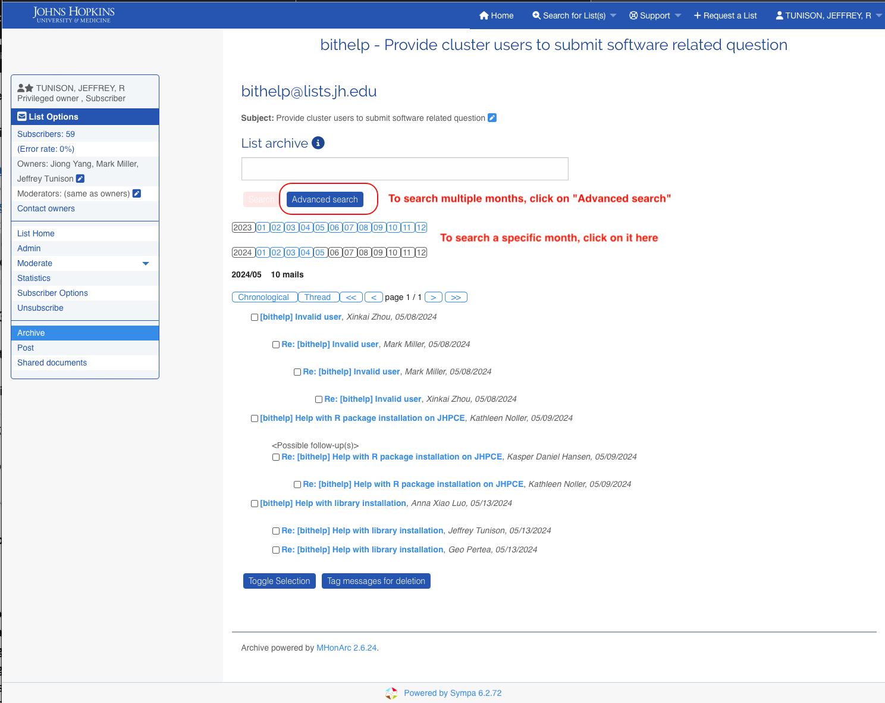
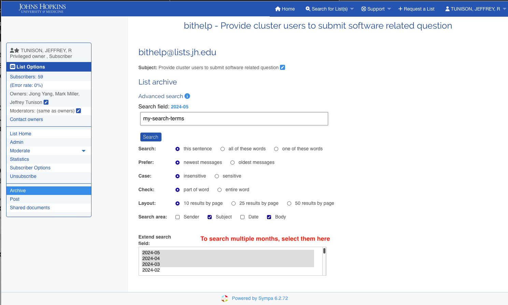

# Using the bithelp & bitsupport email list archives

You can find the answers to questions that people have asked before in the archived list contents. 

Those archives are stored and presented in a format oriented at individual months of traffic. So to look into the past you have to do a few extra steps.

Please note that the "https://lists.jh.edu" web site is only available on the JHU campus networks, or when connected via JHU VPN.

## Direct links to the list archives:

* [https://lists.jh.edu/sympa/arc/bithelp](https://lists.jh.edu/sympa/arc/bithelp)
* [https://lists.jh.edu/sympa/arc/bitsupport](https://lists.jh.edu/sympa/arc/bitsupport)

## Creating Your Search Query

1. Log into https://lists.jhu.edu with your JHED
2. Search for the list “bithelp” or "bitsupport" or go to the list archive directly with the links above.
3. If you know that you want to search in only a single specific month, you can click on that month if it has a blue month number. 
4. Otherwise, click on the “Advanced search” button
4. Select additional months of material beyond the current one by clicking on them in the “extended search term” field at the bottom center. You can add them one at a time by clicking on them or use normal item selection techniques for your operating system (e.g. select multiple months by holding down the ++shift++ key while clicking or all of them using the ++command+a++ key combination on a Mac).
5. Enter your search term in the search field.
6. Make any other search adjustments (e.g. case-sensitive, which terms need to be found, etc)
7. Hit ++enter++

