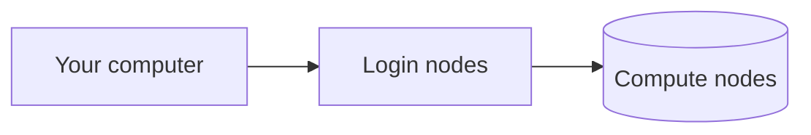
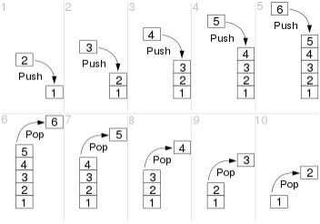

# WEB SITE TOOLS/ENABLED FEATURES WORTH KNOWING HOW TO USE
Let's create a visually appealing web site using some of these features!! Use a WYSIWYG editor like [MacDown](features.md#macdown-wysiwyg-editor) and ["mkdocs serve"](features.md/#recipe-for-running-mkdocs-locally) to quickly edit.

**Material for MkDocs is packed with many great features that make technical writing a *joyful* activity.**

Please consult the [Tips and Conventions](../ourtools/tips-conventions.md) page for authoring guidance and tips.

Jeffrey likes:

* [admonitions](features.md#admonitions) -- a lot!!
* {==[highlighting text](features.md/#highlighting-text)==}
* [keyboard meta keys](features.md/#symbols-for-keyboard-keys) (like ++ctrl++)
* Details [(collapsed blocks of text)](features.md/#details)

Running the mkdocs package installed via python allows you to develop web pages on your local computer. See [the recipe](features.md##recipe-for-running-mkdocs-locally)

There is another document containing [wishlist](wishlist.md) items that we might want to enable/configure.

## Critical Material for MkDocs reference material
Look here for information about these and other features!!! Just keep in mind that ones marked "insiders" are not available for our use.
[Materials for MkDocs reference section](https://squidfunk.github.io/mkdocs-material/reference/).

It isn't clear how much caution one should use in consulting MkDocs documents and people's solutions for it. JRT thinks that Material for MkDocs differs enough that one should definitely keep in mind whether your google search has turned up something about MkDocs.

## Modifying text patterns across the site
Example of changing all markdown files in a copy of the git repo:

```shell
cd jhpce_mkdocs
find . -type f -name \*.md -exec grep -il "www.jhpce.jhu.edu" {} \;
find . -type f -name \*.md -exec sed -i '' "s/www.jhpce.jhu.edu/jhpce-old.jhu.edu/g" {} \;
find . -type f -name \*.md -exec grep -il "jhpce-old.jhu.edu" {} \; | xargs git add
```

## Diagramming with Mermaid

mkdocs.yml contains code enabling the use of a JavaScript tool called Mermaid. If you want your local `mkdocs serve` program to be able to display it, you need to `pip install mkdocs-mermaid2-plugin` (see [recipe](features.md#recipe-for-running-mkdocs-locally) at bottom of this page)

Material for MkDocs Diagrams [documentation](https://squidfunk.github.io/mkdocs-material/reference/diagrams/?h=mermaid#diagrams)

[Diagram syntax](http://mermaid.js.org/intro/syntax-reference.html) from the mermaid people

A [live editor](https://mermaid.live) at the mer-people site!!! You can copy the resulting code to your buffer or save the image as (png,svg).



Supported types: [flowchart](https://mermaid.js.org/syntax/flowchart.html) (aka graph), [sequenceDiagram](https://mermaid.js.org/syntax/sequenceDiagram.html), [stateDiagram-v2](https://mermaid.js.org/syntax/stateDiagram.html),[classDiagram](https://mermaid.js.org/syntax/classDiagram.html), [erDiagram](https://mermaid.js.org/syntax/entityRelationshipDiagram.html)

JRT finds these types interesting: [timeline](https://mermaid.js.org/syntax/timeline.html), user [journey](https://mermaid.js.org/syntax/userJourney.html)

Numerous others, including [pie](https://mermaid.js.org/syntax/pie.html), bar and line charts ([xychart-beta](https://mermaid.js.org/syntax/xyChart.html))

??? Warning "Only some types officially supported by Material for MkDocs"
    Besides the diagram types listed above, Mermaid.js provides support for pie charts, gantt charts, user journeys, git graphs and requirement diagrams, all of which are not officially supported by Material for MkDocs. Those diagrams should still work as advertised by Mermaid.js, but we don't consider them a good choice, mostly as they don't work well on mobile. While all Mermaid.js features should work out-of-the-box, Material for MkDocs will currently only adjust the fonts and colors for flowcharts, sequence diagrams, class diagrams, state diagrams and entity relationship diagrams.

## Details
Like an [admonition](#admonitions) but makes pages more readable by collapsing content.
Documentation [here](https://facelessuser.github.io/pymdown-extensions/extensions/details/) and also explained in the detail below.

??? tip "Psst: Click To Expand"
    You can have it be open by default, too. (Add a ++plus++ after the opening ++question+question+question++). The following "detail" was set in the Markdown to display opened up.

    ???+ multiple "Syntax to use"
        Details must contain a blank line before they start. Use ??? to start a details block or ???+ if you want to start a details block whose default state is 'open'. Follow the start of the block with an optional class keyword (like "tip" or "warning") or classes (separated with spaces) and the summary contained in double quotes. Content is placed below the header and must be indented with FOUR SPACES.
        
        Another detail can be nested inside by adding another blank line and another detail header line and content block. But this header line needs to start with the word "multiple" So ??? multiple class "Title"

You can probably include [code blocks](#fenced-code-blocks) inside of details like you can with admonitions.

## Frontmatter (in document files)
Tags are the primary use of frontmatter I think we should use at this point. [This](https://squidfunk.github.io/mkdocs-material/reference/) may not be a complete list of directives that one can optionally add within a document. But the basics are that you can add to the top of the document a stanza to set the title of the document, a description of it, a status indicator such as new or deprecated. See [this page](https://squidfunk.github.io/mkdocs-material/reference/#setting-the-page-icon) for how to define an icon for the page.

Apparently multiple frontmatter elements, like both tags and a page title, need to exist together inside one pair of three dashed lines. See example:

```
---
tags:
  - a tag
title: some docs need explicit titles set b/c they can't be correctly guessed
---
```

## Tags
An example of frontmatter is the code to [add tags](https://squidfunk.github.io/mkdocs-material/setup/setting-up-tags/) to documents. 20240211 I tested adding a tag and it works. I also specified in the nav section [a page ](tags.md)for Material for MkDocs to automatically list tags and the pages they are found on.

A lot of optional tag-related settings/capabilities seem to be reserved for paying sponsers as of 20240201. See this [page](https://squidfunk.github.io/mkdocs-material/insiders/). Can users search for documents by tags in the search field?

The tags I envision using at the outset are shown below, so we can try to use them to figure out which pages need attention and possibly who is assigned to finish it.

The tag "needs-improvement-later" could be added to a page which has "done" to indicate that what we have is able to be published but needs more work.

The tag "contains-refs-to-old-site" came to me because some pages, such as the R page, contain screenshots which contain the URL of the old web site.

The tag "last-revised-YYYYMMDD" could be used on a page which also has "done" or "needs-improvement-later" so you can tell that information by looking at the tags page. As opposed to having to go look at the repository. The [wishlist](wishlist.md) document mentions adding a plugin or extension which allows the last-revised date to be automatically generated and listed at the bottom of each page.

Place lines like this at the very top of the document, before the document title, to add the tags mentioned. Tags are strings but I am hoping to avoid spaces or underscores. (Underscores suck b/c they require the shift key. And you can't always see them depenind on how text renders.)

Code blocks can be numbered or not by default (given settings in mkdocs.yml). THEY ARE NOW OFF BY DEFAULT. See [this section](features.md#code-block-line-numbers-highlighting) for instructions on {==adding titles==} to code blocks and {==enabling or disabling line numbering==}.

```
---
tags:
  - done
  - needs-review
  - in-progress
  - needs-improvement-later
  - contains-refs-to-old-site
  - last-revised-20240210
  - jeffrey
  - mark
  - jiong
  - adi
  - brian
---
```
## Internal links
From [this mkdocs](https://www.mkdocs.org/user-guide/writing-your-docs/#writing-with-markdown) page JRT learned that {==you can specify anchor points to document sections by knowing that they are converted to lowercase and white space is replaced by dashes.==} So this very section, named "Internal links" can be specified as a link to "../ourtools/features.md#internal-links" (in a different document) or "#internal-links" (inside the same document).

## Working with image files

Key information for doing things like aligning, adding captions, ...

[https://squidfunk.github.io/mkdocs-material/reference/images/](https://squidfunk.github.io/mkdocs-material/reference/images/)

There is no center alignment. You can fake it by adding a caption to the image (see example in above page)

```markdown title="Alight to the left or right like this"
{ align=left }
```
Hmmm, if Jeffrey tries to use that syntax then the rest of the text in this document is placed to the right of the image, even including the next section ("Keyboard meta keys"). How do you indicate a break between the text that you want wrapped on the right and the rest of the document?

This first example places the image to the left (without any align option)

```

```


This second example places the image to the left (without any align option), puts the text I want to the right of it (but no more text!!!)

```
 The text that you want to the right side of image.
```

 The text that you want to the right side of image.

This third example results in the whole rest of the document wrapped up to the right of the image. (So I didn't actually put the live code in the document).

```
{align=left} The text that you want to the right side of image.
```

## **Symbols for keyboard keys**

(enabled by the pymdownx.keys extension)

You can create images of keyboard keys, such as meta keys like ++ctrl++ or ++cmd++ by {==surrounding a keyword such as "ctrl" with two plus characters==}

++plus++ ++plus++ ctrl ++plus++ ++plus++ will create ++ctrl++

This can be useful when trying to draw attention to important small characters like back ticks, exclamation marks or vertical pipe symbols. You can also use them as tags like ++mail++ some-address@bob.edu or ++help++ some-URL

DO NOT USE ANY CAPITAL LETTERS or the symbol will not display, only the word you typed.  "Ctrl" will fail, "ctrl" will succeed.

EXAMPLES:
++context-menu++
++arrow-up++
++bracket-left++ ++bracket-right++
++caps-lock++
++eject++
++fn++
++f4++

### **Key sequences**
You can create a meta-key **sequence** by adding a single ++plus++ between the keywords. (So you surround the sequence with two plus symbols but only use a single plus symbols in between the keywords.)

++ctrl+alt+delete++ is created with ++plus++ ++plus++ ctrl ++plus++ alt ++plus++ delete ++plus++ ++plus++

### **List of keywords**

Example keywords are: **bar, pipe, enter, shift, dblquote, ctrl, esc, tab, space, del, arrow-up, single-quote, brace-left, bracket-right, cmd, windows**.

A backtick ++grave++ is called a grave, by the way. As in the French "accent grave" 

All of the symbols you could desire are listed in the following web page, ({==except for some reason the vertical "pipe" or "bar" symbol -- use ++plus++ ++plus++ pipe ++plus++ ++plus++ to create that==}):

[https://facelessuser.github.io/pymdown-extensions/extensions/keys/](https://facelessuser.github.io/pymdown-extensions/extensions/keys/)

### **CUSTOM "KEYS"**
You can create a key (or key combo) with any wording you want by adding double quotes around your text, for example

++plus++ ++plus++ ++dblquote++ Your Wording Here ++dblquote++ ++plus++ ++plus++ to create ++"Your Wording Here"++

This can be useful to make a series of steps users need to follow more clear. ++"Do this first"+"Then do this second"++


## Abbreviations
Abbreviations can be defined by using a syntax similar to URLs and footnotes, starting with an asterisk immediately followed by the term to be associated in square brackets.

This code creates the sentence that follows. You can hover over "HTML" and see the definition appear.

```
The HTML specification is maintained by the W3C.
*[HTML]: Hyper Text Markup Language
```

The HTML specification is maintained by the W3C.
*[HTML]: Hyper Text Markup Language

## Glossary
There's a way to create a document which is automatically updated when people define abbrieviations. See the wishlist document for details. Currently we have a manually written glossary, because that was quicker, and allows for the explanation to be longer than many page authors would probably provide in their individual pages.

## Definition List
You can create an indented block of text using a colon followed by FOUR space characters.

Example code and result:
```
`a sample term to define`
:    The definition you are seeking. (But not the droids.)
```

`a sample term to define`
:    The definition you are seeking. (But not the droids.)

## Admonitions
These are **sweet**! We should use them frequently. But be aware that they are not rendered correctly in MacDown.app. This is where it is good to be running "mkdocs serve" on your local machine. So you can verify that they are properly constructed before you push up your modified markdown file.

Consider whether or not you want the material collapsed or expanded when users first visit a page. If you want the information collapsed, create a "detail" instead of an "admonition" by using question marks instead of exclamation points. Details are documented [above](#details).

<a href="https://squidfunk.github.io/mkdocs-material/reference/admonitions/"" target="_blank">Admonition documentation</a>

You add an admonition by

1. starting a line with three explanation marks, a space, and a keyword (called a "type qualifier") such as note, danger, example, info, tip, warning. Here is a [list](https://squidfunk.github.io/mkdocs-material/reference/admonitions/#supported-types). Certain colors are used for known keywords. If you use your own word or phrase, the color is maybe out of your control.
2. You can add an optional title for your admonition by adding a double quoted string after the type qualifier.
3. on the next line(s) start with FOUR spaces. You can have multiple paragraphs inside your admonition by continuing to indent the first line by FOUR SPACES.


!!! note
    Some text using the "note" type qualifier

!!! example
    admonitions allow setting off info inside colored boxes, e.g. note, tip, warning, danger, example.
    https://squidfunk.github.io/mkdocs-material/reference/admonitions/#usage
    
    All lines indented four spaces are included in your admonition, including fenced code blocks.
    
!!! Example "Code block inside of an admonition"
    ```Shell title="Show my failed jobs between noon and now" linenums="0"
    sacct -s F -o "user,jobid,state,nodelist,start,end,exitcode" -S noon -E now
    ```

## Open URLs in new tabs
(Adi has configured the server to always open URLs in new tabs.)

JRT thinks there might be plugins which make this easier than what you have to do othwerwise, which is to use HTML instead of the Markdown notation. In normal HTML you add a space and a string to the end of the URL: `target="_blank"`

```
<a href="https://squidfunk.github.io/mkdocs-material/reference/admonitions/" target="_blank">About admonitions</a>
```
    
## Footnotes
This[^1] is a reference to the feature's description.

You add a footnote by entering

`[^1]`

in the midst of your text. Anywhere in the document afterwards you create the footnote contents by

* after a blank line
* placing at the start of a line
* the corresponding numbered entry using the same syntax
* but adding a colon and a space character after the closing square brace, then
* adding your wording for the footnote.


`[^1]: Wording of footnote`

Numbering: It seems to be the case that you can use whatever number you want in your Markdown and Materials for MkDocs will generate the correct numbering in the resulting HTML files. In other words, you could give each footnote the number "1" Perhaps this depends on the ordering of the use of a footnote and its definition. (The only algorithm available to the processing is going to be to associate the first use with the first definition, the second use with the second definition, ...)

[^1]: https://squidfunk.github.io/mkdocs-material/reference/footnotes/#adding-footnote-references


## Data tables
Tables are easily constructed out of vertical pipe symbols ++pipe++, hyphens ++hyphen++ and text. Optional colons can be used to align column contents.

They don't render unless you also include the line of hyphens under the line containing the column titles.

A simple table is created with these characters:

++pipe++ Column1 Title ++pipe++ Column2 Title ++pipe++

++pipe++ ---------- ++pipe++ ---------- ++pipe++

++pipe++ Contents C1R1 ++pipe++ Contents C2R1 ++pipe++

++pipe++ Contents C2R1 ++pipe++ Contents C2R2 ++pipe++

Table Tips:

* Number of pipe symbols per line must match.
* Number of hyphens in the second line do not have to match any column width.
* Alignment is done by placing a colon to the left, right, or on both sides of the hyphens in your dividing line.
    * First column aligned left, second aligned right:  ++pipe++ ++colon++---------- ++pipe++ ----------++colon++ ++pipe++ 
    * First column no alignment, second aligned center:  ++pipe++ ---------- ++pipe++ ++colon++----------++colon++ ++pipe++ 

### Sortable tables
This is now implemented.

https://squidfunk.github.io/mkdocs-material/reference/data-tables/#sortable-tables


### Import CSV or Excel file
See [https://timvink.github.io/mkdocs-table-reader-plugin/](https://timvink.github.io/mkdocs-table-reader-plugin/)

## ICONS and EMOJOIS: Examples: Kinds of check marks
JRT found that these three kinds of check marks are examples of "icons" and "emojis".

|Example|Markdown text|
|-------|-------------|
|:material-check:|`:material-check:`|
|:material-close:|`:material-close:`|
|:material-check-all:|`:material-check-all:`|

They would not render until I added these three lines to mkdocs.yml:
```
  - attr_list
  - pymdownx.emoji:
      emoji_index: !!python/name:material.extensions.emoji.twemoji
      emoji_generator: !!python/name:material.extensions.emoji.to_svg
```

See this page for more information and links to the "icon sets" as well as other pages that display a bazillion emojis:
[https://squidfunk.github.io/mkdocs-material/reference/icons-emojis/](https://squidfunk.github.io/mkdocs-material/reference/icons-emojis/)


:smile: works if you enter `:smile:`

**STILL UNKNOWN - CAN ANYONE FIGURE IT OUT AND UPDATE THIS PAGE???**

But these other things didn't work. For some of them I downloaded an .svg file for them and placed them in both a top-level .icons/ directory and a docs/.icons/ directory. So read more if you want to be able to put all kinds of cool symbols in our pages. DO YOU NEED TO HAVE .ICONS DIRECTORIES AT ALL?

:page-facing-up:

:mdiDatabaseSettingsOutline:

:mdiOrderAlphabeticalAscending:

:fa-regular fa-envelope:

## Fenced code blocks

Note that you can set off a block of text using three preceding and three following backtick characters.
If you provide a valid keyword *immediately* after the backticks (no space char), then your code block will have a set of formatting choices applied to them. That keyword could be, for example, python.

Code blocks can be located inside of [details](#details) and [admonitions](#admonitions) and probably other things (because of settings added to mkdocs.yml)

There are MANY options for code blocks. All kinds of syntaxes can be used to mean different things. Here is the m[ain document ](https://squidfunk.github.io/mkdocs-material/reference/code-blocks/#code-blocks)for code blocks.

### code block line numbers & highlighting
Code blocks can be numbered or not by default (given settings in mkdocs.yml). THEY ARE NOW OFF BY DEFAULT. See [this section](features.md#code-block-line-numbers-highlighting) for instructions on {==adding titles==} to code blocks and {==enabling or disabling line numbering==}.

If line numbers are enabled by default, you can disable them for a specific code block by adding after the beginning three back ticks a space, then a `linenums="0"`

If line numbers are disasbled by default, you can enable them for a specific code block by adding after the beginning three back ticks a space, then a `linenums="N"` where N is a (?positive?) integer other than zero.

If you have multiple code blocks and want the line numbers to continue in second and later blocks, you can replace that "N" with a specific number.

You can highlight specific line numbers within the block by adding after the beginning three back ticks a space, then a `hl_lines="2 3"`

### code block titles
Add a title by following leading 3 backticks with a space and `title=".browserslistrc"`

### code block formatting by programming language
!!! note:
    The language keywords are not the same as in github -- there is overlap but also differences. See this list for the  [language keywords](https://pygments.org/docs/lexers/) for the Pygments
Python syntax highlighter used by Material for MkDocs.

Text written before learning about the above:

Like in Github you can specify a [programming language keyword](https://github.com/github-linguist/linguist/blob/master/lib/linguist/languages.yml) immediately following the leading three backticks to cause the text to be formatted in that language's notation. 

There is a directory [full of examples](https://github.com/github-linguist/linguist/tree/master/samples) you can simply click on.
 
Useful keywords include Awk, checksums, DNS Zone, Jupyter Notebook, Python, R, Regular Expression, Rich Text Format, SAS, Shell, sed, SSH Config/filenames, stata, YAML

A python example

```python
def fn():
pass
```
## Highlighting text

https://squidfunk.github.io/mkdocs-material/reference/code-blocks/

https://squidfunk.github.io/mkdocs-material/setup/extensions/python-markdown-extensions/#highlight

Text can be {--deleted--} and replacement text {++added++}. This can also be
combined into {~~one~>a single~~} operation. {==Highlighting==} is also
possible {>>and comments can be added inline<<}.

{==

Formatting can also be applied to blocks by putting the opening and closing tags on separate lines and adding new lines between the tags and the content.

==}

I could not figure out how to quote plain text correctly so it would be displayed instead of rendered. Here I'm going to use the key symbols to defeat that challenge.

{==Highlight==} a passage by starting with

++brace-left++ ++equal++ ++equal++

and end with 

++equal++ ++equal++ ++brace-right++

{--Delete text--} by starting with

++brace-left++ ++minus++ ++minus++ 

and ending with

++minus++ ++minus++ ++brace-right++


{++Add++} Replacement text by starting with

++brace-left++ ++plus++ ++plus++

and ending with

++plus++ ++plus++ ++brace-right++


This can also be combined using tildes and greater-than characters. See the markdown source code {~~one~>a single~~}.

{>>and comments can be added inline<<} by starting with

++brace-left++ ++greater++ ++greater++

and ending with

++less++ ++less++ ++brace-right++

## Snippets: Including other files
 
??? Note "Required to enable this feature"
    Added stanza to mkdocs.yml:
    ```yaml
      - pymdownx.snippets: # adds the ability to embed content from arbitrary files into a document
          check_paths: false # if true, if snippets cannot be found, the site cannot be rebuilt!!!
          base_path: docs
    ```
    
When Snippets is enabled, HTML or Markdown content from other files (including source files) can be embedded by using the `--8<--` (scissors) notation directly from within a code block to pull in a file via a relative path (starting inside of docs/, not relative to the document doing the including), in this case `ourtools/includes/sample-bashrc`

It can be extremely frustrating figuring out what path to use to make a snippet actually display. If you get it wrong in certain ways it will prevent the rebuilding of the whole site.

``` title="sample bashrc"
--8<-- "ourtools/includes/sample-bashrc"
```
For more details about snippets, including ability to pull in only certain sections of other documents, or to append a file to every page in the web site, see [https://facelessuser.github.io/pymdown-extensions/extensions/snippets/](https://facelessuser.github.io/pymdown-extensions/extensions/snippets/)

This warning says to not enable snippets for security reasons.
I cannot discern the threat level to us in our usage.
[https://github.com/facelessuser/pymdown-extensions/security/advisories/GHSA-jh85-wwv9-24hv](https://github.com/facelessuser/pymdown-extensions/security/advisories/GHSA-jh85-wwv9-24hv)

## Recipe for Running Mkdocs Locally
As of 20240401 these steps are needed to build a local Material for MkDocs server that will run a browser at `http://127.0.0.1:8000/`

!!! Warning
    Because our `mkdocs.yml` contains some certain material, JRT thinks, `mkdocs serve` spits out errors if it doesn't find Git supporting files/directories. But you're supposed to be able to create stand-alone web pages outside of Git so it would be nice to understand the interdependency.

```ShellSession linenums="0"
cd ~/Documents/GitHub/

git clone https://github.com/jhpce-jhu/jhpce_mkdocs
or you can use the ssh-key method:
git clone git@github.com:jhpce-jhu/jhpce_mkdocs

cd jhpce_mkdocs

pip3 install mkdocs-material
pip3 install mkdocs-git-revision-date-localized-plugin
pip3 install mkdocs-open-in-new-tab
pip3 install mkdocs-mermaid2-plugin
pip3 install mkdocs-git-authors-plugin
pip3 install mkdocs-extract-listings-plugin
mkdocs build
mkdocs serve
```

## Errors You Might Run Into Running Mkdocs Locally

2025-04-09 - MM found insalling and running "mkdocs serve" using instructions above on Mac gave constant stream of errors:
```
INFO    -  DeprecationWarning: Call to deprecated method findAll. (Replaced by find_all) -- Deprecated since
           version 4.0.0.
             File
           "/Users/mmill116/Library/Python/3.9/lib/python/site-packages/mkdocs_extract_listings_plugin/html_parser.py",
           line 18, in parse_listings_from_html
               for pre in soup.findAll('pre'):
             File "/Users/mmill116/Library/Python/3.9/lib/python/site-packages/bs4/_deprecation.py", line 56,
           in alias
               warnings.warn(
```
The fix was to edit ```..../Library/Python/3.9/lib/python/site-packages/mkdocs_extract_listings_plugin/html_parser.py``` and change the single instance of "findAll" to "find_all".

It can sometimes be useful to ++ctrl+c++ the mkdocs serve program and restart it. Usually this involves significant changes to `mkdocs.yml` and those will stop over time. However when in doubt give it a try.

JRT added some instructions to the mkdocs.yml file causing warnings to be issued. JRT has found them very useful.
```yaml
# https://www.mkdocs.org/user-guide/configuration/#validation
validation:
  omitted_files: warn
  absolute_links: warn
  unrecognized_links: warn
```

The `mkdocs serve` program will spew out a number of warnings and error messages as you change files. Most of them are important but a few of them are going to recur and are harmless. For example warnings about files in the docs/ tree which are not mentioned in the nav bar. Such files are only going to grow in number. Perhaps there is a way to exclude known cases?


```Shell title="This error means you have an error in frontmatter YML code somewhere" linenums="0"
TypeError: '<' not supported between instances of 'NoneType' and 'str'
ERROR   -  [14:46:28] An error happened during the rebuild. The server will appear
           stuck until build errors are resolved.
```

## MacDown WYSIWYG Editor

Jeffrey has found that the free [MacDown](https://macdown.uranusjr.com) editor is VERY HELPFUL in authoring. It is a MarkDown editor for the Macintosh which displays the source code in one pane and the rendered document in another pane opposite.

It renders most of Material for MkDocs material correctly, but not all. This is another reason why it is useful to run "mkdocs serve" locally, so you can see in a web browser the results of your edits.

There are preferences that are worth enabling. [This page](https://www.markdownguide.org/tools/macdown/) lists the MarkDown elements which are enabled and disabled by default.
[This page](https://www.markdownguide.org/extended-syntax/#overview) discusses extended syntax and the site has other interesting MarkDown reference information.

One handy feature: If you copy a web URL, highlight some text in your source code, then click on the link insert symbol in the toolbar, it will automatically paste in the URl as it inserts the square brackets and parentheses to create a URL.

Does automatic pattern matching for syntax. Includes a command line program to use to open documents (Jeffrey configured his Mac using Get Info on an .md file to use MacDown by default so he can say in Terminal "open file.md" and it opens up the GUI). Supports a variety of themes for those who like dark mode.

One flaw in this program is that sometimes the source code pane is blank when you open existing documents. The solution is to quit the program and launch it again. The fast workaround is to grow and shrink the document width and the dividing line between the source and rendered document panes.

You can install it by download via the web or with Homebrew with `brew install --cask macdown` Stats on [its page ](https://formulae.brew.sh/cask/macdown)indicate some popularity.


## Page Status

You can add icons to pages in two ways by modifying the frontmatter of a page.

Basic documentation for this: https://github.com/squidfunk/mkdocs-material/blob/master/docs/reference/index.md

These show up in the nav bar. Whereas page tags as we are currently using in 04/2004 do not. Would be nice to signal more clearly to users that something was under heavy construction (because they don't necessarily understand the import of the tags, so unless you put in an authoring note at the top...)  Tags are nice to have, too, because they create a sorted list of pages to visit via simple clicks.


### Page Icons
One is by defining an "icon"in the frontmatter for each document

This appears to the left of the page title in the nav bar. I'd rather it be on the right!!!

There are MANY interesting icons you can use.

### Page Status

One is by defining a "status" in the frontmatter for each document
But the only three icons available are LAME LAME LAME in both resolution and appeal

You can define a new icon to go with a status, but how to do that in the css file isn't clear from the 

docs/stylesheets/extra.css

This page goes the furthest to document exactly how to do this, although they used this to define the word BETA rather than using an icon.
https://www.starfallprojects.co.uk/blog/material-custom-status/#enable-the-feature

https://squidfunk.github.io/mkdocs-material/customization/#additional-css

## Tabs
(These don't seem to render correctly in MacDown)

Jeffrey doesn't quite understand **where** we would use these yet. But they're very neat. They make web pages more compact, because you can cover a multipart topic in the same amount of vertical space, and it's intuitive to click on what you need.

[tabs documentation](https://squidfunk.github.io/mkdocs-material/reference/content-tabs/#content-tabs)

An example idea is to divide up some information into Linux, Mac, and Windows sections.

Tabs are created with the same syntax as an admonition or detail but use equal signs.

There has to be a blank line before the beginning of (admonition, detail, tab)

Everything has to be indented FOUR SPACES (not a tab char) inside of (admonition, detail, tab)

You MUST enclose the title of the tab in double quotes even if it is a single word (it seems to Jeffrey)

### Simple example of tabs

This example contains one or two lines of text. The default tab is the left-most, and whichever one you click on becomes rendered in bold font. I fooled around and made the second tab italicized, for contrast.

=== "Mac Way"
    More intuitive and elegant
    
=== "*Other Way*"
    The lesser way
    
=== "Pencil and Paper Way"
    Respect your elders. It was all we had for a LONG TIME.
    
    Really, a long time. At least we had calculators instead of slide rules.
    
### Tabs inside of admonitions or details

Everything has to be indented FOUR SPACES (not a tab char) inside of the tab you are creating

So when inside of an (admonition, detail, tab) therefore tab contents are all indented EIGHT spaces. (Yes, you can have tabs inside of tabs.)

These examples contain code blocks.

??? example "Details are collapsed (by default)"

    === "Mac Way"

        ```
        Contents for Mac users
        ```

    === "Windows Way"

        ```
        Contents for Mac users
        ```

!!! example "Admonitions are always expanded"
    Each tab contains a block of text. Here we've added programming language specifier keywords.

    === "C++"
        Contents for C++ code
        ```c++
        #include <iostream>

        int main() {
        std::cout << "Hello World!";
        return 0;
        }
        ```

    === "Python"

        ```python
        print('Hello, world!')
        ```

    === "Bash"
        Discussion about bash code
        ```bash
        usage()
        {
        echo "Usage: $0 [-h] "
        echo "Displays all defined QOS with nice formatting."
        echo "Caution, this script may not show all fields relevant/used in future."
        echo "    -h     |--help        display usage"
        }
        ```
        
