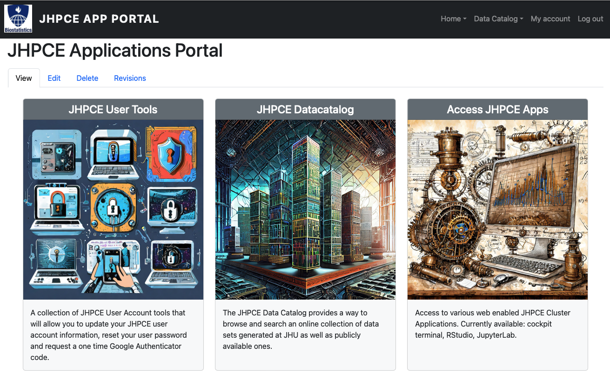
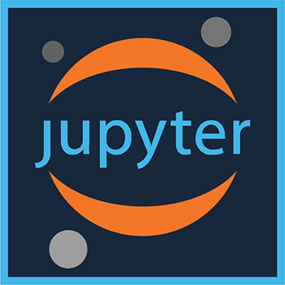

# JHPCE Web Enabled User Apps
---

Our [web portal](https://jhpce-app02.jhsph.edu/) has several sections. ==You will need to log with your JHED ID and password. This web site is only available on campus, so if you are outside of the school network, you will need login to the JHU VPN first.==

---

{ align=center }

  
-   :material-information-outline:{ .lg .middle } __JupyterLab__

    ---
  
    

    ---

    JupyterLab is the latest web-based interactive development environment for notebooks, code, and data. Its flexible interface allows users to configure and arrange workflows in data science, scientific computing, computational journalism, and machine learning. A modular design invites extensions to expand and enrich functionality. The JHPCE JupyterLab session ==will timeout after 60 minutes of inactivity==, a new session will need to be requested if that happens.

-   :material-information-outline:{ .lg .middle } __RStudio__

    ---

    { align=center }
    
    ---

    RStudio is an integrated development environment (IDE) for R. It includes a console, syntax-highlighting editor that supports direct code execution, as well as tools for plotting, history, debugging and workspace management. The JHPCE RStudio session ==will timeout after 1 day of inactivity==, a new session will need to be requested if that happens.

-   :material-information-outline:{ .lg .middle } __Visual Studio Code__

    ---

    { align=center }
    
    ---

    Visual Studio Code is a lightweight but powerful source code editor. It comes with built-in support for JavaScript, TypeScript and Node.js and has a rich ecosystem of extensions for other languages and runtimes (such as C++, C#, Java, Python, PHP, Go, .NET). You can visit the link below for additional setup and usage details (==this web portal is only available on campus, so if you are outside of the school network, you will need login to the JHU VPN first.==) The Visual Studio Code session ==will timeout after 12 hours of inactivity==, a new session will need to be requested if that happens.

    [:octicons-arrow-right-24: Access Instructions](https://jhpce-app02.jhsph.edu/vstudio-instructions){ align=center }
  

