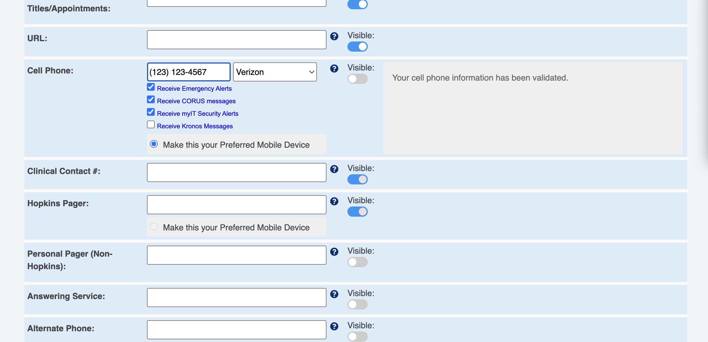

# JHPCE User Account Tools

## Reset password or request a new scratch Code from the JHPCE Web Portal

Our [web portal](https://jhpce-app02.jhsph.edu/) has several sections.

The JHPCE User Account Tools section provide the means to:

* Reset your password
* Request Verification Code ("One Time Password")
* Update Contact Information

This web site is only available on Hopkins networks, so if you are off campus, you will need to login to the JHU VPN first.  If you do not have a valid JHED, then you will be unable to use the portal.  

Please send requests for assistance to bitsupport@lists.jh.edu, taking care to mention this JHED problem.

The JHPCE team maintains two clusters - JHPCE and JADE. Usernames differ between the two. If your JHED is associated with multiple accounts in one or both clusters, then you will see your accounts listed in drop down menus.

Your JHPCE cluster username and password are NOT the same as your JHED ID and password. These are maintained by different groups and do not change in one place when changed in the other.

---

!!! Warning
    Please make sure that you have "Receive CORUS messages" box enabled in your myProfile settings at my.jhu.edu page otherwise our change password / request authenticator code text alerts will not work.
    (This is true whether not our database of cluster accounts contains your current phone number.)

{ align=center }

---
You can visit our [web portal](https://jhpce-app02.jhsph.edu/) which is at [https://jhpce-app02.jhsph.edu](https://jhpce-app02.jhsph.edu/) to get a one-time use verification code and/or reset your password.  

You will first log into that web site {==with your JHED ID and password (so you'll need a valid JHED).==} Once logged in you should then proceed to the *JHPCE Tools* section of the site.  In that section you will find options for requesting a verification code or resetting your JHPCE password.

!!! Note
    You can use different Time-based One-Time Password (TOTP) tools to generate verification codes. Our documentation usually mentions Google Authenticator, but you can also use, for example, Microsoft Authenticator.

## After Logging In

After you ssh into the cluster:
 
- If you need to change your password, use the `kpasswd` command. You will need to use a password with three of the following four sets of
characters: upper-case, lower-case, numerical digits, and special characters.
 
- If you need to set up your Google Authenticator, you can use the following steps:
  
    1. On your smartphone, bring up the "Google Authenticator" app
    2. On the relevant JHPCE cluster, run `auth_util`
    3. In `auth_util`, use option "5" to display the QR code (you may need to resize your ssh window to see it - in MobaXterm, you can ”view->terminal unzoom”.)
    4. Scan the QR code with the Google Authenticator app
    5. Next in `auth_util` use option 2 to display your scratch codes. You can generate more with option 3. You can save some of these for future use, but please don't save your username, password and verification codes in the same place.
    6. In `auth_util`, use option "6" to exit from `auth_util`
 
Going forward, you would then use the 6 digit code from Google Authenticator when prompted for “Verification Code” when logging into a JHPCE cluster.
