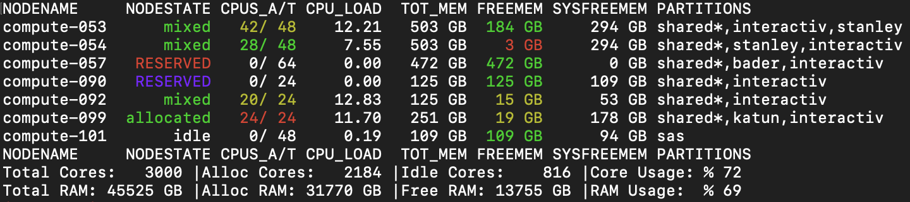

---
tags:
  - slurm
  - in-progress
  - jeffrey
---

# slurmpic

`slurmpic` (SLURM PICture) is a JHPCE-written program which is an important tool for both users and systems administrators. ==You should run slurmpic regularly== to get a feeling for the state of the cluster, and whenever you are wondering about something such as why a node you requested is not available. Run `slurmpic -h` to see important usage notes!

It shows current information about individual compute nodes and partitions (groups of compute nodes). When `slurmpic -a` is run, it shows info about **all** of the nodes in the cluster, and therefore the statistics provided are for the whole cluster. Text is color-coded to try to indicate how fully consumed nodes are.

The SLURM command ["sinfo --node"](https://slurm.schedmd.com/archive/slurm-22.05.9/sinfo.html) is the underlying tool. That produces a node-oriented format with one line per node. `slurmpic` modifies `sinfo` output by adding color-coding, a little upper/lower case modifications for NODESTATE and a summary block of statistics about the nodes displayed.

## Why is it useful?

The per-node lines give you specific answers to questions like:

- "What is the maximum amount of RAM or CPU cores on a single node in the cluster or partition?" (If you try to submit a job request which requests more than that, then the job will never run.)
- "Which nodes or partitions have available capacity that my job might be able to use now or in the near future?" (Of course, your jobs are submitted into a queue of jobs from other users. But some times you can be reminded of partitions like "scavenge" and see that resources are available.)

The summary statistics give insight into how heavily utilized the partition or cluster is at this moment.

## Example output
Here is a condensed example of the output from running `slurmpic --all`

Notes:

- Because we used `--all`, the PARTITIONS column lists all of the partitions that the node is a member of.
- compute-053's cores are almost all used, so CPUS_A/T is a cautionary yellow. But it has enough unallocated RAM to be able to run more SLURM jobs, so FREEMEM is in green. The NODESTATE is "mixed" because it is being used but is not completely allocated.
- compute-054's still has many free cores, so CPUS_A/T is green. But it has almost no unallocated RAM for more SLURM jobs, so FREEMEM is in danger red.
- compute-057 is turned off and reserved, so RESERVED is in red.
- compute-090 is working normally and is reserved, so RESERVED is in purple.
- compute-099's NODESTATE is "allocated" because all of its cores are in use.
- compute-101 is idle.

Does this image display differently?

{: .centered }
Image caption text   

## Which partitions do you see?

- By default `slurmpic` displays one partition, while `slurmpic -a` shows all partitions. 
- `slurmpic -a` allows you to see which partitions each node belongs to.
- In the JHPCE cluster: slurmpic defaults to the **shared** partition.
- In the JADE cluster: slurmpic defaults to the **N-shared** partition, where "N" is the community letter, e.g. "**c-shared**" for CMS community members, "**m-shared**" for MISC community members.
- Specific partitions can be displayed using: `slurmpic -p <partitionname>`
- All of the nodes in all of the GPU partitions can be displayed with `slurmpic -g`.
- Individual GPU-containing partitions can be shown with `slurmpic -g -p <partitionname>`
- You will not see hidden or restricted partitions you cannot submit to, unless you specify `-a`.

## About the displayed summary statistics:

- They are for a single partition, not the whole cluster (except for `slurmpic -a`)
- They do not include the resources of hidden or restricted partitions.
- Memory and CPU use of nodes that are DOWN or in DRAIN are not included in the stats.

## Column names and contents

Typically you will see this header line:
> NODENAME     NODESTATE CPUS_A/T CPU_LOAD  TOT_MEM FREEMEM SYSFREEMEM PARTITIONS

When you add the `-g` (for gpu) flag, two additional columns are shown: 
> NODENAME     NODESTATE CPUS_A/T CPU_LOAD  TOT_MEM FREEMEM SYSFREEMEM  GPUS GPU_TYPES:COUNT     PARTITIONS

When you add the `-r` (for RAM stats) flag, three additional columns are shown: 
> NODENAME     NODESTATE CPUS_A/T CPU_LOAD  TOT_MEM FREEMEM SYSFREEMEM ALLOC  USED   GAP PARTITIONS

- NODENAME - self-explanatory
- NODESTATE - SLURM has a finite set of "states" a node can be in at a time. Slurmpic usually only shows one but nodes can be in several simultaneously. (The command `scontrol show node <nodename> | grep STATE` will show you all of the current states. See `man sinfo` for a list of states.)
- CPUS_A/T - CPU Allocated by SLURM and total CPU
- CPU_LOAD - The current average number of processes that are either in a runnable or uninterruptable state.
- TOT_MEM - The total amount of RAM on the compute node available for SLURM jobs.
- FREEMEM - Currently unused RAM available for new jobs.
- SYSFREEMEM - The operating system's idea of RAM that is not being used for any purpose. Users can ignore this data.
- PARTITIONS - One or more partitions that the node is a member of.
- GPUS - (gpus option) Two numbers: GPU cards in use and total installed. (WARNING: The "in use" number is determined by checking how many are currently running code, **NOT** the number locked down by SLURM job requests.)
- GPU_TYPES:COUNT - (gpus option) A list of GPU card models & how many of them are being used.
- ALLOC - (ramstats option) Total of SLURM job requests (equals TOT_MEM - FREEMEM)
- USED - (ramstats option) Amount of memory being used for _something_ (equals TOT_MEM - SYSFREEMEM)
- GAP - (ramstats option) Difference between what users have requested and what the operating system says is not being used (equals SYSFREEMEM - FREEMEM)

## Color-coding used in column contents
 
The cut-off points for color choices are hard-coded in `slurmpic`. You can inspect the code yourself to see what is being done.

### NODESTATE
Green: The node is running and SLURM can contact it. 
Red: The node is in distress. 
Purple: Only used for state RESERVED. The node is running but has a reservation in place. The command `showres` will list reservations and their details. Nodes which are reserved but also down are shown in red.

### CPUS_A/T
White: No cores are being used. 
Green: A few cores are being used. 
Yellow: Most of the cores are being used. 
Red: Almost all or all cores are being used. 

### CPU_LOAD
We have not, to date, colorized this field. Perhaps we should be calling out load averages higher than the number of total cores, as that indicates problems such as programs believing they have access to all of the cores on the node e.g. the Python "plink" libraries.

### FREEMEM 
Green, yellow or red depending on the amount of currently unused RAM available for new jobs.

### GAP
Various colors which attempt to indicate the scale of over-allocation of RAM by users. This was implemented to provide some informatiom about the scale of over-allocation, so systems administrators could choose courses of action. Such as creating scripts which emailed users who used "much too much" RAM recently. These values are very approximate. For example, FREEMEM is what SLURM thinks is usable, not what the OS does. SYSFREEMEM depends on how much RAM is being used by the OS for caching data such as recently-used files.

### Not colorized
We have not, to date, colorized these fields:

- NODENAME 
- TOT_MEM
- SYSFREEMEM
- GPUS
- GPU_TYPES:COUNT
- ALLOC
- USED
- PARTITIONS

## Caveats

- Summary stats are for specified partition(s), and exclude nodes in DOWN, DRAIN & RESERVED states.
- Output width - You may need to widen your terminal window. One hundred (100) characters should suffice.
- The count of GPUs when using `-g` is how many are currently **running code**, not the number locked down by SLURM job requests. Therefore it can appear that GPUs are available when they are not.
- Using `--all` & `--gpu` together provides (as of 20261003) different output depending on the ordering. Ordering should not matter. `slurmpic -g -a` will show all cluster nodes, with GPU-related statistics. `slurmpic -a -g` will show only GPU-equipped nodes, with GPU-related statistics.
- Hidden partitions - Use the `--all` option to see all nodes. Partitions can be hidden from view because of their configuration. They can be defined as hidden (which we haven't done so far). Partitions can also be configured with an "AllowedGroups" parameter. That restricts usage (and visability) to members of the specified UNIX user group members.
- The JADE cluster does not have any GPU-equipped nodes. Therefore the `--gpu` option does not work there.

## RAM usage stats

The `-r | --ramstats` flag was added to assist systems administrators to get a feeling for how much users were over-allocating RAM when composing their job requests.

## Slurmpic data tools

To be written.

((Describe here the ways to look at historical data -- see the slurm local commands page for starting info.))

Candidates include:

slurm-hist
slurm-hist-all-cores
slurm-hist-all-mem
slurm-hist-shared-cores
slurm-hist-shared-mem

