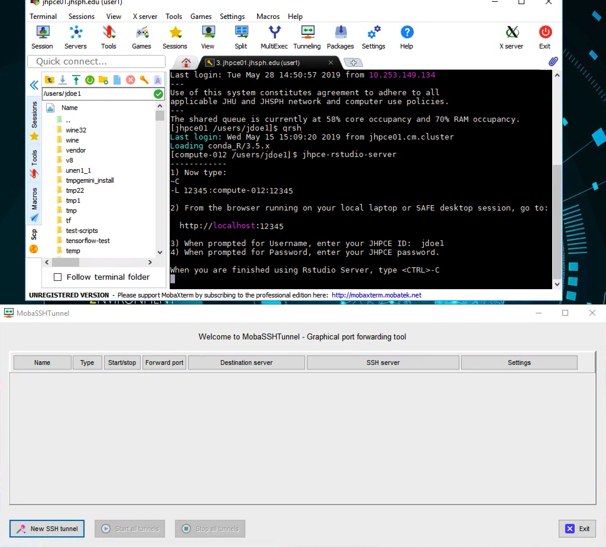
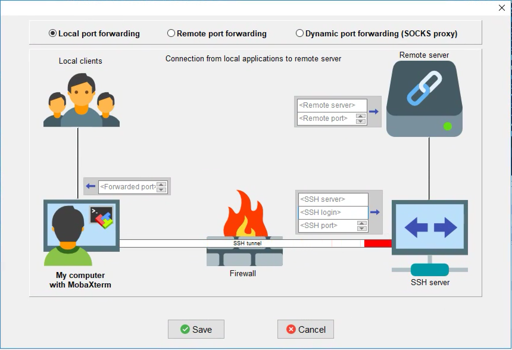
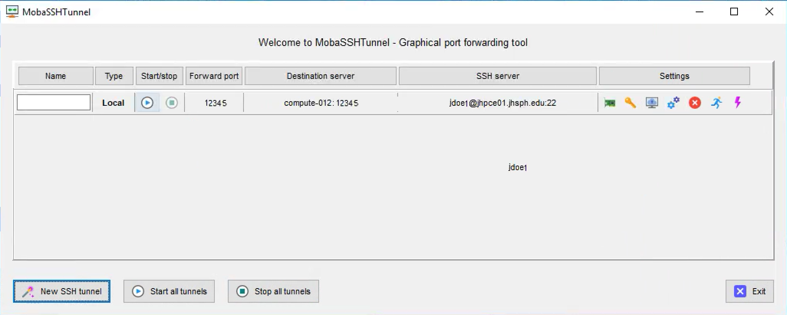
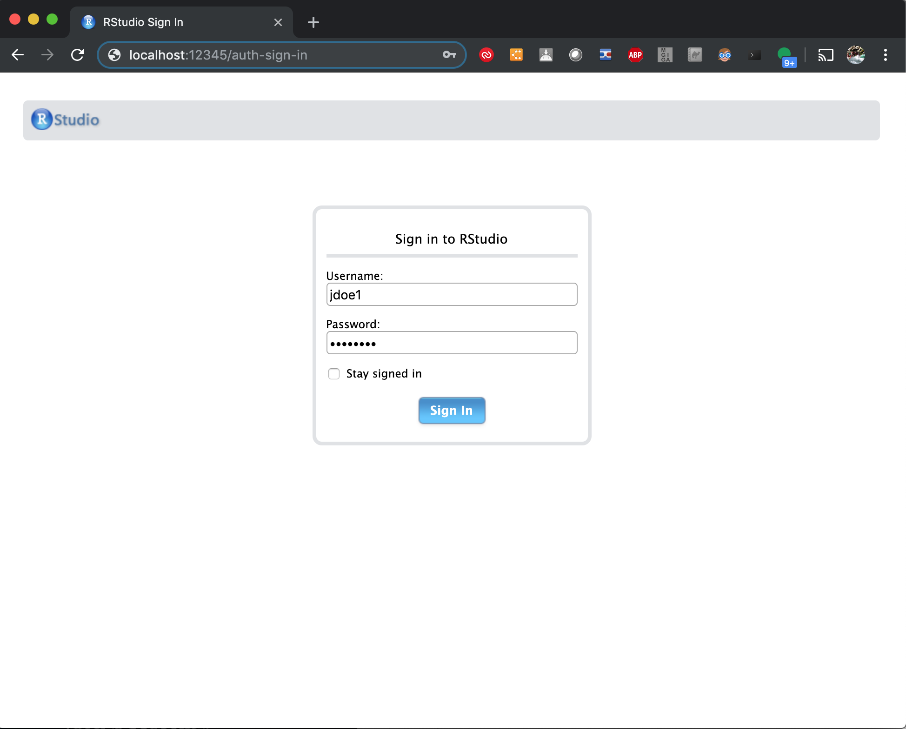
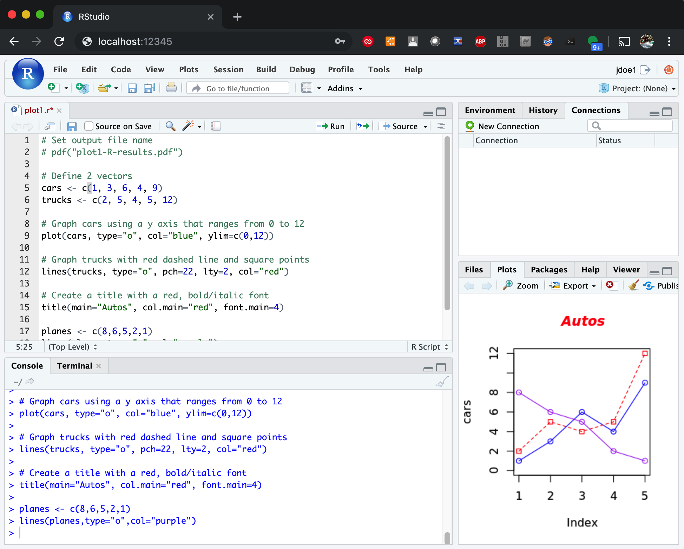

---
tags:
  - in-progress
title: Running R in JHPCE
---  
# Running R in JHPCE

## R Basics

There are a number of ways to run R on the JHPCE cluster.  There is a text-based version of R which is available as a module.  We also have a way to run rstudio over the X11 interface. We have a way to run Rstudio Server through an ssh tunnel.  Lastly we have a way to run Rstudio Server through our Web Application Server.

During orientation, participants are shown a number of example files stored in a directory copied into new account home directories. There is a copy of the latest set of those in the directory /jhpce/shared/jhpce/class-scripts/.  We have one set for users of the main cluster and a second for users of the C-SUB.  You can copy the latest files into your home directory with this command, replacing "*clustername*" with either "jhpce" or "c-sub"
`rsync -av /jhpce/shared/jhpce/slurm/class-scripts/clustername/ $HOME/class-scripts/`
For that rsync command to work correctly, there needs to be a trailing slash on the path to the originals of the class-scripts.

## Ways to run R on JHPCE

### Using the text-based version of R

There are 2 ways to make use of the text-based version of R on the cluster.  You can either run R interactively, and enter your R code in the R, or you can submit an non-interactive batch program that uses R.

#### Running R Interactively


```
[test@login31 ~]$ srun --pty bash
srun: job 3176550 queued and waiting for resources
srun: job 3176550 has been allocated resources
[test@compute-152 ~]$ module load conda_R
Loading conda_R/4.3.x
(4.3.x)[test@compute-152 ~]$ module list

Currently Loaded Modules:
  1) JHPCE_ROCKY9_DEFAULT_ENV   2) JHPCE_tools/3.0   3) conda/3-23.3.1   4) conda_R/4.3.x

(4.3.x)[test@compute-152 ~]$ R

R version 4.3.2 Patched (2024-02-08 r85876) -- "Eye Holes"
Copyright (C) 2024 The R Foundation for Statistical Computing
Platform: x86_64-conda-linux-gnu (64-bit)
...
Type 'demo()' for some demos, 'help()' for on-line help, or
'help.start()' for an HTML browser interface to help.
Type 'q()' to quit R.
...
> 
```

#### Running R in batch mode

In $HOME/class-scripts/R-demo there is an example of submitting an R job on the cluster.  You'll note that there are two files here, a SLURM batch job file and an R program file. Here is an example of running an R session interactively.

1. Write your R source in a file with .r extension (e.g. plot1.r). Here is what the example file looks like:
```
[test@login31 R-demo]$ cat plot1.r
# Set output file name
pdf("plot1-R-results.pdf")

# Define 2 vectors
cars <- c(1, 3, 6, 4, 9)
trucks <- c(2, 5, 4, 5, 12)

# Graph cars using a y axis that ranges from 0 to 12
plot(cars, type="o", col="blue", ylim=c(0,12))

# Graph trucks with red dashed line and square points
lines(trucks, type="o", pch=22, lty=2, col="red")

# Create a title with a red, bold/italic font
title(main="Autos", col.main="red", font.main=4)
```

2. Write a submit job script (e.g. plot1.sh)
```
[test@login31 R-demo]$ cat plot1.sh 
#!/bin/bash

#SBATCH --mem=2G
#SBATCH --time=2:00

module load conda_R
R CMD BATCH plot1.r
```

3. Submit your R job
```
[test@login31 ~]$ sbatch plot1.sh 
Submitted batch job 3177833
```

4. Monitor the job status
```
[test@login31 ~]$ squeue --me
             JOBID PARTITION     NAME     USER ST       TIME  NODES NODELIST(REASON)
           3177833    shared plot1.sh    test  R       0:03      1 compute-095
```

5. When the job is finished, the output files are created in your Current Working Directory
```
-rw-r--r--    1 test test        22 Mar 13 16:29  slurm-3177833.out
-rw-r--r--    1 test test      4988 Mar 13 16:29  plot1-R-results.pdf
```

6. Look at the result file, plot1-R-results.pdf; you can use xpdf to view it if you have set X11 forward when login.
   Otherwise, you need download the file to local machine to view it.
```
[test@login31 ~]$ xpdf plot1-R-results.pdf
```

### Running the X11 version of RStudio

!!! Note "Note"
    In order to run the X11 version of Rstudio, you need to have X11 setup on your local system.
    - For Windows, MobaXterm has an X server built into it  
    - For Mac, you need to have the XQuartz program installed (which requires a reboot), and you need to add the "-X" option to ssh:  
    ```
    ssh -X yourusername@jhpce01.jhsph.edu
    ```
    See more detailed info on X11 [here](../access/x11.md)

If you prefer the graphical version of R, you can the X11 version of Rstudio. Here is an example of running the X11 version of Rstudio:
```
[test@login31 ~]$ srun --mem 10G --x11 --pty bash
srun: job 3244190 queued and waiting for resources
srun: job 3244190 has been allocated resources
[test@compute-097 ~]$ module load R
Loading R/4.3
(4.3)[test@compute-097 ~]$ module load rstudio
(4.3)[test@compute-097 ~]$ rstudio
```

When you run rstudio, you should see the familiar graphical Rstudio interface come up.


### Running RStudio Server

Depending on which cluster you are using, run one of the following two scripts after starting an interactive session and landing on a compute node. (The discussion below assumes that you are on the jhpce cluster.) 

- jhpce-rstudio-server
- csub-rstudio-server

Rstudio Server is a web based environment for developing R programs.  On the JHPCE cluster we have put together a script called “jhpce-rstudio-server” which will allow you to run your own personal copy of Rstudio Server and access it from a browser on your laptop or desktop.  When the “jhpce-rstudio-server” program is run, it starts an instance of the Rstudio Server web server within a Singularity image on a unique port number, and then provides instructions for setting up an ssh tunnel to allow you to access Rstudio Server from your local system.

You will need to perform one step to enable access to this Rstudio Server from your local laptop/desktop;  specifically, you will need to add a tunnel to your existing ssh session to the JHPCE cluster.

!!! tip
    In UNIX, you send an interrupt signal to a running foreground program using the key combination ++control+c++ This is historically written as `^C`  Note that you DO NOT actually use the SHIFT key to capitalize the C. The way it is written is misleading. You do NOT type ++control+shift+c++. However this `^C` is the way it has been written for decades, and we will do so.
    
!!! warning
    However, you DO need to capitalize the letter `c` when trying to send an interrupt signal to the ssh program on Mac or Linux computers. The key combination for an ssh interrupt is `~ SHIFT c` or ++tilde+shift+c++

#### For Mac or Linux computers:

To add this tunnel, first type ~C (while holding down SHIFT, press “~” then “C”).  The ~C is used to send an interrupt to your ssh session.  The ~C will likely not show up, but you should see an “ssh>” prompt as a result.  At this “ssh>” prompt you activate the tunnel by typing  -L XXXXX:compute-YYY:XXXXX  .  This will allow your laptop/desktop to access the compute node compute-YYY on port XXXXX (in the above example, the port used was 12345 and the compute node used was compute-012).

#### For Windows computers, or from the SAFE Desktop:

If you connected to the JHPCE cluster with MobaXterm from a Windows-based system or SAFE desktop, you should ignore the first step (entering ~C and adding the local tunnel). 

Instead, you will need to  add a tunnel from MobaXterm.

Before setting up the tunnel you may find it helpful to set up an SSH key using the steps at [this page about ssh](../access/ssh.md#ssh-keys)   While not a requirement, this will eliminate the need to login using your password and Google Verification Code.  Note that if you are setting up the tunnel for the C-SUB, you will not be able to use SSH keys due to the enhanced security of the C-SUB.

To start, click on the “Tunneling” icon at the top of MobaXterm, and you should see the window below:



Click on “New SSH Tunnel”, and you should see:



Enter the following in the window:

*   For “Forwarded Port”, enter the port number displayed (this is 12345 in the example)
*   For “Remote Server”, enter the compute node (compute-012 in the example)
*   For “Remote Port”, enter the port number (12345 in the example)
*   For “SSH Server”, enter “jhpce01.jhsph.edu” if you are on the JHPCE cluster, or “jhpcecms01.jhsph.edu” if you are on the CSUB.
*   For “SSH Login”, enter your JHPCE cluster login name (jdoe1 in the example)
*   For “SSH Port”, enter “22”

Then click “Save”, and you’ll be take back to the “MobaSSHTunnel” screen with your new tunnel displayed.



Next, click on the yellow “Key” icon  [](https://jhpce.jhu.edu/wp-content/uploads/2019/05/Screen-Shot-2019-05-29-at-12.48.29-PM.png) and browse to the location of your private key (the “.ppk” file).  Now start your tunnel by clicking on the Green triangle icon[](https://jhpce.jhu.edu/wp-content/uploads/2019/05/Screen-Shot-2019-05-29-at-12.48.20-PM.png) in the “Start/Stop” column.

Now that the tunnel is established, you can then access Rstudio Server from your laptop/desktop by using a web browser, and connecting to the url, **http://localhost:XXXXX** .  Once connected you will be prompted for your login and password, and you will need to enter you your JHPCE login and password at this point.



Once you enter your login and password, you should see Rstudio running in your browser.




#### Shutting down the Rstudio Server
--------------------------------

When you have finished using Rstudio Server, you should close the browser tab or window that you are using to run Rstudio Server, and then return to the ssh session where you ran the “jhpce-rstudio-server” command.  To stop the Rstudio Server, type “^C”.  You will then be given a few additional steps to run to deactivate the port forward. As with the establishment of the tunnel, these steps are for MacOS and Linux based desktops/laptops.  You will again be prompted to type “~C”, and then enter “-KL XXXXX” at the “ssh>” prompt to stop the forwarding (NOTE: you’ll need to hit <enter> once before typing “~C”).  The session should look similar to:

```console
[login31 /users/jdoe1] $ srun --pty --x11 --mem=10G bash
Last login: Wed May 1 17:02:29 2019 from login31.cm.cluster
Loading conda_R/3.5.x
[compute-012 /users/jdoe1] $ jhpce-rstudio-server
------------
1) Establish your SSH tunnel.
* Windows users see: https://jhpce.jhu.edu/sw/rstudio-server/
* Mac or Linux Desktop users, please type:
~C
-L 12345:compute-012:12345

2) From the browser running on your local system or SAFE desktop, go to:

  http://localhost:12345

3) When prompted for Username, enter your JHPCE ID:  jdoe1
4) When prompted for Password, enter your JHPCE password.

When you are finished using Rstudio Server, type <CTRL>-C

~C
ssh> -L 12345:compute-012:12345
Forwarding port.

****Cleaning up...
------------
Now type:
~C
-KL 41354

[compute-012 /users/jdoe1] $
[compute-012 /users/jdoe1] $**~C**
ssh> **-KL 12345**
Canceled forwarding.
[compute-012 /users/jdoe1] $ exit
[login31 /users/jdoe1] $ exit
```

### Running RStudio Server via web
You can run RStudio via [JHPCE Application Portal](https://jhpce-app02.jhsph.edu/) by login with your JHED ID and password.
Please see [our page](../portal/web-apps.md) about using the JHPCE Web Portal.

## R on JHPCE - Common Considerations

### Installing R Packages

In all cases, there are a number of R packages preinstalled in each of the R environments.

When running the text based version of R or the X11 based version of R, you will be making use of
one of the R modules. This module is named conda_R and is managed by Dr. Kasper Hansen in the
Biostatistics department in the BSPH.  Dr. Hansen preloads a 

You can see the various version of the conda_R packages that are available (as of April 2025)
with the "module avail conda_R" command. 

```
[mmill116@compute-112 ~]$ module avail conda_R

--------------------- /jhpce/shared/community/modulefiles ----------------------
   conda_R/devel    conda_R/4.3.x    conda_R/4.4.x
   conda_R/test     conda_R/4.3      conda_R/4.4   (D)

```

Dr. Hansen preinstals a ton of R packages in these R modules.  If you find that you need to
install your own modules, you can also install your own R packages to your home directory.  By
deafult, these packages will be installed in the the R directory in your home directory

```R linenums="0"
[mmill116@jhpce01 ~]$ srun --pty --X11 bash
[mmill116@compute-112 ~]$ module load conda_R
(/jhpce/shared/community/core/conda_R/4.4) [mmill116@compute-112 ~]$ R
R version 4.4.0 Patched (2024-05-22 r86590) -- "Puppy Cup"
Copyright (C) 2024 The R Foundation for Statistical Computing
. . .
> install.packages("sf")
> library('sf')
> q()
(/jhpce/shared/community/core/conda_R/4.4) [mmill116@compute-112 ~]$ ls -la R/4.4
total 61
drwxr-xr-x  4 mmill116 mmi  4 Apr 10 10:58 .
drwxr-xr-x 19 mmill116 mmi 20 May 15  2024 ..
drwxr-xr-x 19 mmill116 mmi 25 Apr 10 10:58 sf

```
The same directory is used for both the text-based version of R and the X11 version of Rstuido, since they rely on the same "conda_R" packages.

However for the Rstudio Server options mentioned above the R version will be contained in the
singularity used to run Rstudio Server.  So, any R packages that were installed under the
conda_R will need to be reinstalled under the Rstudio Server environment.  Any R packages you
install will be installed in the directory $HOME/R/packages/singularity-R$VERSION.

In all of the above cases, when you change the version of R that you are using, you will need
to reinstall any R packages.

When installing R packages from source with compiled programs, you can add custom compiler flags in ~/.R/Makevars. Adding optimization flags may provide a boost in performance for some packages. 
```
STDFLAGS = -O2 -pipe -Wall 
```
We have a wide variety of CPU architecture across the cluster, so you probably don't want to add to STDFLAGS `-march=` and `-mtune=` arguments.

For the X11 version of Rstudio, you will also be making 
### Installing your own R 

If you find that you have a specific need in R that is not available in our current offerings, you can compile your own
instance of R in your home directory. We don't have a guide for doing this, but if you are
at this point, you probably have compiled R before, and know what specific settings and customizations you need, and know what you're doing more than we do :-)
Here is one example from the [Iowa Biostat Site](https://iowabiostat.github.io/hpc/12.html)


## From Lieber - Working with SLURM via R and slurmjobs 

The Lieber group has put together some tools for working with R on the JHPCE cluster

[slurmjobs](http://research.libd.org/slurmjobs/articles/slurmjobs.html#basics) provides helper functions for interacting with SLURM-managed high-performance-computing environments from R. It includes functions for creating submittable jobs (including array jobs), monitoring partitions, and extracting info about running or complete jobs.

R is an open-source statistical environment which can be easily modified to enhance its functionality via packages. 

slurmjobs is a R package available via the [Bioconductor](http://bioconductor.org/) repository for packages. R can be installed on any operating system from [CRAN](https://cran.r-project.org/) after which you can install slurmjobs 

For more information about slurmjobs, see

[http://research.libd.org/slurmjobs/articles/slurmjobs.html](http://research.libd.org/slurmjobs/articles/slurmjobs.html#basics)

For Windows desktops/laptops, you should also use “^C” to terminate the Rstudio Server, but to stop the tunnel you will need to return to the MobaSSHTunnel screen, and use the “Stop” icon  in the Start/Stop column.  You can keep this tunnel configuration in MobaSSHTunnel, and reuse it the next time you run Rstudio Server, however you will need to edit the tunnel configuration and change the “Remote Server” to match the compute node you are running on.

### FAQs/Comments

Q) Why did you do this?  R works just fine for me on the cluster!

A) On the JHPCE cluster we have historically had several ways to run R programs.  Often  people will use the text-based version of R to run programs, and that works well for a lot of people.  Some people prefer to work in a graphical environment, so we also have the X11-based “Rstudio” available on the cluster, which is great, except that on a slower network connection, this can get quite laggy.  The web based Rstudio Server provides the same graphical version available in Rstudio, but over a much lighter network protocol than the X11-based Rstudio, so it is much faster and more responsive to use.

Q) Why not just set up a dedicated web server to run Rstudio Server like I had back at ZZZZ?

A) Rstudio Server does not play well with clusters.  For us to run a dedicated Rstudio Server server, we would need to purchase a fairly large system with lots of RAM and CPU power.  This was considered, but in the end was deemed cost prohibitive, and it didn’t allow the use of the JHPCE cluster resources to run R programs.  This solution allows the nice web-based Rstudio Server to be used, while making use of the existing CPU and RAM resources available on the cluster.

Q) My program can’t run because it needs XXX package!

A) The R that is run within the Rstudio Server is completely separate  from the default version of R that is used on the JHPCE cluster, therefor you may need to install packages using the install.packages() function, or through the Rstudio Server GUI .

Q) I forgot to cleanly disconnect from the Rstudio Server/My session got disconnected.

A) This should be fine.  Your interactive srun session will eventually time out and will kill the Rstudio Server that was running.  You may get warning messages about ports being in use – if so, please wait a few minutes and try again.

Q) When I try to add the port forward, I get an error message about “Port is in use”.  How do I fix this?

A) You can only run one instance of Rstudio Server. You likely have another SSH session running that has the port forward lingering.  If you had been using Rstudio Server in another SSH session, you will need to either need to log out of that ssh session, or run the “~C” “-KL XXXXX” command to tear down the port forward.

If you have any questions  about using Rstudio Server, please feel free to email us at bitsupport.
